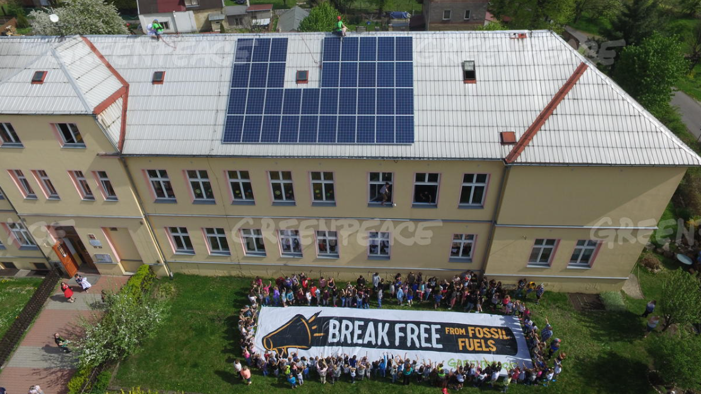

# Potentiel s(c)olaire

Évaluer et cartographier le potentiel photovoltaïque des toitures des établissements scolaires en France pour accélérer la transition énergétique des territoires.

Projet initié par Greenpeace et Dataforgood lors de la saison 13 (2025).

## Le contexte
Actuellement, l'État ne dispose d'aucune base de données nationale concernant le potentiel photovoltaïque des établissements scolaires en France. Ce manque d'information constitue un frein majeur à la transition énergétique dans le secteur éducatif, alors que les toitures des écoles représentent une surface considérable inexploitable pour la production d'énergie solaire.

## Description du projet
Le projet "Potentiel s(c)olaire" vise à développer une méthodologie complète pour identifier et évaluer le potentiel photovoltaïque des toitures des établissements scolaires en France. En combinant l'analyse cartographique, les données cadastrales et les contraintes techniques, le projet permettra de créer une base de données exhaustive et accessible du potentiel solaire des écoles françaises.

Cette initiative s'inscrit dans une démarche plus large de sensibilisation et d'action pour la transition énergétique. En rendant ces données publiques et facilement compréhensibles, le projet donnera aux citoyens et aux collectivités territoriales les moyens d'agir concrètement pour le développement des énergies renouvelables dans leur territoire, en commençant par les établissements scolaires.

## Contribuer
- [Rejoindre](https://dataforgood.fr/join) la communauté Data For Good
- Sur le slack Data For Good, rejoindre le canal _#13_potentiel_solaire_ et se présenter

## Installation
La stack technique est divisée en deux parties :
- [Algorithme](algorithme/README.md) : pour évaluer le potentiel solaire des établissements scolaires
- [Application](application/README.md) : interface publique interactive avec la visualisation des résultats
