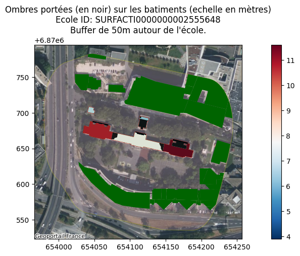
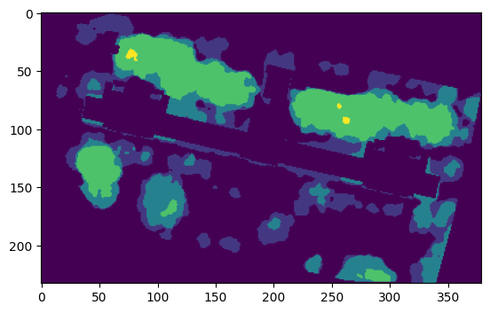
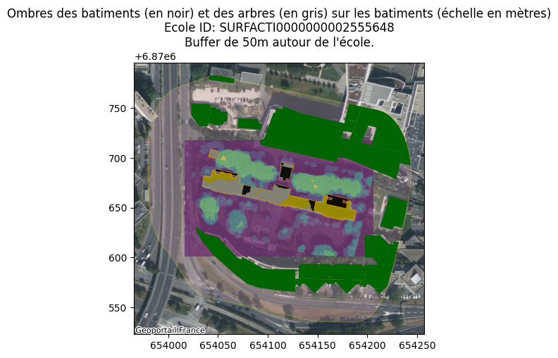

## Analyse d'ombre sur un établissement de St denis


```python
# Autoreload des modules
%load_ext autoreload
%autoreload 2
```

    The autoreload extension is already loaded. To reload it, use:
      %reload_ext autoreload


### Imports


```python
import geopandas as gpd
import matplotlib.pyplot as plt
import contextily as cx
from pathlib import Path
from shapely import Polygon
import pandas as pd
import os, rasterio
from rasterio.plot import show
from potentiel_solaire.features.ombres import getBatimentsEcoles, getOmbre, getBatiments
from potentiel_solaire.features.ombres import get_sun_position
import numpy as np
```


```python
import warnings
warnings.filterwarnings('ignore') 
```


```python
# Executer ci dessous ci besoin pour récupérer les données
# !extract-sample-data
# Et pour sauver une version markdown des notebooks, utiliser
# jupyter nbconvert etude_ombres.ipynb --to markdown --output-dir=exports/
```

### Chargement des Bâtiments et Zones Éducatives

### Pour St Denis


```python
DATA_FOLDER = Path("../data")

saint_denis_path = DATA_FOLDER / "saint_denis_reference_data.gpkg"

ecoles = gpd.read_file(saint_denis_path, layer="bdtopo_education").to_crs(2154)
batiments = gpd.read_file(saint_denis_path, layer="bdtopo_batiment").to_crs(2154)
```

### Batiments non écoles


```python
tous_batiments = DATA_FOLDER / "BDTOPO_3-4_TOUSTHEMES_GPKG_LAMB93_D093_2024-12-15/BDTOPO/1_DONNEES_LIVRAISON_2024-12-00134/BDT_3-4_GPKG_LAMB93_D093-ED2024-12-15/BDT_3-4_GPKG_LAMB93_D093-ED2024-12-15.gpkg"

```

# Création des ombres sur différents jours pour la couche bâtiments


```python
# On charge les couches
ecoles = gpd.read_file(saint_denis_path, layer="bdtopo_education").to_crs(2154)
batiments = gpd.read_file(saint_denis_path, layer="bdtopo_batiment").to_crs(2154)
```


```python
# Choix d'une école
ID = "SURFACTI0000000002555648"
```


```python
# Test de l'angle du soleil à une certaine position, date et heure
a, b= get_sun_position(42, 3, "2024-06-21", 12)
a,b 
```


    (71.32316440778013, 187.2342545098887)


```python
# Capture des batiments proches
batiments_ecole, ecole_cible, zone = getBatimentsEcoles(ID, ecoles, batiments)
batiments_proches = getBatiments(ID, ecoles, batiments, rayon = 100)
# Et on créé les ombres
```


```python
zone = ecoles[ecoles.cleabs_left == ID]["geometry"].iloc[0]
buffer_en_m = 50
# Passage en mètres
zone_with_buffer = ecoles[ecoles.cleabs_left == ID].to_crs(epsg=6933)
# Add buffer de 100m
zone_with_buffer = zone_with_buffer.buffer(buffer_en_m) 
# Repassage en Lamb93
zone_with_buffer = zone_with_buffer.to_crs(epsg=2154)
```


```python
bats = gpd.read_file(tous_batiments, layer="batiment", mask=zone_with_buffer).clip(zone_with_buffer)
bats = bats.to_crs(2154)
ombres = getOmbre(batiments_ecole, bats)
```


```python
# Et on représente les ombres
fig, ax = plt.subplots(figsize=(15,5))
zone_with_buffer.plot(ax=ax, alpha=0.2, color ="pink", edgecolor='yellow')
batiments_ecole.plot(ax=ax, alpha=0.6, linewidth=1,facecolor="none", edgecolor='red', label="batiments")
bats.plot(ax=ax, alpha=1, color="darkgreen",figsize=(15,5))
batiments_ecole.plot(ax=ax, alpha=0.9,column="hauteur",legend=True,figsize=(15,5),cmap="RdBu_r")
ombres.plot(ax=ax, alpha=0.9, color ="black")
ax.set_title("Ombres portées (en noir) sur les batiments (echelle en mètres)\nEcole ID: "+ID+"\nBuffer de "+str(buffer_en_m)+"m autour de l'école.") 
cx.add_basemap(ax, crs=ecole_cible.crs, source=cx.providers.GeoportailFrance.orthos )
fig.show()
```


    

    


# Exploration des ombres des arbres

On commence par calibrer hauteur de la BD TOPO vs hauteur donnée dans les MNS


```python
batiments_ecole = batiments_ecole.to_crs(epsg=6933)
batiments_ecole["surface_calculee"] = batiments_ecole.area
batiments_ecole = batiments_ecole.to_crs(epsg=2154)
batiments_pour_calibration = batiments_ecole.sort_values(by="surface_calculee",ascending=False).dropna(subset="hauteur")[["cleabs_left__bat","surface_calculee","hauteur","geometry"]]
batiments_pour_calibration
```


<div>
<style scoped>
    .dataframe tbody tr th:only-of-type {
        vertical-align: middle;
    }

    .dataframe tbody tr th {
        vertical-align: top;
    }

    .dataframe thead th {
        text-align: right;
    }
</style>
<table border="1" class="dataframe">
  <thead>
    <tr style="text-align: right;">
      <th></th>
      <th>cleabs_left__bat</th>
      <th>surface_calculee</th>
      <th>hauteur</th>
      <th>geometry</th>
    </tr>
  </thead>
  <tbody>
    <tr>
      <th>311</th>
      <td>BATIMENT0000000243405818</td>
      <td>873.041977</td>
      <td>7.9</td>
      <td>MULTIPOLYGON Z (((654073.9 6870662.9 41.9, 654...</td>
    </tr>
    <tr>
      <th>314</th>
      <td>BATIMENT0000000243405819</td>
      <td>648.349874</td>
      <td>10.8</td>
      <td>MULTIPOLYGON Z (((654073.9 6870662.9 44.8, 654...</td>
    </tr>
    <tr>
      <th>310</th>
      <td>BATIMENT0000000243405820</td>
      <td>513.156502</td>
      <td>11.6</td>
      <td>MULTIPOLYGON Z (((654145.9 6870646.6 45.6, 654...</td>
    </tr>
    <tr>
      <th>317</th>
      <td>BATIMENT0000000243405828</td>
      <td>145.074444</td>
      <td>6.3</td>
      <td>MULTIPOLYGON Z (((654115.2 6870679.2 40.4, 654...</td>
    </tr>
    <tr>
      <th>312</th>
      <td>BATIMENT0000000243405821</td>
      <td>133.133387</td>
      <td>6.4</td>
      <td>MULTIPOLYGON Z (((654175.6 6870657.5 40.4, 654...</td>
    </tr>
    <tr>
      <th>320</th>
      <td>BATIMENT0000000243405871</td>
      <td>60.140987</td>
      <td>6.8</td>
      <td>MULTIPOLYGON Z (((654049.3 6870706.9 -1000, 65...</td>
    </tr>
    <tr>
      <th>313</th>
      <td>BATIMENT0000000243405822</td>
      <td>36.643521</td>
      <td>4.1</td>
      <td>MULTIPOLYGON Z (((654180.8 6870656.7 38.1, 654...</td>
    </tr>
    <tr>
      <th>319</th>
      <td>BATIMENT0000000243405823</td>
      <td>34.888313</td>
      <td>4.5</td>
      <td>MULTIPOLYGON Z (((654047.4 6870687.2 38.5, 654...</td>
    </tr>
    <tr>
      <th>315</th>
      <td>BATIMENT0000000243405817</td>
      <td>27.927746</td>
      <td>3.9</td>
      <td>MULTIPOLYGON Z (((654107.6 6870672.5 37.9, 654...</td>
    </tr>
    <tr>
      <th>318</th>
      <td>BATIMENT0000000243405826</td>
      <td>12.541251</td>
      <td>6.3</td>
      <td>MULTIPOLYGON Z (((654115.4 6870680.3 40.4, 654...</td>
    </tr>
    <tr>
      <th>316</th>
      <td>BATIMENT0000000243405827</td>
      <td>5.230522</td>
      <td>6.2</td>
      <td>MULTIPOLYGON Z (((654115.2 6870679.2 40.3, 654...</td>
    </tr>
  </tbody>
</table>
</div>


```python
import rasterio.mask
from rasterio.features import shapes
```

On créé un modele de surface autour de l'école.


```python
geotiff_cached = "../data/cache/mns/"+ID+".masked.tif"

with rasterio.open(geotiff_cached) as img:
    out_image, out_transform = rasterio.mask.mask(img, batiments_pour_calibration[0:1].geometry, crop=True)
    out_meta = img.meta
offset_hauteur = batiments_pour_calibration[0:1].hauteur.iloc[0] - np.mean(out_image[np.nonzero(out_image)])
print("* Hauteur cf data Batiment ecole:\t", batiments_pour_calibration[0:1].hauteur.iloc[0])
print("* Hauteur cf data MNS:\t", np.mean(out_image[np.nonzero(out_image)]))
print("* Offset:\t",offset_hauteur)
geome = ecole_cible.geometry.total_bounds
A = "0"+str(int(geome[0]//1000))
B = str(int(geome[1]//1000)+1)
tile = "/MNS-Correl_1-0__TIFF_LAMB93_D093_2024-01-01/MNS-Correl/1_DONNEES_LIVRAISON_2024-11-00179/MNS-C_0M50_TIF_LAMB93_D93-2024/93-2024-"+A+"-"+B+"-LA93-0M50.tif"
path = DATA_FOLDER / tile
with rasterio.open("../data/"+str(path)) as img:
    out_image, out_transform = rasterio.mask.mask(img, ecole_cible.geometry, crop=True)
    out_meta = img.meta

out_meta.update({"driver": "GTiff",
                "height": out_image.shape[1],
                "width": out_image.shape[2],
                "transform": out_transform})

with rasterio.open("../data/cache/mns/"+ID+".masked.tif", "w", **out_meta) as dest:
    dest.write(out_image)

with rasterio.open("../data/cache/mns/"+ID+".masked.tif") as img:
    out_image, out_transform = rasterio.mask.mask(img, batiments_ecole.geometry, invert=True)
    out_meta = img.meta
out_image = out_image + offset_hauteur
hmin = batiments_pour_calibration.hauteur.min()
out_image = np.where(out_image<hmin*1.05, 0, out_image)

# Essayons d'avoir 3 couches de hauteur
steps = 3
processed = out_image - hmin
hmax = np.max(processed)
G = hmax/steps
OUT = (((processed+G+1)//G)*G)-G+hmin
OUT = np.where(OUT<0, 0, OUT)
plt.imshow(OUT[0])

out_meta.update({"driver": "GTiff",
                "height": OUT.shape[1],
                "width": OUT.shape[2],
                "transform": out_transform})

with rasterio.open("../data/cache/mns/"+ID+".nobats_masked.tif", "w", **out_meta) as dest:
    dest.write(OUT)

with rasterio.open("../data/cache/mns/"+ID+".nobats_masked.tif") as src:
    image = src.read(1)
    imgtoshow = src.read()

img_arbres = rasterio.open("../data/cache/mns/"+ID+".nobats_masked.tif")
```

    * Hauteur cf data Batiment ecole:	 7.9
    * Hauteur cf data MNS:	 41.835487
    * Offset:	 -33.93548736572266


    

    


On créée ensuite les formes des arbres


```python
ombres_mns = []
mask = image != 0
results = (
            {'properties': {'raster_val': v}, 'geometry': s}
            for i, (s, v)
            in enumerate(
                shapes(image, mask=mask, transform=src.transform)))
for x in results:
    #print(x)
    ombres_mns.append([x["properties"]["raster_val"], Polygon(x["geometry"]["coordinates"][0]) ])
df = pd.DataFrame(ombres_mns,columns = ["hauteur","geometry"])
gdf = gpd.GeoDataFrame(df,geometry="geometry",crs = ecole_cible.crs)
gdf
```


<div>
<style scoped>
    .dataframe tbody tr th:only-of-type {
        vertical-align: middle;
    }

    .dataframe tbody tr th {
        vertical-align: top;
    }

    .dataframe thead th {
        text-align: right;
    }
</style>
<table border="1" class="dataframe">
  <thead>
    <tr style="text-align: right;">
      <th></th>
      <th>hauteur</th>
      <th>geometry</th>
    </tr>
  </thead>
  <tbody>
    <tr>
      <th>0</th>
      <td>3.900000</td>
      <td>POLYGON ((654060 6870709, 654060 6870708.5, 65...</td>
    </tr>
    <tr>
      <th>1</th>
      <td>10.701257</td>
      <td>POLYGON ((654058.5 6870708.5, 654058.5 6870708...</td>
    </tr>
    <tr>
      <th>2</th>
      <td>10.701257</td>
      <td>POLYGON ((654060.5 6870708.5, 654060.5 6870708...</td>
    </tr>
    <tr>
      <th>3</th>
      <td>3.900000</td>
      <td>POLYGON ((654061 6870708.5, 654061 6870708, 65...</td>
    </tr>
    <tr>
      <th>4</th>
      <td>10.701257</td>
      <td>POLYGON ((654062.5 6870708, 654062.5 6870707.5...</td>
    </tr>
    <tr>
      <th>...</th>
      <td>...</td>
      <td>...</td>
    </tr>
    <tr>
      <th>337</th>
      <td>17.502514</td>
      <td>POLYGON ((654156.5 6870607, 654156.5 6870605.5...</td>
    </tr>
    <tr>
      <th>338</th>
      <td>10.701257</td>
      <td>POLYGON ((654153 6870613, 654153 6870612.5, 65...</td>
    </tr>
    <tr>
      <th>339</th>
      <td>3.900000</td>
      <td>POLYGON ((654169 6870602, 654169 6870601.5, 65...</td>
    </tr>
    <tr>
      <th>340</th>
      <td>3.900000</td>
      <td>POLYGON ((654179 6870610.5, 654179 6870610, 65...</td>
    </tr>
    <tr>
      <th>341</th>
      <td>10.701257</td>
      <td>POLYGON ((654192.5 6870626, 654192.5 6870625.5...</td>
    </tr>
  </tbody>
</table>
<p>342 rows × 2 columns</p>
</div>


On réutilise ici la fonction 'getOmbre' avant en passant plutot la forme des arbres (plutot que des batiments)


```python
ombres_bis = getOmbre(batiments_ecole, gdf)
```


```python
# Et on représente les ombres
fig, ax = plt.subplots(figsize=(15,5))
zone_with_buffer.plot(ax=ax, alpha=0.2, color ="pink", edgecolor='yellow')
cx.add_basemap(ax, crs=ecole_cible.crs, source=cx.providers.GeoportailFrance.orthos )
show(img_arbres, ax=ax, alpha=0.7)

bats.plot(ax=ax, alpha=1, color="darkgreen", label="batiments non ecole")
batiments_ecole.plot(ax=ax, alpha=0.6, linewidth=1,facecolor="orange", edgecolor='orange', label="batiments ecole")

ombres_bis.plot(ax=ax, alpha=0.9, color ="grey")
ombres.plot(ax=ax, alpha=0.9, color ="black")

ax.set_title("Ombres des batiments (en noir) et des arbres (en gris) sur les batiments (échelle en mètres)\nEcole ID: "+ID+"\nBuffer de "+str(buffer_en_m)+"m autour de l'école.") 
fig.show()
```


    

    

