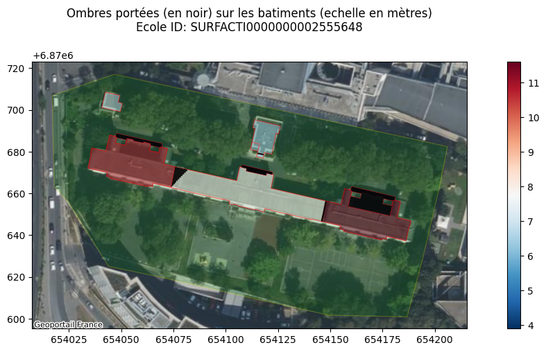
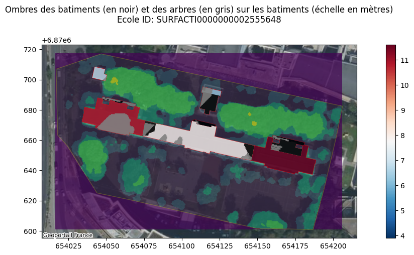

## Analyse d'ombre sur un établissement de St denis


```python
# Autoreload des modules
%load_ext autoreload
%autoreload 2
```

### Imports


```python
import geopandas as gpd
import matplotlib.pyplot as plt
import contextily as cx
from pathlib import Path
from shapely import Polygon
import pandas as pd
import os, rasterio
from rasterio.plot import show
from potentiel_solaire.features.ombres import getBatimentsEcoles, getOmbre, getBatiments
```


```python
import warnings
warnings.filterwarnings('ignore') 
```


```python
# Executer ci dessous ci besoin pour récupérer les données
# !extract-sample-data
# Et pour sauver une version markdown des notebooks, utiliser
# jupyter nbconvert donnees_par_ecole.ipynb --to markdown --output-dir=exports/
```

### Chargement des Bâtiments et Zones Éducatives


```python
DATA_FOLDER = Path("../data")

saint_denis_path = DATA_FOLDER / "saint_denis_reference_data.gpkg"

ecoles = gpd.read_file(saint_denis_path, layer="bdtopo_education").to_crs(2154)
batiments = gpd.read_file(saint_denis_path, layer="bdtopo_batiment").to_crs(2154)
```

# Création des ombres


```python
# On charge les couches
ecoles = gpd.read_file(saint_denis_path, layer="bdtopo_education").to_crs(2154)
batiments = gpd.read_file(saint_denis_path, layer="bdtopo_batiment").to_crs(2154)
```


```python
# Choix d'une école
ID = "SURFACTI0000000002555648"
```


```python
# Capture des batiments proches
batiments_ecole, ecole_cible, zone = getBatimentsEcoles(ID, ecoles, batiments)
batiments_proches = getBatiments(ID, ecoles, batiments, rayon = 100)
# Et on créé les ombres
ombres = getOmbre(batiments_ecole, batiments_proches)
```


```python
# Et on représente les ombres
fig, ax = plt.subplots(figsize=(15,5))
ecole_cible.plot(ax=ax, alpha=0.2, color ="green", edgecolor='yellow')
batiments_ecole.plot(ax=ax, alpha=0.6, linewidth=1,facecolor="none", edgecolor='red', label="batiments")
batiments_ecole.plot(ax=ax, alpha=0.5,column="hauteur",legend=True,figsize=(15,5),cmap="RdBu_r")
ombres.plot(ax=ax, alpha=0.9, color ="black")
ax.set_title("Ombres portées (en noir) sur les batiments (echelle en mètres)\nEcole ID: "+ID+"\n") 
cx.add_basemap(ax, crs=ecole_cible.crs, source=cx.providers.GeoportailFrance.orthos )
fig.show()
```


    

    


# Essayons maintenant avec une date heure


```python
import ephem
from datetime import datetime
import math

def get_sun_position(latitude, longitude, date, hour):
    """
    Calculate sun's position (altitude and azimuth) for given coordinates, date and hour
    
    Args:
        latitude (float): Latitude in degrees (-90 to 90)
        longitude (float): Longitude in degrees (-180 to 180)
        date (str): Date in format 'YYYY-MM-DD'
        hour (int): Hour of the day (0-23)
    
    Returns:
        tuple: (altitude in degrees, azimuth in degrees)
    """
    # Create observer object
    observer = ephem.Observer()
    observer.lat = str(latitude)
    observer.lon = str(longitude)
    
    # Parse the date string and set the specified hour
    specified_date = datetime.strptime(date, '%Y-%m-%d')
    specified_date = specified_date.replace(hour=hour, minute=0, second=0)
    observer.date = specified_date
    
    # Calculate sun's position
    sun = ephem.Sun()
    sun.compute(observer)
    
    # Convert altitude and azimuth to degrees
    altitude = math.degrees(sun.alt)
    azimuth = math.degrees(sun.az)
    
    return altitude, azimuth
```


```python
import geopandas as gpd
from shapely.affinity import translate
from shapely.ops import unary_union
from shapely import intersection
import numpy as np
```


```python
a, b= get_sun_position(42, 3, "2024-06-21", 12)
a,b 
```


    (71.32316440778013, 187.2342545098887)


```python

def getOmbreUnitaire(ombres_potentielles, h, i, shape_batiment, resolution=10):
    # @TODO: Docstring à écrire
    saisons = {
        "hiver": "2024-12-21",       # Soleil bas en hiver (21 décembre)
        "printemps": "2024-03-21",   # Équinoxe (21 mars)
        "été": "2024-06-21",         # Soleil haut en été (21 juin)
        "automne": "2024-09-21"      # Équinoxe (21 septembre)
    }

    jours_cles = list(saisons.keys())

    # Heures à considérer
    heures = [10,12,14,16]
    # @TODO à tweaker
    POS = [43,2]
    
    ombre_totale = []
    for _, saison in enumerate(jours_cles):
        for heure in heures:
            X, Y = get_sun_position(POS[0], POS[1], saisons[saison], heure)
            X = np.radians(X)
            Y = np.radians(Y-180)            
            for _, row in ombres_potentielles.iterrows():
                hauteur_relative = row["hauteur"] - h
                distance_ombre = hauteur_relative / np.tan(X)
                deplacement_x = distance_ombre * np.sin(Y)
                deplacement_y = distance_ombre * np.cos(Y)
                ombre_projetee = []
                for r in range(resolution+1):
                    ombre_projetee.append(translate(row["geometry"], xoff=r*deplacement_x/resolution, yoff=r*deplacement_y/resolution))
                ombre_projetee = unary_union(ombre_projetee)
                ombrage = intersection(ombre_projetee,shape_batiment) # ombre_projetee shape_batiment
                ombre_totale.append(ombrage)
    ombre_totale = unary_union(ombre_totale)
    return ombre_totale

def getOmbre(batiments_ecole, batiments_hauts):
    ombres = []
    for _, row in batiments_ecole.iterrows():
        h = row["hauteur"]
        i = row["cleabs_left__bat"]
        shape_batiment = row["geometry"]
        ombres_potentielles = batiments_hauts[(batiments_hauts.hauteur > h)]
        ombres_potentielles_shapes = getOmbreUnitaire(ombres_potentielles, h, i, shape_batiment,resolution=10)
        if not ombres_potentielles_shapes.is_empty:
            ombres.append(ombres_potentielles_shapes)
    ombres = unary_union(ombres)
    ombres = gpd.GeoDataFrame(geometry=[ombres], crs=2154)
    ombres["geometries"] = ombres.apply(lambda x: [g for g in x.geometry.geoms], axis=1)
    ombres = ombres.explode(column="geometries").drop(columns="geometry").set_geometry("geometries").rename_geometry("geometry").reset_index(drop=True)
    return ombres
```


```python
ombres = getOmbre(batiments_ecole, batiments_proches)
```


```python
# Et on représente les ombres
fig, ax = plt.subplots(figsize=(15,5))
ecole_cible.plot(ax=ax, alpha=0.2, color ="green", edgecolor='yellow')
batiments_ecole.plot(ax=ax, alpha=0.6, linewidth=1,facecolor="none", edgecolor='red', label="batiments")
batiments_ecole.plot(ax=ax, alpha=0.8,column="hauteur",legend=True,figsize=(15,5),cmap="RdBu_r")
ombres.plot(ax=ax, alpha=0.9, color ="black")
ax.set_title("Ombres portées (en noir) sur les batiments (échelle en mètres)\nEcole ID: "+ID+"\n") 
cx.add_basemap(ax, crs=ecole_cible.crs, source=cx.providers.GeoportailFrance.orthos )
fig.show()
```


    

    


# Exploration des ombres des arbres

On commence par calibrer hauteur de la BD TOPO vs hauteur donnée dans les MNS


```python
batiments_ecole = batiments_ecole.to_crs(epsg=6933)
batiments_ecole["surface_calculee"] = batiments_ecole.area
batiments_ecole = batiments_ecole.to_crs(epsg=2154)
batiments_pour_calibration = batiments_ecole.sort_values(by="surface_calculee",ascending=False).dropna(subset="hauteur")[["cleabs_left__bat","surface_calculee","hauteur","geometry"]]
batiments_pour_calibration
```


```python
import rasterio.mask
from rasterio.features import shapes
```

On créé un modele de surface autour de l'école.


```python
geotiff_cached = "../data/cache/mns/"+ID+".masked.tif"

with rasterio.open(geotiff_cached) as img:
    out_image, out_transform = rasterio.mask.mask(img, batiments_pour_calibration[0:1].geometry, crop=True)
    out_meta = img.meta
offset_hauteur = batiments_pour_calibration[0:1].hauteur.iloc[0] - np.mean(out_image[np.nonzero(out_image)])
print("* Hauteur cf data Batiment ecole:\t", batiments_pour_calibration[0:1].hauteur.iloc[0])
print("* Hauteur cf data MNS:\t", np.mean(out_image[np.nonzero(out_image)]))
print("* Offset:\t",offset_hauteur)
geome = ecole_cible.geometry.total_bounds
A = "0"+str(int(geome[0]//1000))
B = str(int(geome[1]//1000)+1)
tile = "/MNS-Correl_1-0__TIFF_LAMB93_D093_2024-01-01/MNS-Correl/1_DONNEES_LIVRAISON_2024-11-00179/MNS-C_0M50_TIF_LAMB93_D93-2024/93-2024-"+A+"-"+B+"-LA93-0M50.tif"
path = DATA_FOLDER / tile
with rasterio.open("../data/"+str(path)) as img:
    out_image, out_transform = rasterio.mask.mask(img, ecole_cible.geometry, crop=True)
    out_meta = img.meta

out_meta.update({"driver": "GTiff",
                "height": out_image.shape[1],
                "width": out_image.shape[2],
                "transform": out_transform})

with rasterio.open("../data/cache/mns/"+ID+".masked.tif", "w", **out_meta) as dest:
    dest.write(out_image)

with rasterio.open("../data/cache/mns/"+ID+".masked.tif") as img:
    out_image, out_transform = rasterio.mask.mask(img, batiments_ecole.geometry, invert=True)
    out_meta = img.meta
out_image = out_image + offset_hauteur
hmin = batiments_pour_calibration.hauteur.min()
out_image = np.where(out_image<hmin*1.05, 0, out_image)

# Essayons d'avoir 3 couches de hauteur
steps = 3
processed = out_image - hmin
hmax = np.max(processed)
G = hmax/steps
OUT = (((processed+G+1)//G)*G)-G+hmin
OUT = np.where(OUT<0, 0, OUT)
plt.imshow(OUT[0])

out_meta.update({"driver": "GTiff",
                "height": OUT.shape[1],
                "width": OUT.shape[2],
                "transform": out_transform})

with rasterio.open("../data/cache/mns/"+ID+".nobats_masked.tif", "w", **out_meta) as dest:
    dest.write(OUT)

with rasterio.open("../data/cache/mns/"+ID+".nobats_masked.tif") as src:
    image = src.read(1)
    imgtoshow = src.read()

img_arbres = rasterio.open("../data/cache/mns/"+ID+".nobats_masked.tif")
```

    * Hauteur cf data Batiment ecole:	 7.9
    * Hauteur cf data MNS:	 41.835487
    * Offset:	 -33.93548736572266


    

    


On créée ensuite les formes des arbres


```python
ombres_mns = []
mask = image != 0
results = (
            {'properties': {'raster_val': v}, 'geometry': s}
            for i, (s, v)
            in enumerate(
                shapes(image, mask=mask, transform=src.transform)))
for x in results:
    #print(x)
    ombres_mns.append([x["properties"]["raster_val"], Polygon(x["geometry"]["coordinates"][0]) ])
df = pd.DataFrame(ombres_mns,columns = ["hauteur","geometry"])
gdf = gpd.GeoDataFrame(df,geometry="geometry",crs = ecole_cible.crs)
gdf
```


<div>
<style scoped>
    .dataframe tbody tr th:only-of-type {
        vertical-align: middle;
    }

    .dataframe tbody tr th {
        vertical-align: top;
    }

    .dataframe thead th {
        text-align: right;
    }
</style>
<table border="1" class="dataframe">
  <thead>
    <tr style="text-align: right;">
      <th></th>
      <th>hauteur</th>
      <th>geometry</th>
    </tr>
  </thead>
  <tbody>
    <tr>
      <th>0</th>
      <td>3.900000</td>
      <td>POLYGON ((654060 6870709, 654060 6870708.5, 65...</td>
    </tr>
    <tr>
      <th>1</th>
      <td>10.701257</td>
      <td>POLYGON ((654058.5 6870708.5, 654058.5 6870708...</td>
    </tr>
    <tr>
      <th>2</th>
      <td>10.701257</td>
      <td>POLYGON ((654060.5 6870708.5, 654060.5 6870708...</td>
    </tr>
    <tr>
      <th>3</th>
      <td>3.900000</td>
      <td>POLYGON ((654061 6870708.5, 654061 6870708, 65...</td>
    </tr>
    <tr>
      <th>4</th>
      <td>10.701257</td>
      <td>POLYGON ((654062.5 6870708, 654062.5 6870707.5...</td>
    </tr>
    <tr>
      <th>...</th>
      <td>...</td>
      <td>...</td>
    </tr>
    <tr>
      <th>337</th>
      <td>17.502514</td>
      <td>POLYGON ((654156.5 6870607, 654156.5 6870605.5...</td>
    </tr>
    <tr>
      <th>338</th>
      <td>10.701257</td>
      <td>POLYGON ((654153 6870613, 654153 6870612.5, 65...</td>
    </tr>
    <tr>
      <th>339</th>
      <td>3.900000</td>
      <td>POLYGON ((654169 6870602, 654169 6870601.5, 65...</td>
    </tr>
    <tr>
      <th>340</th>
      <td>3.900000</td>
      <td>POLYGON ((654179 6870610.5, 654179 6870610, 65...</td>
    </tr>
    <tr>
      <th>341</th>
      <td>10.701257</td>
      <td>POLYGON ((654192.5 6870626, 654192.5 6870625.5...</td>
    </tr>
  </tbody>
</table>
<p>342 rows × 2 columns</p>
</div>


On réutilise ici la fonction 'getOmbre' avant en passant plutot la forme des arbres (plutot que des batiments)


```python
ombres_bis = getOmbre(batiments_ecole, gdf)
```


```python
# Et on représente les ombres
fig, ax = plt.subplots(figsize=(15,5))
ecole_cible.plot(ax=ax, alpha=0.2, color ="green", edgecolor='yellow')
cx.add_basemap(ax, crs=ecole_cible.crs, source=cx.providers.GeoportailFrance.orthos )
show(img_arbres, ax=ax, alpha=0.7)
batiments_ecole.plot(ax=ax, alpha=0.6, linewidth=1,facecolor="none", edgecolor='red', label="batiments")
batiments_ecole.plot(ax=ax, alpha=0.8,column="hauteur",legend=True,figsize=(15,5),cmap="RdBu_r")
ombres.plot(ax=ax, alpha=0.9, color ="black")
ombres_bis.plot(ax=ax, alpha=0.9, color ="grey")
ax.set_title("Ombres des batiments (en noir) et des arbres (en gris) sur les batiments (échelle en mètres)\nEcole ID: "+ID+"\n") 
fig.show()
```


    

    

