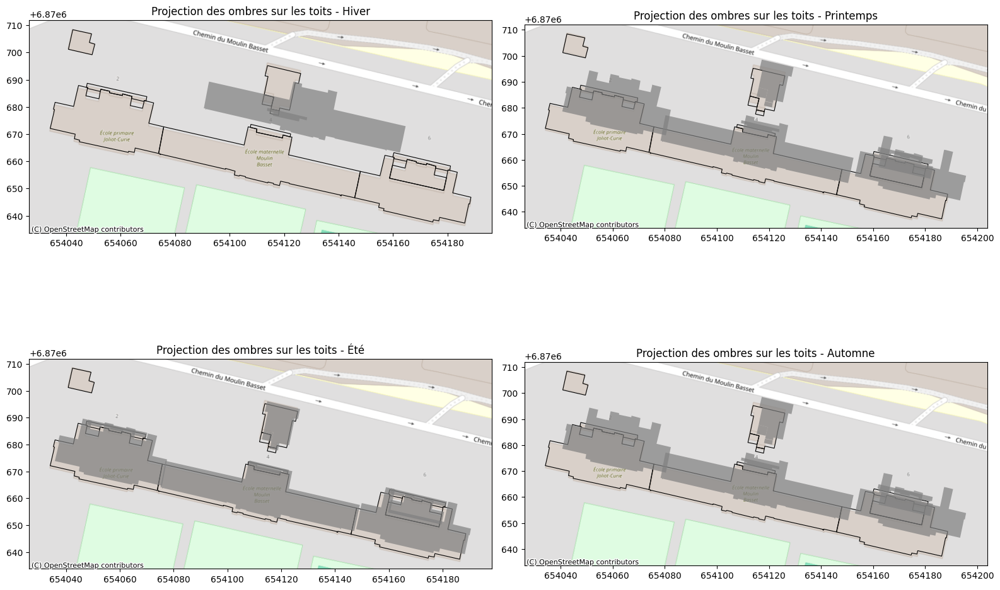
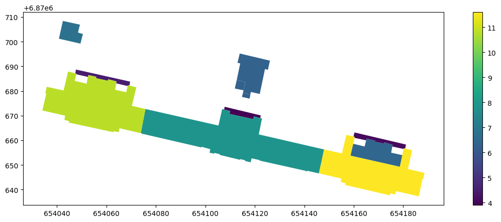
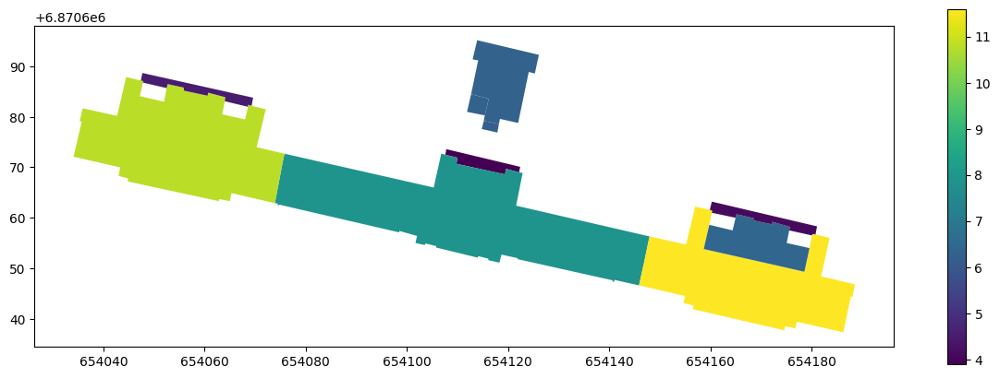

## Analyse d'ombre sur un établissement de St denis

### Imports


```python
import geopandas as gpd
import pandas as pd
import matplotlib.pyplot as plt
import contextily as cx
from shapely.affinity import translate
from shapely.ops import unary_union
from shapely import intersection
from pathlib import Path
import numpy as np
```


```python
import warnings
warnings.filterwarnings('ignore') 
```

### Chargement des Bâtiments et Zones Éducatives


```python
DATA_FOLDER = Path("../data")

saint_denis_path = DATA_FOLDER / "saint_denis_reference_data.gpkg"

ecoles = gpd.read_file(saint_denis_path, layer="bdtopo_education").to_crs(2154)
batiments = gpd.read_file(saint_denis_path, layer="bdtopo_batiment").to_crs(2154)
```

### Préparation des données pour l'analyse des ombres


```python

ecole_cible = ecoles.iloc[[6]]  # On prend la 6ème école par exemple

#Vérification de la hauteur 
if "hauteur" in batiments.columns:
    hauteur_ecole = batiments.loc[batiments["cleabs_right__bat"] == ecole_cible["cleabs_right"].iloc[0], "hauteur"]
    if not hauteur_ecole.empty:
        hauteur_ecole = float(hauteur_ecole.iloc[0])
    else:
        raise ValueError("None")
else:
    raise KeyError("None")


batiments["distance"] = batiments.geometry.distance(ecole_cible.geometry.iloc[0])

rayon = 100  #rayon de 100m
batiments_voisins = batiments[batiments["distance"] < rayon].copy()

batiments_voisins["hauteur"] = pd.to_numeric(batiments_voisins["hauteur"], errors="coerce")

batiments_plus_hauts = batiments_voisins[batiments_voisins["hauteur"] > hauteur_ecole]
```

### Calcul de l'ombre projetée en fonction des 4 jours clés


```python

saisons = {
    "hiver": 15,       # Soleil bas en hiver (21 décembre)
    "printemps": 45,   # Équinoxe (21 mars)
    "été": 75,         # Soleil haut en été (21 juin)
    "automne": 45      # Équinoxe (21 septembre)
}

jours_cles = ["hiver", "printemps", "été", "automne"]
```

### Visualisation comprenant les ombres des bâtiment voisins sur les toits (non sur le sol)


```python

fig, axes = plt.subplots(2, 2, figsize=(16, 12))
axes = axes.flatten()

for i, saison in enumerate(jours_cles):
    angle_solaire = np.radians(saisons[saison])
    ombres_toit = []
    
    for _, row in batiments_plus_hauts.iterrows():
        hauteur_relative = row["hauteur"] - hauteur_ecole
        distance_ombre = hauteur_relative / np.tan(angle_solaire)
        
        
        deplacement_x = distance_ombre * np.cos(np.radians(45))
        deplacement_y = distance_ombre * np.sin(np.radians(45))
        ombre_projetee = translate(row["geometry"], xoff=deplacement_x, yoff=deplacement_y)
        
        
        instn = batiments_voisins.intersects(ombre_projetee)
        if instn.any():
            ombres_toit.append(ombre_projetee)
    
    ombre_toit_gdf = gpd.GeoDataFrame(geometry=ombres_toit, crs=2154)
    
    batiments_voisins.plot(ax=axes[i], color="none", edgecolor="black", linewidth=0.8)
    ombre_toit_gdf.plot(ax=axes[i], color="grey", alpha=0.7, label=f"Ombres sur toits - {saison}")
    cx.add_basemap(axes[i], crs=batiments_voisins.crs, source=cx.providers.OpenStreetMap.Mapnik)
    axes[i].set_title(f"Projection des ombres sur les toits - {saison.capitalize()}")

plt.tight_layout()
plt.show()

```


    

    


# Proposition d'ajustement


```python
ecoles = gpd.read_file(saint_denis_path, layer="bdtopo_education").to_crs(2154)
batiments = gpd.read_file(saint_denis_path, layer="bdtopo_batiment").to_crs(2154)
ecole_cible = ecoles.iloc[[6]]  # On prend la 6ème école par exemple
id = ecole_cible["cleabs_left"].iloc[0] # id de la surface
zone = ecole_cible["geometry"].iloc[0]
print(id)
```

    SURFACTI0000000002555648


```python
batiments_ecole = batiments[batiments.within(zone)]
hauteur_moyenne = batiments_ecole['hauteur'].mean() 
if hauteur_moyenne > 0:
    batiments_ecole.fillna(value=hauteur_moyenne, inplace=True) 
else:
    raise KeyError("None")

batiments_ecole.plot(column="hauteur",legend=True,figsize=(15,5))
```


    <Axes: >


    

    


@TODO: les batiments proches peuvent etre des batiments qui ne sont pas du fichier écoles. Ici, ne sont pas pris en compte les batiments autres que zone éducative, il faudrait donc élargir la recherche à la BDD bâtiments initiale.

Par conséquent, le travail sur les ombres va être fait sur uniquement les batiments de l'école qui font de l'ombre aux autres batiments de l'école.


```python
batiments_proches = batiments[batiments.within(zone.buffer(100))]
batiments_proches.plot(column="hauteur",legend=True,figsize=(15,5))
```


    <Axes: >


    

    


```python
def getOmbre(ombres_potentielles, h, shape_batiment,resolution=10):
    ombres_toit = []
    for i, saison in enumerate(jours_cles):
        angle_solaire = np.radians(saisons[saison])
        for _, row in ombres_potentielles.iterrows():
            hauteur_relative = row["hauteur"] - h
            distance_ombre = hauteur_relative / np.tan(angle_solaire)

            # @TODO: pourquoi hardcoder 45 ci-dessous?
            deplacement_x = distance_ombre * np.cos(np.radians(45))
            deplacement_y = distance_ombre * np.sin(np.radians(45))
            ombre_projetee = []
            for r in range(resolution+1):
                ombre_projetee.append(translate(row["geometry"], xoff=r*deplacement_x/resolution, yoff=r*deplacement_y/resolution))
            ombre_projetee = unary_union(ombre_projetee)
            ombrage = intersection(shape_batiment,ombre_projetee)
            ombres_toit.append(ombrage)
    ombres_toit = unary_union(ombres_toit)

    return ombres_toit
```


```python
ombres = []
for ix, row in batiments_ecole.iterrows():
    h = row["hauteur"]
    i = row["cleabs_left__bat"]
    shape_batiment = row["geometry"]
    ombres_potentielles = batiments_ecole[(batiments_ecole.hauteur > h)]
    ombres_potentielles_shapes = getOmbre(ombres_potentielles, h, shape_batiment,resolution=10)
    if not ombres_potentielles_shapes.is_empty:
        ombres.append(ombres_potentielles_shapes)    
ombres = unary_union(ombres)
ombres = gpd.GeoDataFrame(geometry=[ombres], crs=2154)
ombres["geometries"] = ombres.apply(lambda x: [g for g in x.geometry.geoms], axis=1)
ombres = ombres.explode(column="geometries").drop(columns="geometry").set_geometry("geometries").rename_geometry("geometry")
```


```python
fig, ax = plt.subplots(figsize=(15,5))

ecole_cible.plot(ax=ax, alpha=0.2, color ="green", edgecolor='yellow')
batiments_ecole.plot(ax=ax, alpha=0.6, linewidth=1,facecolor="none", edgecolor='red', label="batiments")
batiments_ecole.plot(ax=ax, alpha=0.5,column="hauteur",legend=True,figsize=(15,5),cmap="RdBu_r")
ombres.plot(ax=ax, alpha=0.9, color ="black")
ax.set_title("Ombres portées (en noir) sur les batiments (echelle en mètres)\nEcole ID: "+id+"\n") 
cx.add_basemap(ax, crs=ecole_cible.crs, source=cx.providers.GeoportailFrance.orthos )
fig.show()
```


    

    

