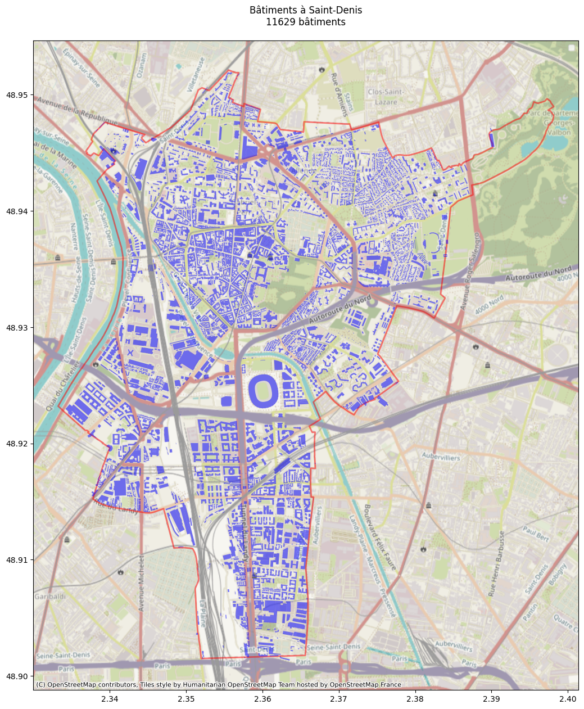
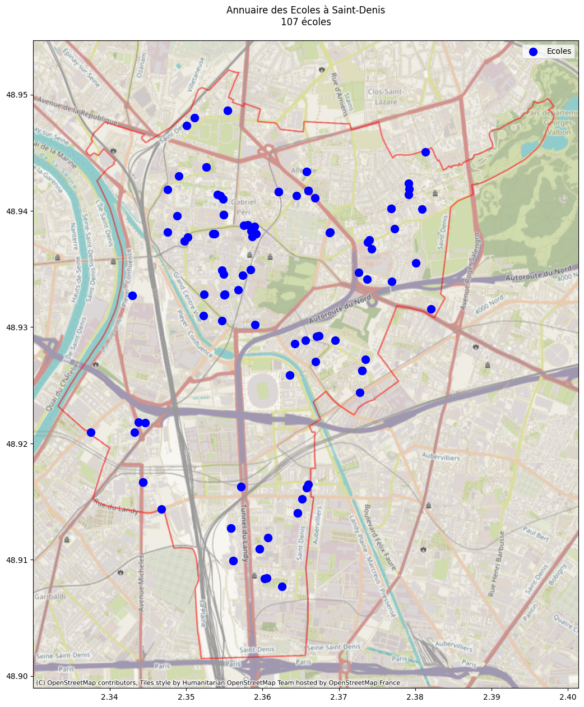
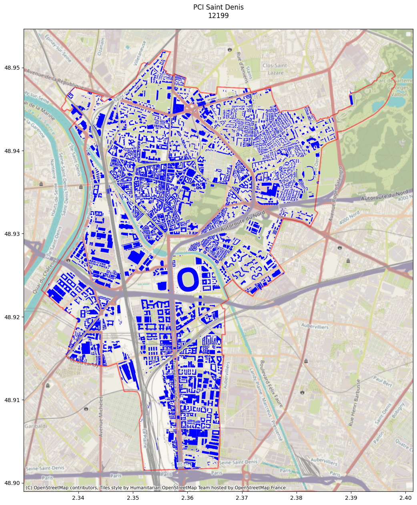
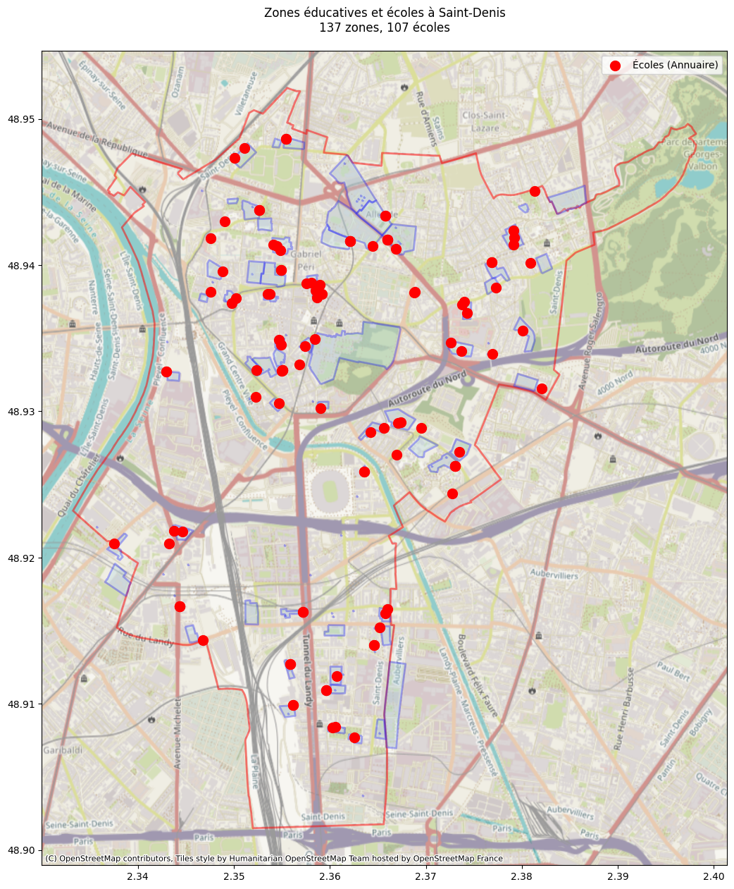
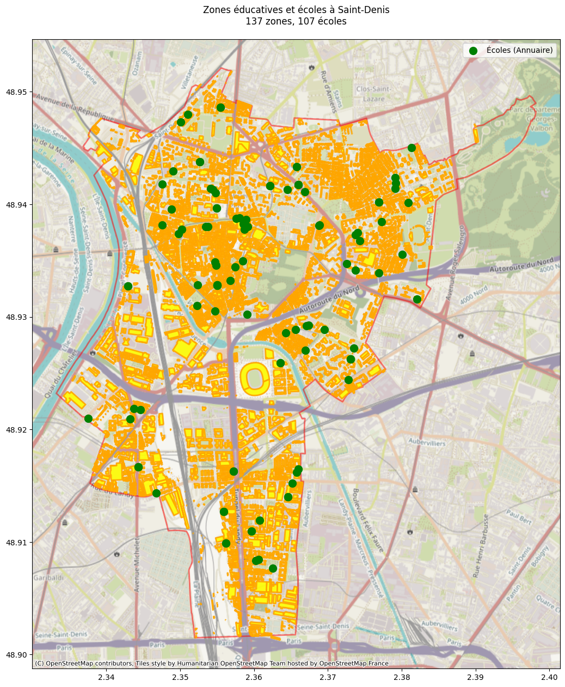
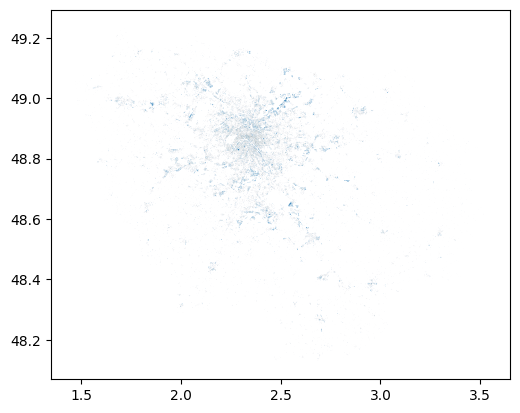
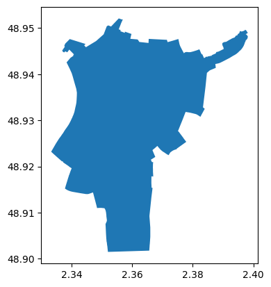
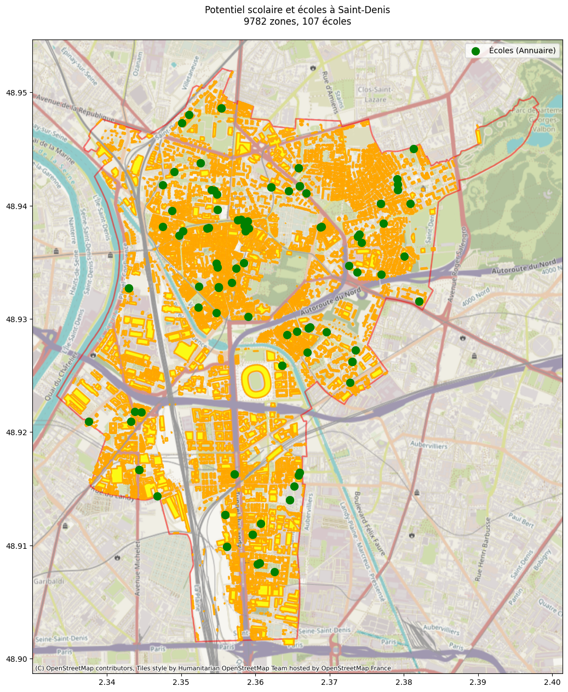
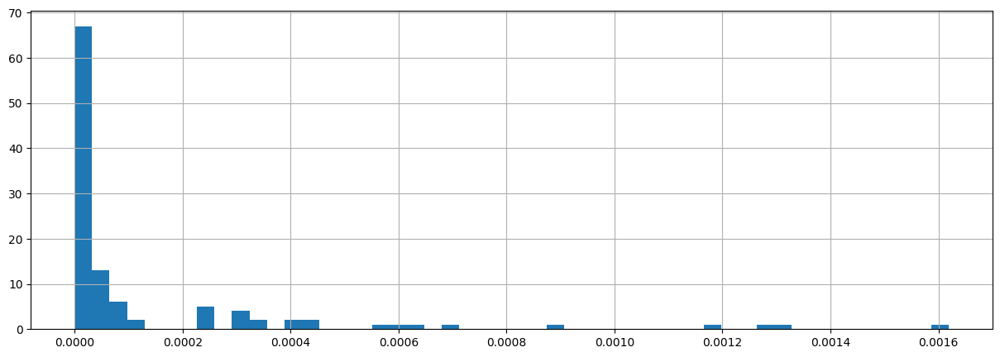
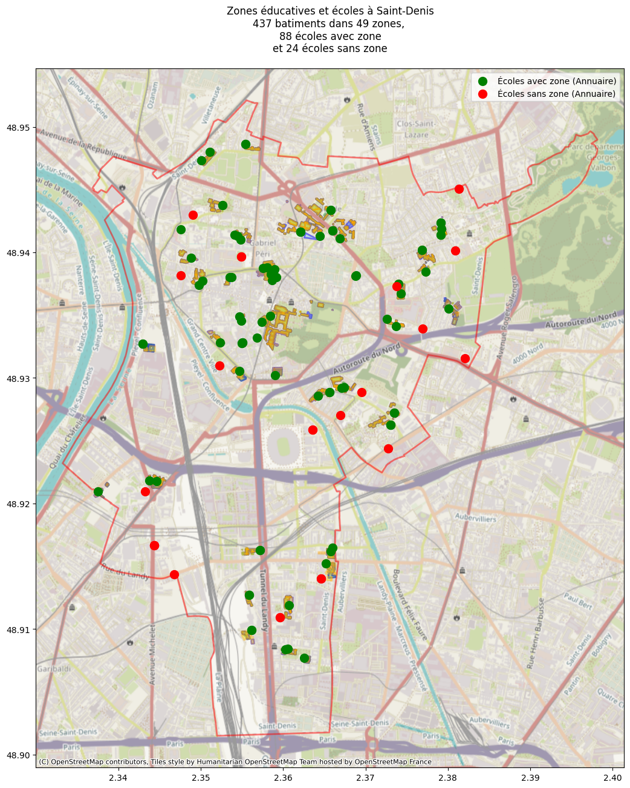

```python
import geopandas as gpd
from pathlib import Path
import matplotlib.pyplot as plt
import contextily as cx
import fiona

# Potentiel solaire package
from potentiel_solaire.constants import DATA_FOLDER
```


```python
657070112 / (657070112 + 868979549)
```


    0.4305692853857919


```python
# Executer ci dessous ci besoin pour récupérer les données
# !extract-sample-data
# Et pour sauver une version markdown des notebooks, utiliser
# jupyter nbconvert donnees_par_ecole.ipynb --to markdown --output-dir=exports/
```

    2025-02-15 15:52:42,311 - INFO - root - /home/kelu/projets/13_potentiel_solaire/algorithme/potentiel_solaire/extract_sample_data.py - main - GPKG file potentiel-solaire.gpkg already exists, skipping conversion.
    2025-02-15 15:52:42,311 - INFO - root - /home/kelu/projets/13_potentiel_solaire/algorithme/potentiel_solaire/extract_sample_data.py - main - GPKG file potentiel-gisement-solaire-brut-au-bati.gpkg already exists, skipping conversion.
    2025-02-15 15:52:42,312 - INFO - root - /home/kelu/projets/13_potentiel_solaire/algorithme/potentiel_solaire/extract_sample_data.py - main - Folder for BDTOPO_3-4_TOUSTHEMES_GPKG_LAMB93_D093_2024-12-15.7z already exists, skipping download and extraction.
    2025-02-15 15:52:42,312 - INFO - root - /home/kelu/projets/13_potentiel_solaire/algorithme/potentiel_solaire/extract_sample_data.py - main - Folder for PARCELLAIRE-EXPRESS_1-1__SHP_LAMB93_D093_2024-10-01.7z already exists, skipping download and extraction.
    2025-02-15 15:52:42,312 - INFO - root - /home/kelu/projets/13_potentiel_solaire/algorithme/potentiel_solaire/extract_sample_data.py - download_file - ENR_1-0_POT-SOL-SOL_GPKG_LAMB93_FXX_2024-04-01.7z already exists, skipping download.
    2025-02-15 15:52:42,312 - INFO - root - /home/kelu/projets/13_potentiel_solaire/algorithme/potentiel_solaire/extract_sample_data.py - extract_7z - Extracting ENR_1-0_POT-SOL-SOL_GPKG_LAMB93_FXX_2024-04-01.7z...
    2025-02-15 16:00:15,532 - INFO - root - /home/kelu/projets/13_potentiel_solaire/algorithme/potentiel_solaire/extract_sample_data.py - extract_7z - Extracted ENR_1-0_POT-SOL-SOL_GPKG_LAMB93_FXX_2024-04-01.7z
    2025-02-15 16:00:16,175 - INFO - root - /home/kelu/projets/13_potentiel_solaire/algorithme/potentiel_solaire/extract_sample_data.py - delete_7z - Deleted ENR_1-0_POT-SOL-SOL_GPKG_LAMB93_FXX_2024-04-01.7z
    2025-02-15 16:00:16,176 - INFO - root - /home/kelu/projets/13_potentiel_solaire/algorithme/potentiel_solaire/extract_sample_data.py - main - Folder for MNS-Correl_1-0__TIFF_LAMB93_D093_2024-01-01.7z already exists, skipping download and extraction.


## BDTOPO

### Extraction 


```python
GPKG = DATA_FOLDER / "BDTOPO_3-4_TOUSTHEMES_GPKG_LAMB93_D093_2024-12-15/BDTOPO/1_DONNEES_LIVRAISON_2024-12-00134/BDT_3-4_GPKG_LAMB93_D093-ED2024-12-15/BDT_3-4_GPKG_LAMB93_D093-ED2024-12-15.gpkg"
communes = gpd.read_file(GPKG, layer="commune")

# on crée la var qui nous servira de filtre sur les autres db
saint_denis = communes[communes.code_insee == "93066"].to_crs(4326)
```


```python
# Takes 50s on my laptop 

# 1. Bâtiments
bats = gpd.read_file(GPKG, layer="batiment")
bats = bats.to_crs(4326)
#TODO: confirm use of intersect (instead of within) with Luc or else
bats_st_denis = gpd.sjoin(bats, saint_denis, how='inner', predicate='intersects')

# 2. Zones d'éducation
bdedu = gpd.read_file(GPKG, layer="zone_d_activite_ou_d_interet")
bdedu = bdedu.to_crs(4326)
bdedu = bdedu[bdedu["categorie"] == "Science et enseignement"]
bdedu_st_denis = gpd.sjoin(bdedu, saint_denis, how='inner', predicate='intersects')
```

### Visualisation


```python
# 1. Plot des bâtiments
fig1, ax1 = plt.subplots(figsize=(15, 15))
saint_denis.plot(ax=ax1, facecolor='none', edgecolor='red', linewidth=2, alpha=0.5, label='Saint-Denis')
bats_st_denis.plot(ax=ax1, color='blue', alpha=0.5, label='Bâtiments')
cx.add_basemap(ax1, crs=bats_st_denis.crs, zoom=14)
ax1.set_title(f"Bâtiments à Saint-Denis\n{len(bats_st_denis)} bâtiments", pad=20)
ax1.legend()
plt.show()
```

    /tmp/ipykernel_280992/559999521.py:7: UserWarning: Legend does not support handles for PatchCollection instances.
    See: https://matplotlib.org/stable/tutorials/intermediate/legend_guide.html#implementing-a-custom-legend-handler
      ax1.legend()
    /tmp/ipykernel_280992/559999521.py:7: UserWarning: No artists with labels found to put in legend.  Note that artists whose label start with an underscore are ignored when legend() is called with no argument.
      ax1.legend()


    

    


```python
# 2. Plot des zones d'éducation
fig2, ax2 = plt.subplots(figsize=(15, 15))
saint_denis.plot(ax=ax2, facecolor='none', edgecolor='red', linewidth=2, alpha=0.5, label='Saint-Denis')
bdedu_st_denis.plot(ax=ax2, facecolor='blue', alpha=0.3, edgecolor='blue', linewidth=2, label='Zones éducatives')
cx.add_basemap(ax2, crs=bdedu_st_denis.crs, zoom=14)
ax2.set_title(f"Zones d'éducation à Saint-Denis\n{len(bdedu_st_denis)} zones", pad=20)
ax2.legend()
plt.show()
```

    /tmp/ipykernel_280992/1857609020.py:7: UserWarning: Legend does not support handles for PatchCollection instances.
    See: https://matplotlib.org/stable/tutorials/intermediate/legend_guide.html#implementing-a-custom-legend-handler
      ax2.legend()
    /tmp/ipykernel_280992/1857609020.py:7: UserWarning: No artists with labels found to put in legend.  Note that artists whose label start with an underscore are ignored when legend() is called with no argument.
      ax2.legend()


    

    


## Annuaire éducation

### Extraction 


```python
# Takes 12s on my laptop 

annuaire = gpd.read_file(DATA_FOLDER / 'fr-en-annuaire-education.geojson')
annuaire = annuaire.to_crs(4326)
annuaire_st_denis = gpd.sjoin(annuaire, saint_denis, how='inner', predicate='within')
```

### Visualisation


```python
fig, ax = plt.subplots(figsize=(15, 15))
saint_denis.plot(ax=ax, facecolor='none', edgecolor='red', linewidth=2, alpha=0.5, label='Saint-Denis')
annuaire_st_denis.plot(ax=ax, color='blue', markersize=100, label='Ecoles')

cx.add_basemap(ax, crs=annuaire_st_denis.crs, zoom=14)
ax.set_title(f"Annuaire des Ecoles à Saint-Denis\n{len(annuaire_st_denis)} écoles", pad=20)
ax.legend()
plt.show()
```

    /tmp/ipykernel_280992/1613889881.py:7: UserWarning: Legend does not support handles for PatchCollection instances.
    See: https://matplotlib.org/stable/tutorials/intermediate/legend_guide.html#implementing-a-custom-legend-handler
      ax.legend()


    

    


## Plan Cadastral Informatisé (PCI)

### Extraction 


```python
# Takes 10s on my laptop

pci = gpd.read_file(DATA_FOLDER / "PARCELLAIRE-EXPRESS_1-1__SHP_LAMB93_D093_2024-10-01/PARCELLAIRE-EXPRESS/1_DONNEES_LIVRAISON_2024-11-00210/PEPCI_1-1_SHP_LAMB93_D093/BATIMENT.SHP")

pci = pci.to_crs(4326)
pci_st_denis = gpd.sjoin(pci, saint_denis, how='inner', predicate='intersects')
```

### Visualisation 


```python
fig, ax = plt.subplots(figsize=(15, 15))
saint_denis.plot(ax=ax, facecolor='none', edgecolor='red', linewidth=2, alpha=0.5, label='Saint-Denis')
pci_st_denis.plot(ax=ax, color='blue', label='Ecoles')

cx.add_basemap(ax, crs=pci_st_denis.crs, zoom=14)
ax.set_title(f"PCI Saint Denis\n{len(pci_st_denis)}", pad=20)
ax.legend()
plt.show()
```

    /tmp/ipykernel_280992/793451477.py:7: UserWarning: Legend does not support handles for PatchCollection instances.
    See: https://matplotlib.org/stable/tutorials/intermediate/legend_guide.html#implementing-a-custom-legend-handler
      ax.legend()
    /tmp/ipykernel_280992/793451477.py:7: UserWarning: No artists with labels found to put in legend.  Note that artists whose label start with an underscore are ignored when legend() is called with no argument.
      ax.legend()


    

    


## Visualisation des écoles selon la bd topo vs selon l'annuaire 


```python

fig, ax = plt.subplots(figsize=(15, 15))

# 1. la limite de Saint-Denis (en fond)
saint_denis.plot(
    ax=ax, 
    facecolor='none', 
    edgecolor='red', 
    linewidth=2, 
    alpha=0.5, 
    label='Saint-Denis'
)

# 2. les zones d'éducation de la BD TOPO (en dessous)
bdedu_st_denis.plot(
    ax=ax, 
    facecolor='lightblue', 
    alpha=0.3, 
    edgecolor='blue', 
    linewidth=2, 
    label='Zones éducatives (BD TOPO)'
)

# 3. les points de l'annuaire (au-dessus)
annuaire_st_denis.plot(
    ax=ax,
    color='red',
    markersize=100,
    label='Écoles (Annuaire)'
)

cx.add_basemap(ax, crs=bdedu_st_denis.crs, zoom=14)
ax.set_title(f"Zones éducatives et écoles à Saint-Denis\n"
             f"{len(bdedu_st_denis)} zones, {len(annuaire_st_denis)} écoles", 
             pad=20)
ax.legend()

plt.show()

```

    /tmp/ipykernel_280992/2392975819.py:35: UserWarning: Legend does not support handles for PatchCollection instances.
    See: https://matplotlib.org/stable/tutorials/intermediate/legend_guide.html#implementing-a-custom-legend-handler
      ax.legend()


    

    


## Ajout du Potentiel gisement Solaire brut au bati


```python
GPKG = DATA_FOLDER / "potentiel-gisement-solaire-brut-au-bati.gpkg"
gsbab = gpd.read_file(GPKG)
# There are 1113344 items in it
gsbab.head()
# on crée la var qui nous servira de filtre sur les autres db
#saint_denis = communes[communes.code_insee == "93066"].to_crs(4326)
```


<div>
<style scoped>
    .dataframe tbody tr th:only-of-type {
        vertical-align: middle;
    }

    .dataframe tbody tr th {
        vertical-align: top;
    }

    .dataframe thead th {
        text-align: right;
    }
</style>
<table border="1" class="dataframe">
  <thead>
    <tr style="text-align: right;">
      <th></th>
      <th>geo_point_2d</th>
      <th>geo_shape</th>
      <th>objectid</th>
      <th>n_sq_eb</th>
      <th>n_sq_eb_or</th>
      <th>c_cainsee</th>
      <th>m2_e_in700</th>
      <th>m2_e_70_80</th>
      <th>m2_e_80_90</th>
      <th>m2_e_90_10</th>
      <th>m2_e_s1000</th>
      <th>m2_e_tot</th>
      <th>c_ens_moy</th>
      <th>shape_leng</th>
      <th>shape_area</th>
      <th>geometry</th>
    </tr>
  </thead>
  <tbody>
    <tr>
      <th>0</th>
      <td>{ "lon": 2.4548880156979727, "lat": 48.8032270...</td>
      <td>None</td>
      <td>941001</td>
      <td>940053796.0</td>
      <td>940053796.0</td>
      <td>94028.0</td>
      <td>19</td>
      <td>24</td>
      <td>51</td>
      <td>174</td>
      <td>62</td>
      <td>330</td>
      <td>915.0</td>
      <td>79.598288</td>
      <td>330.772438</td>
      <td>MULTIPOLYGON (((2.4548 48.80311, 2.45479 48.80...</td>
    </tr>
    <tr>
      <th>1</th>
      <td>{ "lon": 2.3915597355600062, "lat": 48.8216005...</td>
      <td>None</td>
      <td>941005</td>
      <td>940209546.0</td>
      <td>940209546.0</td>
      <td>94041.0</td>
      <td>22</td>
      <td>14</td>
      <td>31</td>
      <td>64</td>
      <td>10</td>
      <td>141</td>
      <td>827.0</td>
      <td>63.734072</td>
      <td>142.606878</td>
      <td>MULTIPOLYGON (((2.3915 48.82172, 2.39167 48.82...</td>
    </tr>
    <tr>
      <th>2</th>
      <td>{ "lon": 2.2831803386784282, "lat": 48.9156218...</td>
      <td>None</td>
      <td>941010</td>
      <td>920023539.0</td>
      <td>920023539.0</td>
      <td>92004.0</td>
      <td>144</td>
      <td>60</td>
      <td>51</td>
      <td>25</td>
      <td>18</td>
      <td>298</td>
      <td>679.0</td>
      <td>111.107846</td>
      <td>297.527682</td>
      <td>MULTIPOLYGON (((2.28332 48.91569, 2.28313 48.9...</td>
    </tr>
    <tr>
      <th>3</th>
      <td>{ "lon": 2.5174661645534049, "lat": 48.8068805...</td>
      <td>None</td>
      <td>941016</td>
      <td>940283756.0</td>
      <td>940283756.0</td>
      <td>94068.0</td>
      <td>12</td>
      <td>38</td>
      <td>23</td>
      <td>35</td>
      <td>14</td>
      <td>122</td>
      <td>842.0</td>
      <td>44.113718</td>
      <td>121.386924</td>
      <td>MULTIPOLYGON (((2.51757 48.8069, 2.51751 48.80...</td>
    </tr>
    <tr>
      <th>4</th>
      <td>{ "lon": 2.4498132809153113, "lat": 48.8526403...</td>
      <td>None</td>
      <td>941021</td>
      <td>940066406.0</td>
      <td>940066406.0</td>
      <td>94033.0</td>
      <td>46</td>
      <td>1</td>
      <td>0</td>
      <td>0</td>
      <td>0</td>
      <td>47</td>
      <td>434.0</td>
      <td>35.478160</td>
      <td>46.945389</td>
      <td>MULTIPOLYGON (((2.44981 48.85269, 2.44988 48.8...</td>
    </tr>
  </tbody>
</table>
</div>


```python
#gsbab = gsbab[gsbab.c_cainsee == 93066]
gsbab = gpd.sjoin(gsbab, saint_denis, how='inner', predicate='intersects')
```


```python

fig, ax = plt.subplots(figsize=(15, 15))

# 1. la limite de Saint-Denis (en fond)
saint_denis.plot(
    ax=ax, 
    facecolor='none', 
    edgecolor='red', 
    linewidth=2, 
    alpha=0.5, 
    label='Saint-Denis'
)

# 2. le potentiel brut au bati
gsbab.plot(
    ax=ax, 
    facecolor='yellow', 
    alpha=0.9, 
    edgecolor='orange', 
    linewidth=2, 
    label='Potentiel Solaire Brut au bati'
)

# 3. les points de l'annuaire (au-dessus)
annuaire_st_denis.plot(
    ax=ax,
    color='green',
    markersize=100,
    label='Écoles (Annuaire)'
)

cx.add_basemap(ax, crs=bdedu_st_denis.crs, zoom=14)
ax.set_title(f"Zones éducatives et écoles à Saint-Denis\n"
             f"{len(bdedu_st_denis)} zones, {len(annuaire_st_denis)} écoles", 
             pad=20)
ax.legend()

plt.show()

```

    /tmp/ipykernel_280992/3645091274.py:35: UserWarning: Legend does not support handles for PatchCollection instances.
    See: https://matplotlib.org/stable/tutorials/intermediate/legend_guide.html#implementing-a-custom-legend-handler
      ax.legend()


    

    


## Utilisation de l'autre base de données - Potentiel solaire des toitures

Provenant de https://data-iau-idf.opendata.arcgis.com/datasets/iau-idf::le-potentiel-solaire-des-toitures/explore?location=48.947152%2C2.406292%2C12.00


```python
GPKG = DATA_FOLDER / "potentiel-solaire.geojson"
gspsdt_total = gpd.read_file(GPKG)
print(len(gspsdt_total))
gspsdt_total=  gspsdt_total.to_crs(4326)
# There are 2450931 items in it
gspsdt_total.head()
```

    2450931


<div>
<style scoped>
    .dataframe tbody tr th:only-of-type {
        vertical-align: middle;
    }

    .dataframe tbody tr th {
        vertical-align: top;
    }

    .dataframe thead th {
        text-align: right;
    }
</style>
<table border="1" class="dataframe">
  <thead>
    <tr style="text-align: right;">
      <th></th>
      <th>objectid</th>
      <th>id</th>
      <th>nature</th>
      <th>surf_util</th>
      <th>indic2</th>
      <th>gisement</th>
      <th>eq_pano</th>
      <th>eq_surf</th>
      <th>systeme</th>
      <th>protection</th>
      <th>mos2017</th>
      <th>insee</th>
      <th>moyenne2</th>
      <th>forme</th>
      <th>production</th>
      <th>mos17</th>
      <th>st_areashape</th>
      <th>st_lengthshape</th>
      <th>geometry</th>
    </tr>
  </thead>
  <tbody>
    <tr>
      <th>0</th>
      <td>1</td>
      <td>BATIMENT0000000356480536</td>
      <td>Bâtiment industriel</td>
      <td>382.50</td>
      <td>3</td>
      <td>important</td>
      <td>plus de 50 panneaux</td>
      <td>plus de 115 m2</td>
      <td>thermique ou photovoltaïque</td>
      <td>0</td>
      <td>45.0</td>
      <td>95078.0</td>
      <td>1210.328054</td>
      <td>plat</td>
      <td>42184.047797</td>
      <td>5.0</td>
      <td>609.870</td>
      <td>108.056166</td>
      <td>POLYGON ((2.03865 49.08767, 2.03867 49.08767, ...</td>
    </tr>
    <tr>
      <th>1</th>
      <td>2</td>
      <td>BATIMENT0000000356480545</td>
      <td>Bâtiment industriel</td>
      <td>83.25</td>
      <td>2</td>
      <td>intermédiaire</td>
      <td>10 à 50 panneaux</td>
      <td>entre 20 et 115 m2</td>
      <td>thermique ou photovoltaïque</td>
      <td>0</td>
      <td>45.0</td>
      <td>95078.0</td>
      <td>1197.261665</td>
      <td>Npans</td>
      <td>12199.856914</td>
      <td>5.0</td>
      <td>159.180</td>
      <td>51.796212</td>
      <td>POLYGON ((2.04011 49.08265, 2.04006 49.08257, ...</td>
    </tr>
    <tr>
      <th>2</th>
      <td>3</td>
      <td>BATIMENT0000000356475551</td>
      <td>Bâtiment industriel</td>
      <td>213.75</td>
      <td>3</td>
      <td>important</td>
      <td>plus de 50 panneaux</td>
      <td>plus de 115 m2</td>
      <td>thermique ou photovoltaïque</td>
      <td>1</td>
      <td>45.0</td>
      <td>95211.0</td>
      <td>1204.673158</td>
      <td>plat</td>
      <td>23463.298631</td>
      <td>5.0</td>
      <td>713.220</td>
      <td>115.314199</td>
      <td>POLYGON ((2.1148 49.06608, 2.11477 49.06605, 2...</td>
    </tr>
    <tr>
      <th>3</th>
      <td>4</td>
      <td>BATIMENT0000000317228796</td>
      <td>Bâtiment industriel</td>
      <td>240.75</td>
      <td>3</td>
      <td>important</td>
      <td>plus de 50 panneaux</td>
      <td>plus de 115 m2</td>
      <td>thermique ou photovoltaïque</td>
      <td>1</td>
      <td>45.0</td>
      <td>95211.0</td>
      <td>1243.157793</td>
      <td>toit2pentes</td>
      <td>36633.125213</td>
      <td>5.0</td>
      <td>729.620</td>
      <td>119.633673</td>
      <td>POLYGON ((2.11964 49.06853, 2.11947 49.06864, ...</td>
    </tr>
    <tr>
      <th>4</th>
      <td>5</td>
      <td>BATIMENT0000000003786796</td>
      <td>Bâtiment industriel</td>
      <td>132.75</td>
      <td>3</td>
      <td>important</td>
      <td>plus de 50 panneaux</td>
      <td>plus de 115 m2</td>
      <td>thermique ou photovoltaïque</td>
      <td>1</td>
      <td>45.0</td>
      <td>95370.0</td>
      <td>1210.220040</td>
      <td>plat</td>
      <td>14639.039443</td>
      <td>5.0</td>
      <td>305.425</td>
      <td>74.696097</td>
      <td>POLYGON ((1.97282 49.14438, 1.97277 49.14436, ...</td>
    </tr>
  </tbody>
</table>
</div>


```python
gspsdt_total
```


<div>
<style scoped>
    .dataframe tbody tr th:only-of-type {
        vertical-align: middle;
    }

    .dataframe tbody tr th {
        vertical-align: top;
    }

    .dataframe thead th {
        text-align: right;
    }
</style>
<table border="1" class="dataframe">
  <thead>
    <tr style="text-align: right;">
      <th></th>
      <th>objectid</th>
      <th>id</th>
      <th>nature</th>
      <th>surf_util</th>
      <th>indic2</th>
      <th>gisement</th>
      <th>eq_pano</th>
      <th>eq_surf</th>
      <th>systeme</th>
      <th>protection</th>
      <th>mos2017</th>
      <th>insee</th>
      <th>moyenne2</th>
      <th>forme</th>
      <th>production</th>
      <th>mos17</th>
      <th>st_areashape</th>
      <th>st_lengthshape</th>
      <th>geometry</th>
    </tr>
  </thead>
  <tbody>
    <tr>
      <th>0</th>
      <td>1</td>
      <td>BATIMENT0000000356480536</td>
      <td>Bâtiment industriel</td>
      <td>382.50</td>
      <td>3</td>
      <td>important</td>
      <td>plus de 50 panneaux</td>
      <td>plus de 115 m2</td>
      <td>thermique ou photovoltaïque</td>
      <td>0</td>
      <td>45.0</td>
      <td>95078.0</td>
      <td>1210.328054</td>
      <td>plat</td>
      <td>42184.047797</td>
      <td>5.0</td>
      <td>609.870</td>
      <td>108.056166</td>
      <td>POLYGON ((2.03865 49.08767, 2.03867 49.08767, ...</td>
    </tr>
    <tr>
      <th>1</th>
      <td>2</td>
      <td>BATIMENT0000000356480545</td>
      <td>Bâtiment industriel</td>
      <td>83.25</td>
      <td>2</td>
      <td>intermédiaire</td>
      <td>10 à 50 panneaux</td>
      <td>entre 20 et 115 m2</td>
      <td>thermique ou photovoltaïque</td>
      <td>0</td>
      <td>45.0</td>
      <td>95078.0</td>
      <td>1197.261665</td>
      <td>Npans</td>
      <td>12199.856914</td>
      <td>5.0</td>
      <td>159.180</td>
      <td>51.796212</td>
      <td>POLYGON ((2.04011 49.08265, 2.04006 49.08257, ...</td>
    </tr>
    <tr>
      <th>2</th>
      <td>3</td>
      <td>BATIMENT0000000356475551</td>
      <td>Bâtiment industriel</td>
      <td>213.75</td>
      <td>3</td>
      <td>important</td>
      <td>plus de 50 panneaux</td>
      <td>plus de 115 m2</td>
      <td>thermique ou photovoltaïque</td>
      <td>1</td>
      <td>45.0</td>
      <td>95211.0</td>
      <td>1204.673158</td>
      <td>plat</td>
      <td>23463.298631</td>
      <td>5.0</td>
      <td>713.220</td>
      <td>115.314199</td>
      <td>POLYGON ((2.1148 49.06608, 2.11477 49.06605, 2...</td>
    </tr>
    <tr>
      <th>3</th>
      <td>4</td>
      <td>BATIMENT0000000317228796</td>
      <td>Bâtiment industriel</td>
      <td>240.75</td>
      <td>3</td>
      <td>important</td>
      <td>plus de 50 panneaux</td>
      <td>plus de 115 m2</td>
      <td>thermique ou photovoltaïque</td>
      <td>1</td>
      <td>45.0</td>
      <td>95211.0</td>
      <td>1243.157793</td>
      <td>toit2pentes</td>
      <td>36633.125213</td>
      <td>5.0</td>
      <td>729.620</td>
      <td>119.633673</td>
      <td>POLYGON ((2.11964 49.06853, 2.11947 49.06864, ...</td>
    </tr>
    <tr>
      <th>4</th>
      <td>5</td>
      <td>BATIMENT0000000003786796</td>
      <td>Bâtiment industriel</td>
      <td>132.75</td>
      <td>3</td>
      <td>important</td>
      <td>plus de 50 panneaux</td>
      <td>plus de 115 m2</td>
      <td>thermique ou photovoltaïque</td>
      <td>1</td>
      <td>45.0</td>
      <td>95370.0</td>
      <td>1210.220040</td>
      <td>plat</td>
      <td>14639.039443</td>
      <td>5.0</td>
      <td>305.425</td>
      <td>74.696097</td>
      <td>POLYGON ((1.97282 49.14438, 1.97277 49.14436, ...</td>
    </tr>
    <tr>
      <th>...</th>
      <td>...</td>
      <td>...</td>
      <td>...</td>
      <td>...</td>
      <td>...</td>
      <td>...</td>
      <td>...</td>
      <td>...</td>
      <td>...</td>
      <td>...</td>
      <td>...</td>
      <td>...</td>
      <td>...</td>
      <td>...</td>
      <td>...</td>
      <td>...</td>
      <td>...</td>
      <td>...</td>
      <td>...</td>
    </tr>
    <tr>
      <th>2450926</th>
      <td>2450927</td>
      <td>BATIMENT0000000356480514</td>
      <td>Bâtiment industriel</td>
      <td>234.00</td>
      <td>3</td>
      <td>important</td>
      <td>plus de 50 panneaux</td>
      <td>plus de 115 m2</td>
      <td>thermique ou photovoltaïque</td>
      <td>0</td>
      <td>45.0</td>
      <td>95510.0</td>
      <td>1205.443993</td>
      <td>plat</td>
      <td>25702.573254</td>
      <td>5.0</td>
      <td>360.980</td>
      <td>76.083356</td>
      <td>POLYGON ((2.02059 49.06468, 2.02053 49.0645, 2...</td>
    </tr>
    <tr>
      <th>2450927</th>
      <td>2450928</td>
      <td>BATIMENT0000000356480538</td>
      <td>Bâtiment industriel</td>
      <td>184.50</td>
      <td>3</td>
      <td>important</td>
      <td>plus de 50 panneaux</td>
      <td>plus de 115 m2</td>
      <td>thermique ou photovoltaïque</td>
      <td>0</td>
      <td>45.0</td>
      <td>95078.0</td>
      <td>1191.764870</td>
      <td>plat</td>
      <td>20035.521959</td>
      <td>5.0</td>
      <td>368.890</td>
      <td>78.768617</td>
      <td>POLYGON ((2.03845 49.08723, 2.03841 49.08718, ...</td>
    </tr>
    <tr>
      <th>2450928</th>
      <td>2450929</td>
      <td>BATIMENT0000000356480585</td>
      <td>Bâtiment industriel</td>
      <td>418.50</td>
      <td>3</td>
      <td>important</td>
      <td>plus de 50 panneaux</td>
      <td>plus de 115 m2</td>
      <td>thermique ou photovoltaïque</td>
      <td>0</td>
      <td>31.0</td>
      <td>95078.0</td>
      <td>1221.485395</td>
      <td>plat</td>
      <td>46579.782037</td>
      <td>2.0</td>
      <td>2051.925</td>
      <td>189.377673</td>
      <td>POLYGON ((2.04027 49.08764, 2.0405 49.08797, 2...</td>
    </tr>
    <tr>
      <th>2450929</th>
      <td>2450930</td>
      <td>BATIMENT0000000317228802</td>
      <td>Bâtiment industriel</td>
      <td>582.75</td>
      <td>3</td>
      <td>important</td>
      <td>plus de 50 panneaux</td>
      <td>plus de 115 m2</td>
      <td>thermique ou photovoltaïque</td>
      <td>1</td>
      <td>45.0</td>
      <td>95211.0</td>
      <td>1226.587678</td>
      <td>plat</td>
      <td>65132.026488</td>
      <td>5.0</td>
      <td>1320.620</td>
      <td>163.971335</td>
      <td>POLYGON ((2.12028 49.06837, 2.12002 49.0685, 2...</td>
    </tr>
    <tr>
      <th>2450930</th>
      <td>2450931</td>
      <td>BATIMENT0000000003785359</td>
      <td>Bâtiment industriel</td>
      <td>382.50</td>
      <td>3</td>
      <td>important</td>
      <td>plus de 50 panneaux</td>
      <td>plus de 115 m2</td>
      <td>thermique ou photovoltaïque</td>
      <td>1</td>
      <td>45.0</td>
      <td>95370.0</td>
      <td>1197.680057</td>
      <td>plat</td>
      <td>41743.222099</td>
      <td>5.0</td>
      <td>708.045</td>
      <td>112.387860</td>
      <td>POLYGON ((1.96723 49.14733, 1.96742 49.14705, ...</td>
    </tr>
  </tbody>
</table>
<p>2450931 rows × 19 columns</p>
</div>


```python
gspsdt = gspsdt_total[gspsdt_total.insee == 93066]
gspsdt = gpd.sjoin(gspsdt_total, saint_denis, how='inner', predicate='intersects')

gspsdt.head(3)
```


<div>
<style scoped>
    .dataframe tbody tr th:only-of-type {
        vertical-align: middle;
    }

    .dataframe tbody tr th {
        vertical-align: top;
    }

    .dataframe thead th {
        text-align: right;
    }
</style>
<table border="1" class="dataframe">
  <thead>
    <tr style="text-align: right;">
      <th></th>
      <th>objectid</th>
      <th>id</th>
      <th>nature</th>
      <th>surf_util</th>
      <th>indic2</th>
      <th>gisement</th>
      <th>eq_pano</th>
      <th>eq_surf</th>
      <th>systeme</th>
      <th>protection</th>
      <th>...</th>
      <th>chef_lieu_de_collectivite_terr</th>
      <th>chef_lieu_de_departement</th>
      <th>chef_lieu_de_region</th>
      <th>capitale_d_etat</th>
      <th>date_du_recensement</th>
      <th>organisme_recenseur</th>
      <th>codes_siren_des_epci</th>
      <th>lien_vers_chef_lieu</th>
      <th>liens_vers_autorite_administrative</th>
      <th>code_siren</th>
    </tr>
  </thead>
  <tbody>
    <tr>
      <th>250386</th>
      <td>250387</td>
      <td>BATIMENT0000000229476311</td>
      <td>indifferencie</td>
      <td>339.75</td>
      <td>3</td>
      <td>important</td>
      <td>plus de 50 panneaux</td>
      <td>plus de 115 m2</td>
      <td>thermique ou photovoltaïque</td>
      <td>1</td>
      <td>...</td>
      <td>False</td>
      <td>False</td>
      <td>False</td>
      <td>False</td>
      <td>2021-01-01</td>
      <td>INSEE</td>
      <td>200054781/200057867</td>
      <td>PAIHABIT0000000002597636</td>
      <td>SURFACTI0000000002556769</td>
      <td>219300662</td>
    </tr>
    <tr>
      <th>250387</th>
      <td>250388</td>
      <td>BATIMENT0000000243404067</td>
      <td>indifferencie</td>
      <td>87.75</td>
      <td>2</td>
      <td>intermédiaire</td>
      <td>10 à 50 panneaux</td>
      <td>entre 20 et 115 m2</td>
      <td>thermique ou photovoltaïque</td>
      <td>1</td>
      <td>...</td>
      <td>False</td>
      <td>False</td>
      <td>False</td>
      <td>False</td>
      <td>2021-01-01</td>
      <td>INSEE</td>
      <td>200054781/200057867</td>
      <td>PAIHABIT0000000002597636</td>
      <td>SURFACTI0000000002556769</td>
      <td>219300662</td>
    </tr>
    <tr>
      <th>250388</th>
      <td>250389</td>
      <td>BATIMENT0000000243404069</td>
      <td>indifferencie</td>
      <td>0.00</td>
      <td>-1</td>
      <td>Non favorable</td>
      <td>Non favorable</td>
      <td>Non favorable</td>
      <td>Non favorable</td>
      <td>0</td>
      <td>...</td>
      <td>False</td>
      <td>False</td>
      <td>False</td>
      <td>False</td>
      <td>2021-01-01</td>
      <td>INSEE</td>
      <td>200054781/200057867</td>
      <td>PAIHABIT0000000002597636</td>
      <td>SURFACTI0000000002556769</td>
      <td>219300662</td>
    </tr>
  </tbody>
</table>
<p>3 rows × 45 columns</p>
</div>


```python
gspsdt_total.plot()
```


    <Axes: >


    

    


```python
saint_denis.plot()
```


    <Axes: >


    

    


```python

fig, ax = plt.subplots(figsize=(15, 15))

# 1. la limite de Saint-Denis (en fond)
saint_denis.plot(
    ax=ax, 
    facecolor='none', 
    edgecolor='red', 
    linewidth=2, 
    alpha=0.5, 
    label='Saint-Denis'
)

# 2. Potentiel Solaire des toitures
gspsdt.plot(
    ax=ax, 
    facecolor='yellow', 
    alpha=0.9, 
    edgecolor='orange', 
    linewidth=2, 
    label='Potentiel Solaire des toitures'
)

# 3. les points de l'annuaire (au-dessus)
annuaire_st_denis.plot(
    ax=ax,
    color='green',
    markersize=100,
    label='Écoles (Annuaire)'
)

cx.add_basemap(ax, crs=saint_denis.crs, zoom=14)
ax.set_title(f"Potentiel scolaire et écoles à Saint-Denis\n"
             f"{len(gspsdt)} zones, {len(annuaire_st_denis)} écoles", 
             pad=20)
ax.legend()

plt.show()

```

    /tmp/ipykernel_280992/3462502002.py:35: UserWarning: Legend does not support handles for PatchCollection instances.
    See: https://matplotlib.org/stable/tutorials/intermediate/legend_guide.html#implementing-a-custom-legend-handler
      ax.legend()


    

    


## Nettoyer le dataset 

### Retirer les écoles de l'annuaire qui 'trop loin' des zones d'éducation


```python
ecoles_avec_zone = gpd.sjoin_nearest(
    annuaire_st_denis,
    bdedu_st_denis,
    how='inner',
    lsuffix='_annuaire',
    rsuffix='_zone',
    distance_col="distances",
    exclusive=True
)
print(len(ecoles_avec_zone))
```

    112


    /home/kelu/projets/13_potentiel_solaire/algorithme/.venv/lib/python3.10/site-packages/geopandas/array.py:403: UserWarning: Geometry is in a geographic CRS. Results from 'sjoin_nearest' are likely incorrect. Use 'GeoSeries.to_crs()' to re-project geometries to a projected CRS before this operation.
    
      warnings.warn(


```python
seuil_recol = ecoles_avec_zone.distances.quantile(q=0.7)
print(seuil_recol)
ecoles_avec_zone.distances.hist(bins=50,figsize=(15,5))
```

    4.5889734632582286e-05


    <Axes: >


    

    


```python
seuil_de_match = 0.0002 # cf histogramme ci dessus.
ecoles_sans_zone = ecoles_avec_zone[ecoles_avec_zone.distances >= seuil_de_match ]
ecoles_avec_zone = ecoles_avec_zone[ecoles_avec_zone.distances < seuil_de_match ]
ecoles_avec_zone["UID"] = ecoles_avec_zone.identifiant_de_l_etablissement
print(len(ecoles_sans_zone),len(ecoles_avec_zone))
ecoles_avec_zone.head()
```

    24 88


<div>
<style scoped>
    .dataframe tbody tr th:only-of-type {
        vertical-align: middle;
    }

    .dataframe tbody tr th {
        vertical-align: top;
    }

    .dataframe thead th {
        text-align: right;
    }
</style>
<table border="1" class="dataframe">
  <thead>
    <tr style="text-align: right;">
      <th></th>
      <th>identifiant_de_l_etablissement</th>
      <th>nom_etablissement</th>
      <th>type_etablissement</th>
      <th>statut_public_prive</th>
      <th>adresse_1</th>
      <th>adresse_2</th>
      <th>adresse_3</th>
      <th>code_postal_left</th>
      <th>code_commune</th>
      <th>nom_commune</th>
      <th>...</th>
      <th>chef_lieu_de_region__zone</th>
      <th>capitale_d_etat__zone</th>
      <th>date_du_recensement__zone</th>
      <th>organisme_recenseur__zone</th>
      <th>codes_siren_des_epci__zone</th>
      <th>lien_vers_chef_lieu__zone</th>
      <th>liens_vers_autorite_administrative__zone</th>
      <th>code_siren__zone</th>
      <th>distances</th>
      <th>UID</th>
    </tr>
  </thead>
  <tbody>
    <tr>
      <th>63</th>
      <td>0932595R</td>
      <td>Ecole primaire La Roseraie - Jacqueline de Cha...</td>
      <td>Ecole</td>
      <td>Public</td>
      <td>47 rue Pinel</td>
      <td>None</td>
      <td>93200 ST DENIS</td>
      <td>93200</td>
      <td>93066</td>
      <td>Saint-Denis</td>
      <td>...</td>
      <td>False</td>
      <td>False</td>
      <td>2021-01-01</td>
      <td>INSEE</td>
      <td>200054781/200057867</td>
      <td>PAIHABIT0000000002597636</td>
      <td>SURFACTI0000000002556769</td>
      <td>219300662</td>
      <td>0.000000</td>
      <td>0932595R</td>
    </tr>
    <tr>
      <th>8973</th>
      <td>0930150H</td>
      <td>Ecole élémentaire Victor Hugo</td>
      <td>Ecole</td>
      <td>Public</td>
      <td>8 rue Jean Mermoz</td>
      <td>None</td>
      <td>93200 ST DENIS</td>
      <td>93200</td>
      <td>93066</td>
      <td>Saint-Denis</td>
      <td>...</td>
      <td>False</td>
      <td>False</td>
      <td>2021-01-01</td>
      <td>INSEE</td>
      <td>200054781/200057867</td>
      <td>PAIHABIT0000000002597636</td>
      <td>SURFACTI0000000002556769</td>
      <td>219300662</td>
      <td>0.000000</td>
      <td>0930150H</td>
    </tr>
    <tr>
      <th>8979</th>
      <td>0930210Y</td>
      <td>Ecole élémentaire André Diez</td>
      <td>Ecole</td>
      <td>Public</td>
      <td>38 avenue Lénine</td>
      <td>None</td>
      <td>93200 ST DENIS</td>
      <td>93200</td>
      <td>93066</td>
      <td>Saint-Denis</td>
      <td>...</td>
      <td>False</td>
      <td>False</td>
      <td>2021-01-01</td>
      <td>INSEE</td>
      <td>200054781/200057867</td>
      <td>PAIHABIT0000000002597636</td>
      <td>SURFACTI0000000002556769</td>
      <td>219300662</td>
      <td>0.000000</td>
      <td>0930210Y</td>
    </tr>
    <tr>
      <th>8985</th>
      <td>0930306C</td>
      <td>Ecole élémentaire Daniel Sorano</td>
      <td>Ecole</td>
      <td>Public</td>
      <td>3 boulevard Félix Faure</td>
      <td>None</td>
      <td>93200 ST DENIS</td>
      <td>93200</td>
      <td>93066</td>
      <td>Saint-Denis</td>
      <td>...</td>
      <td>False</td>
      <td>False</td>
      <td>2021-01-01</td>
      <td>INSEE</td>
      <td>200054781/200057867</td>
      <td>PAIHABIT0000000002597636</td>
      <td>SURFACTI0000000002556769</td>
      <td>219300662</td>
      <td>0.000017</td>
      <td>0930306C</td>
    </tr>
    <tr>
      <th>9007</th>
      <td>0930434S</td>
      <td>Ecole maternelle Moulin Basset</td>
      <td>Ecole</td>
      <td>Public</td>
      <td>4 chemin du Moulin Basset</td>
      <td>None</td>
      <td>93200 ST DENIS</td>
      <td>93200</td>
      <td>93066</td>
      <td>Saint-Denis</td>
      <td>...</td>
      <td>False</td>
      <td>False</td>
      <td>2021-01-01</td>
      <td>INSEE</td>
      <td>200054781/200057867</td>
      <td>PAIHABIT0000000002597636</td>
      <td>SURFACTI0000000002556769</td>
      <td>219300662</td>
      <td>0.000000</td>
      <td>0930434S</td>
    </tr>
  </tbody>
</table>
<p>5 rows × 147 columns</p>
</div>


```python
identifiers = gpd.GeoDataFrame(ecoles_avec_zone[["identifiant_de_l_etablissement","nom_etablissement","cleabs_left","adresse_1","code_postal_left","geometry"]].reset_index(drop=True), geometry="geometry")
identifiers["UID"] = identifiers.identifiant_de_l_etablissement
identifiers.head(3)
```


<div>
<style scoped>
    .dataframe tbody tr th:only-of-type {
        vertical-align: middle;
    }

    .dataframe tbody tr th {
        vertical-align: top;
    }

    .dataframe thead th {
        text-align: right;
    }
</style>
<table border="1" class="dataframe">
  <thead>
    <tr style="text-align: right;">
      <th></th>
      <th>identifiant_de_l_etablissement</th>
      <th>nom_etablissement</th>
      <th>cleabs_left</th>
      <th>adresse_1</th>
      <th>code_postal_left</th>
      <th>geometry</th>
      <th>UID</th>
    </tr>
  </thead>
  <tbody>
    <tr>
      <th>0</th>
      <td>0932595R</td>
      <td>Ecole primaire La Roseraie - Jacqueline de Cha...</td>
      <td>SURFACTI0000000351259092</td>
      <td>47 rue Pinel</td>
      <td>93200</td>
      <td>POINT (2.35905 48.93022)</td>
      <td>0932595R</td>
    </tr>
    <tr>
      <th>1</th>
      <td>0930150H</td>
      <td>Ecole élémentaire Victor Hugo</td>
      <td>SURFACTI0000000002555608</td>
      <td>8 rue Jean Mermoz</td>
      <td>93200</td>
      <td>POINT (2.35446 48.94132)</td>
      <td>0930150H</td>
    </tr>
    <tr>
      <th>2</th>
      <td>0930210Y</td>
      <td>Ecole élémentaire André Diez</td>
      <td>SURFACTI0000000002555602</td>
      <td>38 avenue Lénine</td>
      <td>93200</td>
      <td>POINT (2.36598 48.94175)</td>
      <td>0930210Y</td>
    </tr>
  </tbody>
</table>
</div>


## Retirer les zones éducatives de la bd topo qui ne sont pas dans l'annuaire


```python
def checkUID(gdf):
    assert "UID" in list(gdf.columns)

    
```


```python
# On utilise cleabs_left qui est la colonne d'identifiant dans bdedu_st_denis
zones_avec_ecole = bdedu_st_denis[bdedu_st_denis.cleabs_left.isin(ecoles_avec_zone['cleabs_left'])]
```

### Filtrer les bâtiments de la bd topo qui sont dans une zone éducative


```python
batiments_ecoles = gpd.sjoin(
    bats_st_denis,
    zones_avec_ecole,
    how='inner',
    predicate='intersects',
    lsuffix='_bat',
    rsuffix='_zone'
)
batiments_ecoles.head(2)

#checkUID(batiments_ecoles)
```


<div>
<style scoped>
    .dataframe tbody tr th:only-of-type {
        vertical-align: middle;
    }

    .dataframe tbody tr th {
        vertical-align: top;
    }

    .dataframe thead th {
        text-align: right;
    }
</style>
<table border="1" class="dataframe">
  <thead>
    <tr style="text-align: right;">
      <th></th>
      <th>cleabs_left__bat</th>
      <th>nature__bat</th>
      <th>usage_1</th>
      <th>usage_2</th>
      <th>construction_legere</th>
      <th>etat_de_l_objet__bat</th>
      <th>date_creation_left__bat</th>
      <th>date_modification_left__bat</th>
      <th>date_d_apparition_left__bat</th>
      <th>date_de_confirmation_left__bat</th>
      <th>...</th>
      <th>chef_lieu_de_collectivite_terr__zone</th>
      <th>chef_lieu_de_departement__zone</th>
      <th>chef_lieu_de_region__zone</th>
      <th>capitale_d_etat__zone</th>
      <th>date_du_recensement__zone</th>
      <th>organisme_recenseur__zone</th>
      <th>codes_siren_des_epci__zone</th>
      <th>lien_vers_chef_lieu__zone</th>
      <th>liens_vers_autorite_administrative__zone</th>
      <th>code_siren__zone</th>
    </tr>
  </thead>
  <tbody>
    <tr>
      <th>2728</th>
      <td>BATIMENT0000000002624227</td>
      <td>Indifférenciée</td>
      <td>Commercial et services</td>
      <td>None</td>
      <td>False</td>
      <td>En service</td>
      <td>2006-05-22 16:31:28.175</td>
      <td>2019-01-09 13:12:02.057</td>
      <td>None</td>
      <td>NaT</td>
      <td>...</td>
      <td>False</td>
      <td>False</td>
      <td>False</td>
      <td>False</td>
      <td>2021-01-01</td>
      <td>INSEE</td>
      <td>200054781/200057867</td>
      <td>PAIHABIT0000000002597636</td>
      <td>SURFACTI0000000002556769</td>
      <td>219300662</td>
    </tr>
    <tr>
      <th>2805</th>
      <td>BATIMENT0000000002626863</td>
      <td>Indifférenciée</td>
      <td>Commercial et services</td>
      <td>Résidentiel</td>
      <td>False</td>
      <td>En service</td>
      <td>2006-05-22 16:31:28.175</td>
      <td>2019-03-15 15:47:12.549</td>
      <td>1956/01/01</td>
      <td>NaT</td>
      <td>...</td>
      <td>False</td>
      <td>False</td>
      <td>False</td>
      <td>False</td>
      <td>2021-01-01</td>
      <td>INSEE</td>
      <td>200054781/200057867</td>
      <td>PAIHABIT0000000002597636</td>
      <td>SURFACTI0000000002556769</td>
      <td>219300662</td>
    </tr>
  </tbody>
</table>
<p>2 rows × 101 columns</p>
</div>


### Filtrer les batiments du plan cadastral qui sont dans une zone éducative


```python
cadastre_ecoles = gpd.sjoin(
    pci_st_denis,
    zones_avec_ecole,
    how='inner',
    predicate='intersects',
    lsuffix='_cadastre',
    rsuffix='_zone'
)
cadastre_ecoles.head(2)
```


<div>
<style scoped>
    .dataframe tbody tr th:only-of-type {
        vertical-align: middle;
    }

    .dataframe tbody tr th {
        vertical-align: top;
    }

    .dataframe thead th {
        text-align: right;
    }
</style>
<table border="1" class="dataframe">
  <thead>
    <tr style="text-align: right;">
      <th></th>
      <th>TYPE</th>
      <th>geometry</th>
      <th>index_right__cadastre</th>
      <th>cleabs</th>
      <th>code_insee__cadastre</th>
      <th>code_insee_de_l_arrondissement__cadastre</th>
      <th>code_insee_de_la_collectivite_terr__cadastre</th>
      <th>code_insee_du_departement__cadastre</th>
      <th>code_insee_de_la_region__cadastre</th>
      <th>population__cadastre</th>
      <th>...</th>
      <th>chef_lieu_de_collectivite_terr__zone</th>
      <th>chef_lieu_de_departement__zone</th>
      <th>chef_lieu_de_region__zone</th>
      <th>capitale_d_etat__zone</th>
      <th>date_du_recensement__zone</th>
      <th>organisme_recenseur__zone</th>
      <th>codes_siren_des_epci__zone</th>
      <th>lien_vers_chef_lieu__zone</th>
      <th>liens_vers_autorite_administrative__zone</th>
      <th>code_siren__zone</th>
    </tr>
  </thead>
  <tbody>
    <tr>
      <th>1865</th>
      <td>Bâtiment en dur</td>
      <td>POLYGON ((2.36067 48.91156, 2.36066 48.91156, ...</td>
      <td>122</td>
      <td>COMMUNE_0000000009735515</td>
      <td>93066</td>
      <td>3</td>
      <td>93D</td>
      <td>93</td>
      <td>11</td>
      <td>113942</td>
      <td>...</td>
      <td>False</td>
      <td>False</td>
      <td>False</td>
      <td>False</td>
      <td>2021-01-01</td>
      <td>INSEE</td>
      <td>200054781/200057867</td>
      <td>PAIHABIT0000000002597636</td>
      <td>SURFACTI0000000002556769</td>
      <td>219300662</td>
    </tr>
    <tr>
      <th>1986</th>
      <td>Construction légère</td>
      <td>POLYGON ((2.35786 48.93317, 2.35789 48.93317, ...</td>
      <td>122</td>
      <td>COMMUNE_0000000009735515</td>
      <td>93066</td>
      <td>3</td>
      <td>93D</td>
      <td>93</td>
      <td>11</td>
      <td>113942</td>
      <td>...</td>
      <td>False</td>
      <td>False</td>
      <td>False</td>
      <td>False</td>
      <td>2021-01-01</td>
      <td>INSEE</td>
      <td>200054781/200057867</td>
      <td>PAIHABIT0000000002597636</td>
      <td>SURFACTI0000000002556769</td>
      <td>219300662</td>
    </tr>
  </tbody>
</table>
<p>2 rows × 74 columns</p>
</div>


### Filtrer les batiments avec potentiel solaire au bati qui sont dans une zone éducative


```python
gspsdt_ecoles = gpd.sjoin(
    gspsdt,
    zones_avec_ecole,
    how='inner',
    predicate='intersects',
    lsuffix='_gspsdt',
    rsuffix='_zone'
)
gspsdt_ecoles.head(2)
```


<div>
<style scoped>
    .dataframe tbody tr th:only-of-type {
        vertical-align: middle;
    }

    .dataframe tbody tr th {
        vertical-align: top;
    }

    .dataframe thead th {
        text-align: right;
    }
</style>
<table border="1" class="dataframe">
  <thead>
    <tr style="text-align: right;">
      <th></th>
      <th>objectid</th>
      <th>id</th>
      <th>nature__gspsdt</th>
      <th>surf_util</th>
      <th>indic2</th>
      <th>gisement</th>
      <th>eq_pano</th>
      <th>eq_surf</th>
      <th>systeme</th>
      <th>protection</th>
      <th>...</th>
      <th>chef_lieu_de_collectivite_terr__zone</th>
      <th>chef_lieu_de_departement__zone</th>
      <th>chef_lieu_de_region__zone</th>
      <th>capitale_d_etat__zone</th>
      <th>date_du_recensement__zone</th>
      <th>organisme_recenseur__zone</th>
      <th>codes_siren_des_epci__zone</th>
      <th>lien_vers_chef_lieu__zone</th>
      <th>liens_vers_autorite_administrative__zone</th>
      <th>code_siren__zone</th>
    </tr>
  </thead>
  <tbody>
    <tr>
      <th>250461</th>
      <td>250462</td>
      <td>BATIMENT0000000318256828</td>
      <td>indifferencie</td>
      <td>1944.0</td>
      <td>3</td>
      <td>important</td>
      <td>plus de 50 panneaux</td>
      <td>plus de 115 m2</td>
      <td>thermique ou photovoltaïque</td>
      <td>1</td>
      <td>...</td>
      <td>False</td>
      <td>False</td>
      <td>False</td>
      <td>False</td>
      <td>2021-01-01</td>
      <td>INSEE</td>
      <td>200054781/200057867</td>
      <td>PAIHABIT0000000002597636</td>
      <td>SURFACTI0000000002556769</td>
      <td>219300662</td>
    </tr>
    <tr>
      <th>250561</th>
      <td>250562</td>
      <td>BATIMENT0000000243404073</td>
      <td>indifferencie</td>
      <td>810.0</td>
      <td>3</td>
      <td>important</td>
      <td>plus de 50 panneaux</td>
      <td>plus de 115 m2</td>
      <td>thermique ou photovoltaïque</td>
      <td>1</td>
      <td>...</td>
      <td>False</td>
      <td>False</td>
      <td>False</td>
      <td>False</td>
      <td>2021-01-01</td>
      <td>INSEE</td>
      <td>200054781/200057867</td>
      <td>PAIHABIT0000000002597636</td>
      <td>SURFACTI0000000002556769</td>
      <td>219300662</td>
    </tr>
  </tbody>
</table>
<p>2 rows × 91 columns</p>
</div>


### Filtrer les batiments avec potentiel solaire au bati qui sont dans une zone éducative


```python
gsbab_ecoles = gpd.sjoin(
    gsbab,
    zones_avec_ecole,
    how='inner',
    predicate='intersects',
    lsuffix='_gsbab',
    rsuffix='_zone'
)
gsbab_ecoles.head(2)
```


<div>
<style scoped>
    .dataframe tbody tr th:only-of-type {
        vertical-align: middle;
    }

    .dataframe tbody tr th {
        vertical-align: top;
    }

    .dataframe thead th {
        text-align: right;
    }
</style>
<table border="1" class="dataframe">
  <thead>
    <tr style="text-align: right;">
      <th></th>
      <th>geo_point_2d</th>
      <th>geo_shape</th>
      <th>objectid</th>
      <th>n_sq_eb</th>
      <th>n_sq_eb_or</th>
      <th>c_cainsee</th>
      <th>m2_e_in700</th>
      <th>m2_e_70_80</th>
      <th>m2_e_80_90</th>
      <th>m2_e_90_10</th>
      <th>...</th>
      <th>chef_lieu_de_collectivite_terr__zone</th>
      <th>chef_lieu_de_departement__zone</th>
      <th>chef_lieu_de_region__zone</th>
      <th>capitale_d_etat__zone</th>
      <th>date_du_recensement__zone</th>
      <th>organisme_recenseur__zone</th>
      <th>codes_siren_des_epci__zone</th>
      <th>lien_vers_chef_lieu__zone</th>
      <th>liens_vers_autorite_administrative__zone</th>
      <th>code_siren__zone</th>
    </tr>
  </thead>
  <tbody>
    <tr>
      <th>2038</th>
      <td>{ "lon": 2.3507828775040069, "lat": 48.9476293...</td>
      <td>None</td>
      <td>951638</td>
      <td>930289481.0</td>
      <td>930289481.0</td>
      <td>93066.0</td>
      <td>21</td>
      <td>10</td>
      <td>18</td>
      <td>6</td>
      <td>...</td>
      <td>False</td>
      <td>False</td>
      <td>False</td>
      <td>False</td>
      <td>2021-01-01</td>
      <td>INSEE</td>
      <td>200054781/200057867</td>
      <td>PAIHABIT0000000002597636</td>
      <td>SURFACTI0000000002556769</td>
      <td>219300662</td>
    </tr>
    <tr>
      <th>2874</th>
      <td>{ "lon": 2.3657541458555107, "lat": 48.9151898...</td>
      <td>None</td>
      <td>954090</td>
      <td>930150570.0</td>
      <td>930150570.0</td>
      <td>NaN</td>
      <td>6</td>
      <td>1</td>
      <td>2</td>
      <td>2</td>
      <td>...</td>
      <td>False</td>
      <td>False</td>
      <td>False</td>
      <td>False</td>
      <td>2021-01-01</td>
      <td>INSEE</td>
      <td>200054781/200057867</td>
      <td>PAIHABIT0000000002597636</td>
      <td>SURFACTI0000000002556769</td>
      <td>219300662</td>
    </tr>
  </tbody>
</table>
<p>2 rows × 88 columns</p>
</div>


```python
print("\n=== Statistiques avant/après nettoyage ===")
print(f"Annuaire: {len(annuaire_st_denis)} -> {len(ecoles_avec_zone)}")
print(f"Zones éducatives: {len(bdedu_st_denis)} -> {len(zones_avec_ecole)}")
print(f"Bâtiments: {len(bats_st_denis)} -> {len(batiments_ecoles)}")
print(f"Cadastre: {len(pci_st_denis)} -> {len(cadastre_ecoles)}")
print(f"Bâtiments avec potentiel scolaire au bati: {len(gsbab)} -> {len(gsbab_ecoles)}")
print(f"Bâtiments avec potentiel scolaire des toitures: {len(gspsdt_total)}(total 93) -> {len(gspsdt)} -> {len(gspsdt_ecoles)}")
```

    
    === Statistiques avant/après nettoyage ===
    Annuaire: 107 -> 88
    Zones éducatives: 137 -> 49
    Bâtiments: 11629 -> 437
    Cadastre: 12199 -> 477
    Bâtiments avec potentiel scolaire au bati: 12658 -> 496
    Bâtiments avec potentiel scolaire des toitures: 2450931(total 93) -> 9782 -> 357


## Geopackage final

### Sauvegarder en Geopackage


```python
output_gpkg = DATA_FOLDER / "saint_denis_reference_data.gpkg"

# Ecoles d'apres l'annuaire
ecoles_avec_zone.to_file(output_gpkg, layer='annuaire_education', driver="GPKG")
ecoles_sans_zone.to_file(output_gpkg, layer='annuaire_education_sans_zone', driver="GPKG")
# Données geographiques écoles
zones_avec_ecole.to_file(output_gpkg, layer='bdtopo_education', driver="GPKG")
batiments_ecoles.to_file(output_gpkg, layer='bdtopo_batiment', driver="GPKG")
cadastre_ecoles.to_file(output_gpkg, layer='cadastre_parcellaire', driver="GPKG")
gsbab_ecoles.to_file(output_gpkg, layer='potentielsolaire_bati', driver="GPKG")
gspsdt_ecoles.to_file(output_gpkg, layer='potentielsolaire_toitures', driver="GPKG")
saint_denis.to_file(output_gpkg, layer='perimetre_st_denis', driver="GPKG")
# Rajout des identifiants
identifiers.to_file(output_gpkg, layer='identifiers', driver="GPKG")
```

## Visualiser le geopackage créé 

### Verification des layers


```python
layers = fiona.listlayers(output_gpkg)

for layer in layers:
    gdf = gpd.read_file(output_gpkg, layer=layer)
    print(f"\n=== Couche: {layer} ===")
    print(f"Nombre d'objets: {len(gdf)}")
    print(f"Colonnes disponibles: {gdf.columns.tolist()}")
    print(f"Type de géométrie: {gdf.geometry.geom_type.unique()}")
    print(f"CRS: {gdf.crs}") # bien vérifier que tout est en EPSG:4326 / WGS84
```

    
    === Couche: annuaire_education ===
    Nombre d'objets: 88
    Colonnes disponibles: ['identifiant_de_l_etablissement', 'nom_etablissement', 'type_etablissement', 'statut_public_prive', 'adresse_1', 'adresse_2', 'adresse_3', 'code_postal_left', 'code_commune', 'nom_commune', 'code_departement', 'code_academie', 'code_region', 'ecole_maternelle', 'ecole_elementaire', 'voie_generale', 'voie_technologique', 'voie_professionnelle', 'telephone', 'fax', 'web', 'mail', 'restauration', 'hebergement', 'ulis', 'apprentissage', 'segpa', 'section_arts', 'section_cinema', 'section_theatre', 'section_sport', 'section_internationale', 'section_europeenne', 'lycee_agricole', 'lycee_militaire', 'lycee_des_metiers', 'post_bac', 'appartenance_education_prioritaire', 'greta', 'siren_siret', 'nombre_d_eleves', 'fiche_onisep', 'position', 'type_contrat_prive', 'libelle_departement', 'libelle_academie', 'libelle_region', 'coordx_origine', 'coordy_origine', 'epsg_origine', 'nom_circonscription', 'latitude', 'longitude', 'precision_localisation', 'date_ouverture', 'date_maj_ligne', 'etat', 'ministere_tutelle', 'multi_uai', 'rpi_concentre', 'rpi_disperse', 'code_nature', 'libelle_nature', 'code_type_contrat_prive', 'pial', 'etablissement_mere', 'type_rattachement_etablissement_mere', 'code_circonscription', 'code_zone_animation_pedagogique', 'libelle_zone_animation_pedagogique', 'code_bassin_formation', 'libelle_bassin_formation', 'index_right__annuaire', 'cleabs', 'code_insee__annuaire', 'code_insee_de_l_arrondissement__annuaire', 'code_insee_de_la_collectivite_terr__annuaire', 'code_insee_du_departement__annuaire', 'code_insee_de_la_region__annuaire', 'population__annuaire', 'surface_en_ha__annuaire', 'date_creation', 'date_modification', 'date_d_apparition', 'date_de_confirmation', 'code_postal_right', 'nom_officiel__annuaire', 'chef_lieu_d_arrondissement__annuaire', 'chef_lieu_de_collectivite_terr__annuaire', 'chef_lieu_de_departement__annuaire', 'chef_lieu_de_region__annuaire', 'capitale_d_etat__annuaire', 'date_du_recensement__annuaire', 'organisme_recenseur__annuaire', 'codes_siren_des_epci__annuaire', 'lien_vers_chef_lieu__annuaire', 'liens_vers_autorite_administrative__annuaire', 'code_siren__annuaire', 'index__zone', 'cleabs_left', 'categorie', 'nature', 'nature_detaillee', 'toponyme', 'statut_du_toponyme', 'importance', 'fictif', 'etat_de_l_objet', 'date_creation_left', 'date_modification_left', 'date_d_apparition_left', 'date_de_confirmation_left', 'sources', 'identifiants_sources', 'methode_d_acquisition_planimetrique', 'precision_planimetrique', 'identifiant_voie_ban', 'nom_commercial', 'index_right__zone', 'cleabs_right', 'code_insee__zone', 'code_insee_de_l_arrondissement__zone', 'code_insee_de_la_collectivite_terr__zone', 'code_insee_du_departement__zone', 'code_insee_de_la_region__zone', 'population__zone', 'surface_en_ha__zone', 'date_creation_right', 'date_modification_right', 'date_d_apparition_right', 'date_de_confirmation_right', 'code_postal', 'nom_officiel__zone', 'chef_lieu_d_arrondissement__zone', 'chef_lieu_de_collectivite_terr__zone', 'chef_lieu_de_departement__zone', 'chef_lieu_de_region__zone', 'capitale_d_etat__zone', 'date_du_recensement__zone', 'organisme_recenseur__zone', 'codes_siren_des_epci__zone', 'lien_vers_chef_lieu__zone', 'liens_vers_autorite_administrative__zone', 'code_siren__zone', 'distances', 'UID', 'geometry']
    Type de géométrie: ['Point']
    CRS: EPSG:4326
    
    === Couche: annuaire_education_sans_zone ===
    Nombre d'objets: 24
    Colonnes disponibles: ['identifiant_de_l_etablissement', 'nom_etablissement', 'type_etablissement', 'statut_public_prive', 'adresse_1', 'adresse_2', 'adresse_3', 'code_postal_left', 'code_commune', 'nom_commune', 'code_departement', 'code_academie', 'code_region', 'ecole_maternelle', 'ecole_elementaire', 'voie_generale', 'voie_technologique', 'voie_professionnelle', 'telephone', 'fax', 'web', 'mail', 'restauration', 'hebergement', 'ulis', 'apprentissage', 'segpa', 'section_arts', 'section_cinema', 'section_theatre', 'section_sport', 'section_internationale', 'section_europeenne', 'lycee_agricole', 'lycee_militaire', 'lycee_des_metiers', 'post_bac', 'appartenance_education_prioritaire', 'greta', 'siren_siret', 'nombre_d_eleves', 'fiche_onisep', 'position', 'type_contrat_prive', 'libelle_departement', 'libelle_academie', 'libelle_region', 'coordx_origine', 'coordy_origine', 'epsg_origine', 'nom_circonscription', 'latitude', 'longitude', 'precision_localisation', 'date_ouverture', 'date_maj_ligne', 'etat', 'ministere_tutelle', 'multi_uai', 'rpi_concentre', 'rpi_disperse', 'code_nature', 'libelle_nature', 'code_type_contrat_prive', 'pial', 'etablissement_mere', 'type_rattachement_etablissement_mere', 'code_circonscription', 'code_zone_animation_pedagogique', 'libelle_zone_animation_pedagogique', 'code_bassin_formation', 'libelle_bassin_formation', 'index_right__annuaire', 'cleabs', 'code_insee__annuaire', 'code_insee_de_l_arrondissement__annuaire', 'code_insee_de_la_collectivite_terr__annuaire', 'code_insee_du_departement__annuaire', 'code_insee_de_la_region__annuaire', 'population__annuaire', 'surface_en_ha__annuaire', 'date_creation', 'date_modification', 'date_d_apparition', 'date_de_confirmation', 'code_postal_right', 'nom_officiel__annuaire', 'chef_lieu_d_arrondissement__annuaire', 'chef_lieu_de_collectivite_terr__annuaire', 'chef_lieu_de_departement__annuaire', 'chef_lieu_de_region__annuaire', 'capitale_d_etat__annuaire', 'date_du_recensement__annuaire', 'organisme_recenseur__annuaire', 'codes_siren_des_epci__annuaire', 'lien_vers_chef_lieu__annuaire', 'liens_vers_autorite_administrative__annuaire', 'code_siren__annuaire', 'index__zone', 'cleabs_left', 'categorie', 'nature', 'nature_detaillee', 'toponyme', 'statut_du_toponyme', 'importance', 'fictif', 'etat_de_l_objet', 'date_creation_left', 'date_modification_left', 'date_d_apparition_left', 'date_de_confirmation_left', 'sources', 'identifiants_sources', 'methode_d_acquisition_planimetrique', 'precision_planimetrique', 'identifiant_voie_ban', 'nom_commercial', 'index_right__zone', 'cleabs_right', 'code_insee__zone', 'code_insee_de_l_arrondissement__zone', 'code_insee_de_la_collectivite_terr__zone', 'code_insee_du_departement__zone', 'code_insee_de_la_region__zone', 'population__zone', 'surface_en_ha__zone', 'date_creation_right', 'date_modification_right', 'date_d_apparition_right', 'date_de_confirmation_right', 'code_postal', 'nom_officiel__zone', 'chef_lieu_d_arrondissement__zone', 'chef_lieu_de_collectivite_terr__zone', 'chef_lieu_de_departement__zone', 'chef_lieu_de_region__zone', 'capitale_d_etat__zone', 'date_du_recensement__zone', 'organisme_recenseur__zone', 'codes_siren_des_epci__zone', 'lien_vers_chef_lieu__zone', 'liens_vers_autorite_administrative__zone', 'code_siren__zone', 'distances', 'geometry']
    Type de géométrie: ['Point']
    CRS: EPSG:4326
    
    === Couche: bdtopo_education ===
    Nombre d'objets: 49
    Colonnes disponibles: ['cleabs_left', 'categorie', 'nature', 'nature_detaillee', 'toponyme', 'statut_du_toponyme', 'importance', 'fictif', 'etat_de_l_objet', 'date_creation_left', 'date_modification_left', 'date_d_apparition_left', 'date_de_confirmation_left', 'sources', 'identifiants_sources', 'methode_d_acquisition_planimetrique', 'precision_planimetrique', 'identifiant_voie_ban', 'nom_commercial', 'index_right', 'cleabs_right', 'code_insee', 'code_insee_de_l_arrondissement', 'code_insee_de_la_collectivite_terr', 'code_insee_du_departement', 'code_insee_de_la_region', 'population', 'surface_en_ha', 'date_creation_right', 'date_modification_right', 'date_d_apparition_right', 'date_de_confirmation_right', 'code_postal', 'nom_officiel', 'chef_lieu_d_arrondissement', 'chef_lieu_de_collectivite_terr', 'chef_lieu_de_departement', 'chef_lieu_de_region', 'capitale_d_etat', 'date_du_recensement', 'organisme_recenseur', 'codes_siren_des_epci', 'lien_vers_chef_lieu', 'liens_vers_autorite_administrative', 'code_siren', 'geometry']
    Type de géométrie: ['MultiPolygon']
    CRS: EPSG:4326
    
    === Couche: bdtopo_batiment ===
    Nombre d'objets: 437
    Colonnes disponibles: ['cleabs_left__bat', 'nature__bat', 'usage_1', 'usage_2', 'construction_legere', 'etat_de_l_objet__bat', 'date_creation_left__bat', 'date_modification_left__bat', 'date_d_apparition_left__bat', 'date_de_confirmation_left__bat', 'sources__bat', 'identifiants_sources__bat', 'methode_d_acquisition_planimetrique__bat', 'methode_d_acquisition_altimetrique', 'precision_planimetrique__bat', 'precision_altimetrique', 'nombre_de_logements', 'nombre_d_etages', 'materiaux_des_murs', 'materiaux_de_la_toiture', 'hauteur', 'altitude_minimale_sol', 'altitude_minimale_toit', 'altitude_maximale_toit', 'altitude_maximale_sol', 'origine_du_batiment', 'appariement_fichiers_fonciers', 'identifiants_rnb', 'index_right__bat', 'cleabs_right__bat', 'code_insee__bat', 'code_insee_de_l_arrondissement__bat', 'code_insee_de_la_collectivite_terr__bat', 'code_insee_du_departement__bat', 'code_insee_de_la_region__bat', 'population__bat', 'surface_en_ha__bat', 'date_creation_right__bat', 'date_modification_right__bat', 'date_d_apparition_right__bat', 'date_de_confirmation_right__bat', 'code_postal__bat', 'nom_officiel__bat', 'chef_lieu_d_arrondissement__bat', 'chef_lieu_de_collectivite_terr__bat', 'chef_lieu_de_departement__bat', 'chef_lieu_de_region__bat', 'capitale_d_etat__bat', 'date_du_recensement__bat', 'organisme_recenseur__bat', 'codes_siren_des_epci__bat', 'lien_vers_chef_lieu__bat', 'liens_vers_autorite_administrative__bat', 'code_siren__bat', 'index__zone', 'cleabs_left__zone', 'categorie', 'nature__zone', 'nature_detaillee', 'toponyme', 'statut_du_toponyme', 'importance', 'fictif', 'etat_de_l_objet__zone', 'date_creation_left__zone', 'date_modification_left__zone', 'date_d_apparition_left__zone', 'date_de_confirmation_left__zone', 'sources__zone', 'identifiants_sources__zone', 'methode_d_acquisition_planimetrique__zone', 'precision_planimetrique__zone', 'identifiant_voie_ban', 'nom_commercial', 'index_right__zone', 'cleabs_right__zone', 'code_insee__zone', 'code_insee_de_l_arrondissement__zone', 'code_insee_de_la_collectivite_terr__zone', 'code_insee_du_departement__zone', 'code_insee_de_la_region__zone', 'population__zone', 'surface_en_ha__zone', 'date_creation_right__zone', 'date_modification_right__zone', 'date_d_apparition_right__zone', 'date_de_confirmation_right__zone', 'code_postal__zone', 'nom_officiel__zone', 'chef_lieu_d_arrondissement__zone', 'chef_lieu_de_collectivite_terr__zone', 'chef_lieu_de_departement__zone', 'chef_lieu_de_region__zone', 'capitale_d_etat__zone', 'date_du_recensement__zone', 'organisme_recenseur__zone', 'codes_siren_des_epci__zone', 'lien_vers_chef_lieu__zone', 'liens_vers_autorite_administrative__zone', 'code_siren__zone', 'geometry']
    Type de géométrie: ['MultiPolygon']
    CRS: EPSG:4326
    
    === Couche: cadastre_parcellaire ===
    Nombre d'objets: 477
    Colonnes disponibles: ['TYPE', 'index_right__cadastre', 'cleabs', 'code_insee__cadastre', 'code_insee_de_l_arrondissement__cadastre', 'code_insee_de_la_collectivite_terr__cadastre', 'code_insee_du_departement__cadastre', 'code_insee_de_la_region__cadastre', 'population__cadastre', 'surface_en_ha__cadastre', 'date_creation', 'date_modification', 'date_d_apparition', 'date_de_confirmation', 'code_postal__cadastre', 'nom_officiel__cadastre', 'chef_lieu_d_arrondissement__cadastre', 'chef_lieu_de_collectivite_terr__cadastre', 'chef_lieu_de_departement__cadastre', 'chef_lieu_de_region__cadastre', 'capitale_d_etat__cadastre', 'date_du_recensement__cadastre', 'organisme_recenseur__cadastre', 'codes_siren_des_epci__cadastre', 'lien_vers_chef_lieu__cadastre', 'liens_vers_autorite_administrative__cadastre', 'code_siren__cadastre', 'index__zone', 'cleabs_left', 'categorie', 'nature', 'nature_detaillee', 'toponyme', 'statut_du_toponyme', 'importance', 'fictif', 'etat_de_l_objet', 'date_creation_left', 'date_modification_left', 'date_d_apparition_left', 'date_de_confirmation_left', 'sources', 'identifiants_sources', 'methode_d_acquisition_planimetrique', 'precision_planimetrique', 'identifiant_voie_ban', 'nom_commercial', 'index_right__zone', 'cleabs_right', 'code_insee__zone', 'code_insee_de_l_arrondissement__zone', 'code_insee_de_la_collectivite_terr__zone', 'code_insee_du_departement__zone', 'code_insee_de_la_region__zone', 'population__zone', 'surface_en_ha__zone', 'date_creation_right', 'date_modification_right', 'date_d_apparition_right', 'date_de_confirmation_right', 'code_postal__zone', 'nom_officiel__zone', 'chef_lieu_d_arrondissement__zone', 'chef_lieu_de_collectivite_terr__zone', 'chef_lieu_de_departement__zone', 'chef_lieu_de_region__zone', 'capitale_d_etat__zone', 'date_du_recensement__zone', 'organisme_recenseur__zone', 'codes_siren_des_epci__zone', 'lien_vers_chef_lieu__zone', 'liens_vers_autorite_administrative__zone', 'code_siren__zone', 'geometry']
    Type de géométrie: ['Polygon']
    CRS: EPSG:4326
    
    === Couche: potentielsolaire_bati ===
    Nombre d'objets: 496
    Colonnes disponibles: ['geo_point_2d', 'geo_shape', 'objectid', 'n_sq_eb', 'n_sq_eb_or', 'c_cainsee', 'm2_e_in700', 'm2_e_70_80', 'm2_e_80_90', 'm2_e_90_10', 'm2_e_s1000', 'm2_e_tot', 'c_ens_moy', 'shape_leng', 'shape_area', 'index_right__gsbab', 'cleabs', 'code_insee__gsbab', 'code_insee_de_l_arrondissement__gsbab', 'code_insee_de_la_collectivite_terr__gsbab', 'code_insee_du_departement__gsbab', 'code_insee_de_la_region__gsbab', 'population__gsbab', 'surface_en_ha__gsbab', 'date_creation', 'date_modification', 'date_d_apparition', 'date_de_confirmation', 'code_postal__gsbab', 'nom_officiel__gsbab', 'chef_lieu_d_arrondissement__gsbab', 'chef_lieu_de_collectivite_terr__gsbab', 'chef_lieu_de_departement__gsbab', 'chef_lieu_de_region__gsbab', 'capitale_d_etat__gsbab', 'date_du_recensement__gsbab', 'organisme_recenseur__gsbab', 'codes_siren_des_epci__gsbab', 'lien_vers_chef_lieu__gsbab', 'liens_vers_autorite_administrative__gsbab', 'code_siren__gsbab', 'index__zone', 'cleabs_left', 'categorie', 'nature', 'nature_detaillee', 'toponyme', 'statut_du_toponyme', 'importance', 'fictif', 'etat_de_l_objet', 'date_creation_left', 'date_modification_left', 'date_d_apparition_left', 'date_de_confirmation_left', 'sources', 'identifiants_sources', 'methode_d_acquisition_planimetrique', 'precision_planimetrique', 'identifiant_voie_ban', 'nom_commercial', 'index_right__zone', 'cleabs_right', 'code_insee__zone', 'code_insee_de_l_arrondissement__zone', 'code_insee_de_la_collectivite_terr__zone', 'code_insee_du_departement__zone', 'code_insee_de_la_region__zone', 'population__zone', 'surface_en_ha__zone', 'date_creation_right', 'date_modification_right', 'date_d_apparition_right', 'date_de_confirmation_right', 'code_postal__zone', 'nom_officiel__zone', 'chef_lieu_d_arrondissement__zone', 'chef_lieu_de_collectivite_terr__zone', 'chef_lieu_de_departement__zone', 'chef_lieu_de_region__zone', 'capitale_d_etat__zone', 'date_du_recensement__zone', 'organisme_recenseur__zone', 'codes_siren_des_epci__zone', 'lien_vers_chef_lieu__zone', 'liens_vers_autorite_administrative__zone', 'code_siren__zone', 'geometry']
    Type de géométrie: ['MultiPolygon']
    CRS: EPSG:4326
    
    === Couche: potentielsolaire_toitures ===
    Nombre d'objets: 357
    Colonnes disponibles: ['objectid', 'id', 'nature__gspsdt', 'surf_util', 'indic2', 'gisement', 'eq_pano', 'eq_surf', 'systeme', 'protection', 'mos2017', 'insee', 'moyenne2', 'forme', 'production', 'mos17', 'st_areashape', 'st_lengthshape', 'index_right__gspsdt', 'cleabs', 'code_insee__gspsdt', 'code_insee_de_l_arrondissement__gspsdt', 'code_insee_de_la_collectivite_terr__gspsdt', 'code_insee_du_departement__gspsdt', 'code_insee_de_la_region__gspsdt', 'population__gspsdt', 'surface_en_ha__gspsdt', 'date_creation', 'date_modification', 'date_d_apparition', 'date_de_confirmation', 'code_postal__gspsdt', 'nom_officiel__gspsdt', 'chef_lieu_d_arrondissement__gspsdt', 'chef_lieu_de_collectivite_terr__gspsdt', 'chef_lieu_de_departement__gspsdt', 'chef_lieu_de_region__gspsdt', 'capitale_d_etat__gspsdt', 'date_du_recensement__gspsdt', 'organisme_recenseur__gspsdt', 'codes_siren_des_epci__gspsdt', 'lien_vers_chef_lieu__gspsdt', 'liens_vers_autorite_administrative__gspsdt', 'code_siren__gspsdt', 'index__zone', 'cleabs_left', 'categorie', 'nature__zone', 'nature_detaillee', 'toponyme', 'statut_du_toponyme', 'importance', 'fictif', 'etat_de_l_objet', 'date_creation_left', 'date_modification_left', 'date_d_apparition_left', 'date_de_confirmation_left', 'sources', 'identifiants_sources', 'methode_d_acquisition_planimetrique', 'precision_planimetrique', 'identifiant_voie_ban', 'nom_commercial', 'index_right__zone', 'cleabs_right', 'code_insee__zone', 'code_insee_de_l_arrondissement__zone', 'code_insee_de_la_collectivite_terr__zone', 'code_insee_du_departement__zone', 'code_insee_de_la_region__zone', 'population__zone', 'surface_en_ha__zone', 'date_creation_right', 'date_modification_right', 'date_d_apparition_right', 'date_de_confirmation_right', 'code_postal__zone', 'nom_officiel__zone', 'chef_lieu_d_arrondissement__zone', 'chef_lieu_de_collectivite_terr__zone', 'chef_lieu_de_departement__zone', 'chef_lieu_de_region__zone', 'capitale_d_etat__zone', 'date_du_recensement__zone', 'organisme_recenseur__zone', 'codes_siren_des_epci__zone', 'lien_vers_chef_lieu__zone', 'liens_vers_autorite_administrative__zone', 'code_siren__zone', 'geometry']
    Type de géométrie: ['Polygon']
    CRS: EPSG:4326
    
    === Couche: perimetre_st_denis ===
    Nombre d'objets: 1
    Colonnes disponibles: ['cleabs', 'code_insee', 'code_insee_de_l_arrondissement', 'code_insee_de_la_collectivite_terr', 'code_insee_du_departement', 'code_insee_de_la_region', 'population', 'surface_en_ha', 'date_creation', 'date_modification', 'date_d_apparition', 'date_de_confirmation', 'code_postal', 'nom_officiel', 'chef_lieu_d_arrondissement', 'chef_lieu_de_collectivite_terr', 'chef_lieu_de_departement', 'chef_lieu_de_region', 'capitale_d_etat', 'date_du_recensement', 'organisme_recenseur', 'codes_siren_des_epci', 'lien_vers_chef_lieu', 'liens_vers_autorite_administrative', 'code_siren', 'geometry']
    Type de géométrie: ['MultiPolygon']
    CRS: EPSG:4326
    
    === Couche: identifiers ===
    Nombre d'objets: 88
    Colonnes disponibles: ['identifiant_de_l_etablissement', 'nom_etablissement', 'cleabs_left', 'adresse_1', 'code_postal_left', 'UID', 'geometry']
    Type de géométrie: ['Point']
    CRS: EPSG:4326


### Verification visuelle


```python

fig, ax = plt.subplots(figsize=(15, 15))

saint_denis.plot(
    ax=ax, 
    facecolor='none', 
    edgecolor='red', 
    linewidth=2, 
    alpha=0.5, 
    label='Saint-Denis'
)

# les zones d'éducation de la BD TOPO
batiments_ecoles.plot(
    ax=ax, 
    facecolor='lightblue', 
    alpha=0.3, 
    edgecolor='blue', 
    linewidth=2, 
    label='Zones éducatives (BD TOPO)'
)

# les zones d'éducation de la BD TOPO
cadastre_ecoles.plot(
    ax=ax, 
    facecolor='green', 
    alpha=0.3, 
    edgecolor='green', 
    linewidth=2, 
    label='Batiments d écoles cf cadastre(BD TOPO)'
)


# les zones d'éducation de la BD TOPO
batiments_ecoles.plot(
    ax=ax, 
    facecolor='lightblue', 
    alpha=0.3, 
    edgecolor='blue', 
    linewidth=2, 
    label='Zones éducatives (BD TOPO)'
)

gspsdt_ecoles.plot(
    ax=ax, 
    facecolor='orange', 
    alpha=0.3, 
    edgecolor='orange', 
    linewidth=2, 
    label='Potentiel Solaire des Toitures'
)

gsbab_ecoles.plot(
    ax=ax, 
    facecolor='yellow', 
    alpha=0.3, 
    edgecolor='orange', 
    linewidth=2, 
    label='Potentiel Solaire au bati'
)

# les points de l'annuaire avec zone
ecoles_avec_zone.plot(
    ax=ax,
    color='green',
    markersize=100,
    label='Écoles avec zone (Annuaire)'
)

# les points de l'annuaire sans zone
ecoles_sans_zone.plot(
    ax=ax,
    color='red',
    markersize=100,
    label='Écoles sans zone (Annuaire)'
)

cx.add_basemap(ax, crs=batiments_ecoles.crs, zoom=14)
ax.set_title(f"Zones éducatives et écoles à Saint-Denis\n"
             f"{len(batiments_ecoles)} batiments dans {len(zones_avec_ecole)} zones, \n{len(ecoles_avec_zone)} écoles avec zone\net {len(ecoles_sans_zone)} écoles sans zone", 
             pad=20)
ax.legend()

plt.show()

```

    /tmp/ipykernel_280992/3623608945.py:81: UserWarning: Legend does not support handles for PatchCollection instances.
    See: https://matplotlib.org/stable/tutorials/intermediate/legend_guide.html#implementing-a-custom-legend-handler
      ax.legend()


    

    

