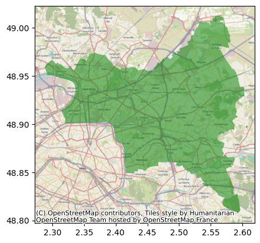
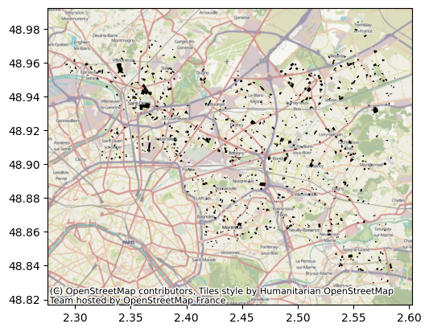
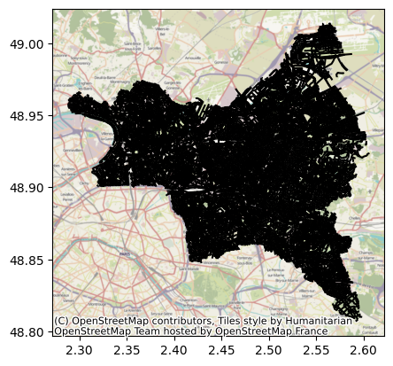
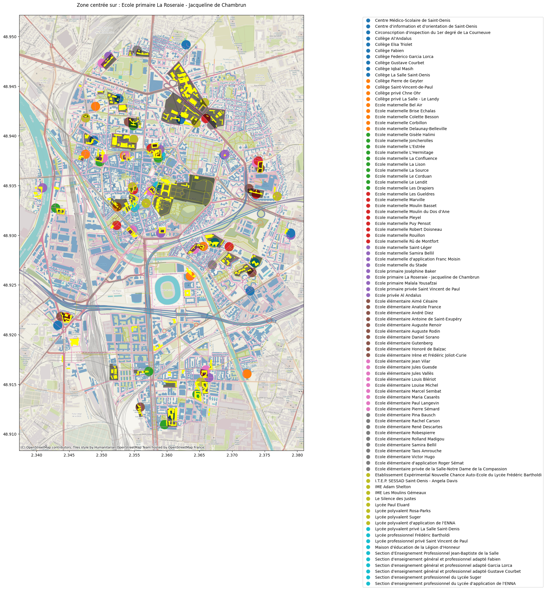
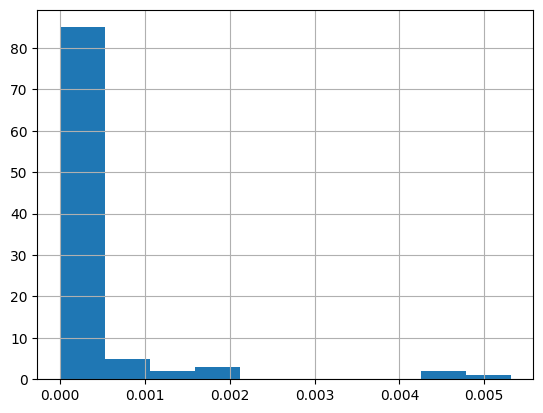
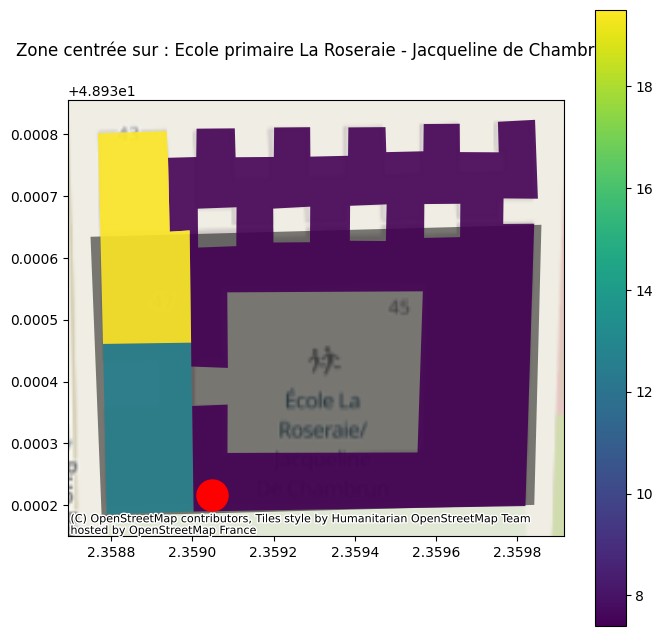
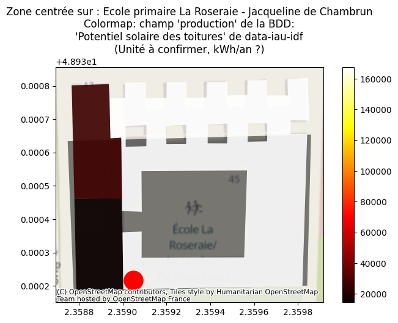
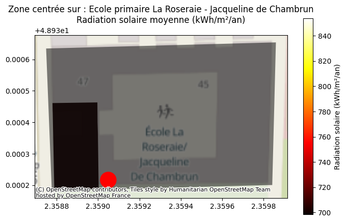

```python
# Manipulations standard
import geopandas as gpd
import pandas as pd
# Plotting
import matplotlib.pyplot as plt
# Pour la basemap
import contextily as cx
# Autres
import os
# Potentiel solaire package
from potentiel_solaire.constants import DATA_FOLDER
```

# Etape 1: Ouverture des datasets

## Dataset : départements


```python
dpts = gpd.read_file(DATA_FOLDER / "contour-des-departements.geojson").to_crs(4326)
ShapeNT = dpts[dpts.code == "93"].geometry
fig, ax = plt.subplots()
dpts[dpts.code == "93"].plot(column="nom",legend=True, categorical = True, ax = ax, color="green",alpha=0.5)
cx.add_basemap(ax, crs=dpts.crs)
fig.show()
```

    /tmp/ipykernel_273337/2162312035.py:4: UserWarning: Only specify one of 'column' or 'color'. Using 'color'.
      dpts[dpts.code == "93"].plot(column="nom",legend=True, categorical = True, ax = ax, color="green",alpha=0.5)
    /tmp/ipykernel_273337/2162312035.py:6: UserWarning: FigureCanvasAgg is non-interactive, and thus cannot be shown
      fig.show()


    

    


## Dataset : annuaire éducation / écoles


```python
# Takes 58s on my laptop
annuaire = gpd.read_file(DATA_FOLDER / 'fr-en-annuaire-education.geojson')
print(len(annuaire),"items")
annuaire = annuaire[annuaire.code_postal.str.startswith("93")]
print(len(annuaire),"objets dans le 93")
annuaire = annuaire.to_crs(4326)
annuaire.head(3)
```

    69641 items
    1432 objets dans le 93


<div>
<style scoped>
    .dataframe tbody tr th:only-of-type {
        vertical-align: middle;
    }

    .dataframe tbody tr th {
        vertical-align: top;
    }

    .dataframe thead th {
        text-align: right;
    }
</style>
<table border="1" class="dataframe">
  <thead>
    <tr style="text-align: right;">
      <th></th>
      <th>identifiant_de_l_etablissement</th>
      <th>nom_etablissement</th>
      <th>type_etablissement</th>
      <th>statut_public_prive</th>
      <th>adresse_1</th>
      <th>adresse_2</th>
      <th>adresse_3</th>
      <th>code_postal</th>
      <th>code_commune</th>
      <th>nom_commune</th>
      <th>...</th>
      <th>code_type_contrat_prive</th>
      <th>pial</th>
      <th>etablissement_mere</th>
      <th>type_rattachement_etablissement_mere</th>
      <th>code_circonscription</th>
      <th>code_zone_animation_pedagogique</th>
      <th>libelle_zone_animation_pedagogique</th>
      <th>code_bassin_formation</th>
      <th>libelle_bassin_formation</th>
      <th>geometry</th>
    </tr>
  </thead>
  <tbody>
    <tr>
      <th>63</th>
      <td>0932595R</td>
      <td>Ecole primaire La Roseraie - Jacqueline de Cha...</td>
      <td>Ecole</td>
      <td>Public</td>
      <td>47 rue Pinel</td>
      <td>None</td>
      <td>93200 ST DENIS</td>
      <td>93200</td>
      <td>93066</td>
      <td>Saint-Denis</td>
      <td>...</td>
      <td>99</td>
      <td>None</td>
      <td>None</td>
      <td>None</td>
      <td>0932058G</td>
      <td>None</td>
      <td>None</td>
      <td>None</td>
      <td>None</td>
      <td>POINT (2.35905 48.93022)</td>
    </tr>
    <tr>
      <th>8972</th>
      <td>0930145C</td>
      <td>Ecole élémentaire Anatole France</td>
      <td>Ecole</td>
      <td>Public</td>
      <td>68 rue Anatole France</td>
      <td>None</td>
      <td>93120 LA COURNEUVE</td>
      <td>93120</td>
      <td>93027</td>
      <td>La Courneuve</td>
      <td>...</td>
      <td>99</td>
      <td>None</td>
      <td>None</td>
      <td>None</td>
      <td>0931038Y</td>
      <td>None</td>
      <td>None</td>
      <td>None</td>
      <td>None</td>
      <td>POINT (2.40338 48.92178)</td>
    </tr>
    <tr>
      <th>8973</th>
      <td>0930150H</td>
      <td>Ecole élémentaire Victor Hugo</td>
      <td>Ecole</td>
      <td>Public</td>
      <td>8 rue Jean Mermoz</td>
      <td>None</td>
      <td>93200 ST DENIS</td>
      <td>93200</td>
      <td>93066</td>
      <td>Saint-Denis</td>
      <td>...</td>
      <td>99</td>
      <td>0930587H</td>
      <td>None</td>
      <td>None</td>
      <td>0932609F</td>
      <td>None</td>
      <td>None</td>
      <td>None</td>
      <td>None</td>
      <td>POINT (2.35446 48.94132)</td>
    </tr>
  </tbody>
</table>
<p>3 rows × 73 columns</p>
</div>


## Dataset : BD TOPO


```python
import fiona
```

Vérifions quelles sont les layers de dispo dans le gpkg


```python
GPKG = DATA_FOLDER / "BDTOPO_3-4_TOUSTHEMES_GPKG_LAMB93_D093_2024-12-15/BDTOPO/1_DONNEES_LIVRAISON_2024-12-00134/BDT_3-4_GPKG_LAMB93_D093-ED2024-12-15/BDT_3-4_GPKG_LAMB93_D093-ED2024-12-15.gpkg"
layers = fiona.listlayers(GPKG)
print(" ".join(layers))
```

    troncon_de_route route_numerotee_ou_nommee itineraire_autre troncon_de_voie_ferree equipement_de_transport piste_d_aerodrome aerodrome point_de_repere non_communication point_du_reseau voie_ferree_nommee toponymie_transport batiment cimetiere construction_lineaire construction_ponctuelle construction_surfacique reservoir ligne_orographique pylone terrain_de_sport toponymie_bati cours_d_eau troncon_hydrographique bassin_versant_topographique plan_d_eau surface_hydrographique noeud_hydrographique detail_hydrographique toponymie_hydrographie zone_d_habitation lieu_dit_non_habite detail_orographique toponymie_lieux_nommes canalisation ligne_electrique poste_de_transformation erp zone_d_activite_ou_d_interet toponymie_services_et_activites voie_nommee parc_ou_reserve foret_publique toponymie_zones_reglementees haie zone_de_vegetation arrondissement arrondissement_municipal commune epci collectivite_territoriale departement region adresse_ban batiment_rnb_lien_bdtopo lien_adresse_vers_bdtopo section_de_points_de_repere info_metadonnees metadonnees_lot metadonnees_theme layer_styles


Et on les display


```python
bats = gpd.read_file(GPKG, layer="batiment")# toponymie_services_et_activites
bats = bats.to_crs(4326) 
```


```python
bats.columns
```


    Index(['cleabs', 'nature', 'usage_1', 'usage_2', 'construction_legere',
           'etat_de_l_objet', 'date_creation', 'date_modification',
           'date_d_apparition', 'date_de_confirmation', 'sources',
           'identifiants_sources', 'methode_d_acquisition_planimetrique',
           'methode_d_acquisition_altimetrique', 'precision_planimetrique',
           'precision_altimetrique', 'nombre_de_logements', 'nombre_d_etages',
           'materiaux_des_murs', 'materiaux_de_la_toiture', 'hauteur',
           'altitude_minimale_sol', 'altitude_minimale_toit',
           'altitude_maximale_toit', 'altitude_maximale_sol',
           'origine_du_batiment', 'appariement_fichiers_fonciers',
           'identifiants_rnb', 'geometry'],
          dtype='object')


```python
# Takes 10s on my laptop
bdedu = gpd.read_file(GPKG, layer="zone_d_activite_ou_d_interet")# toponymie_services_et_activites
print(len(bdedu),"items")
# Utilisons les memes projections
bdedu = bdedu.to_crs(4326) 
# Tri sur la catégorie d'intéret
bdedu = bdedu[bdedu["categorie"] == "Science et enseignement"] 
bdedu = gpd.sjoin(bdedu, dpts[dpts.code == "93"], how='left').dropna(subset="code")
print(len(bdedu),"items dans la zone")

fig, ax = plt.subplots()
bdedu.plot(column="nature",legend=True, categorical = True, ax = ax, color="black")
cx.add_basemap(ax, crs=dpts.crs)
fig.show()

```

    13348 items
    1385 items dans la zone


    /tmp/ipykernel_273337/2806925089.py:12: UserWarning: Only specify one of 'column' or 'color'. Using 'color'.
      bdedu.plot(column="nature",legend=True, categorical = True, ax = ax, color="black")
    /tmp/ipykernel_273337/2806925089.py:14: UserWarning: FigureCanvasAgg is non-interactive, and thus cannot be shown
      fig.show()


    

    


```python
bat_edu = gpd.sjoin(gpd.GeoDataFrame(bats[["cleabs","geometry","identifiants_rnb","materiaux_de_la_toiture","hauteur"]],geometry="geometry"), gpd.GeoDataFrame(bdedu[["cleabs","toponyme","geometry"]],geometry="geometry"), how='left').dropna(subset="toponyme")
bat_edu.head(3)
```


<div>
<style scoped>
    .dataframe tbody tr th:only-of-type {
        vertical-align: middle;
    }

    .dataframe tbody tr th {
        vertical-align: top;
    }

    .dataframe thead th {
        text-align: right;
    }
</style>
<table border="1" class="dataframe">
  <thead>
    <tr style="text-align: right;">
      <th></th>
      <th>cleabs_left</th>
      <th>geometry</th>
      <th>identifiants_rnb</th>
      <th>materiaux_de_la_toiture</th>
      <th>hauteur</th>
      <th>index_right</th>
      <th>cleabs_right</th>
      <th>toponyme</th>
    </tr>
  </thead>
  <tbody>
    <tr>
      <th>1699</th>
      <td>BATIMENT0000000002599800</td>
      <td>MULTIPOLYGON Z (((2.55395 48.98409 82.5, 2.553...</td>
      <td>A12MR4AER8XA/H3V9FEZVTCQH</td>
      <td>None</td>
      <td>7.9</td>
      <td>8101.0</td>
      <td>SURFACTI0000000002555409</td>
      <td>I.M.E. B. Guillez le Petit Orme</td>
    </tr>
    <tr>
      <th>1771</th>
      <td>BATIMENT0000000002600955</td>
      <td>MULTIPOLYGON Z (((2.37721 48.96971 54, 2.3772 ...</td>
      <td>GMKNQX3Q3AY4</td>
      <td>None</td>
      <td>11.4</td>
      <td>9799.0</td>
      <td>SURFACTI0000000002555414</td>
      <td>Groupe Scolaire Paul Langevin</td>
    </tr>
    <tr>
      <th>1772</th>
      <td>BATIMENT0000000002600963</td>
      <td>MULTIPOLYGON Z (((2.37721 48.96971 54, 2.37734...</td>
      <td>FWK5CQ31Y968</td>
      <td></td>
      <td>11.3</td>
      <td>9799.0</td>
      <td>SURFACTI0000000002555414</td>
      <td>Groupe Scolaire Paul Langevin</td>
    </tr>
  </tbody>
</table>
</div>


On peut aussi afficher les réseaux


```python
# Takes 80s on my laptop -- loading roads in this case
bdtopo = gpd.read_file(GPKG)
print(len(bdtopo),"items")
# Utilisons les memes projections
bdtopo = bdtopo.to_crs(4326)
bdtopo = gpd.sjoin(bdtopo, dpts[dpts.code == "93"], how='left').dropna(subset="code")
print(len(bdtopo),"items")
fig, ax = plt.subplots()
bdtopo.plot(column="nature",legend=True, categorical = True, ax = ax, color="black")
cx.add_basemap(ax, crs=dpts.crs)
fig.show()
```

    /home/kelu/projets/13_potentiel_solaire/algorithme/.venv/lib/python3.10/site-packages/pyogrio/raw.py:198: RuntimeWarning: Field format 'character varying' not supported
      return ogr_read(
    /home/kelu/projets/13_potentiel_solaire/algorithme/.venv/lib/python3.10/site-packages/pyogrio/raw.py:198: RuntimeWarning: Field format 'character varying(256)' not supported
      return ogr_read(
    /home/kelu/projets/13_potentiel_solaire/algorithme/.venv/lib/python3.10/site-packages/pyogrio/raw.py:198: RuntimeWarning: Field format 'character varying(30)' not supported
      return ogr_read(
    /home/kelu/projets/13_potentiel_solaire/algorithme/.venv/lib/python3.10/site-packages/pyogrio/raw.py:198: RuntimeWarning: Field format 'timestamp with time zone' not supported
      return ogr_read(
    /home/kelu/projets/13_potentiel_solaire/algorithme/.venv/lib/python3.10/site-packages/pyogrio/geopandas.py:265: UserWarning: More than one layer found in 'BDT_3-4_GPKG_LAMB93_D093-ED2024-12-15.gpkg': 'troncon_de_route' (default), 'route_numerotee_ou_nommee', 'itineraire_autre', 'troncon_de_voie_ferree', 'equipement_de_transport', 'piste_d_aerodrome', 'aerodrome', 'point_de_repere', 'non_communication', 'point_du_reseau', 'voie_ferree_nommee', 'toponymie_transport', 'batiment', 'cimetiere', 'construction_lineaire', 'construction_ponctuelle', 'construction_surfacique', 'reservoir', 'ligne_orographique', 'pylone', 'terrain_de_sport', 'toponymie_bati', 'cours_d_eau', 'troncon_hydrographique', 'bassin_versant_topographique', 'plan_d_eau', 'surface_hydrographique', 'noeud_hydrographique', 'detail_hydrographique', 'toponymie_hydrographie', 'zone_d_habitation', 'lieu_dit_non_habite', 'detail_orographique', 'toponymie_lieux_nommes', 'canalisation', 'ligne_electrique', 'poste_de_transformation', 'erp', 'zone_d_activite_ou_d_interet', 'toponymie_services_et_activites', 'voie_nommee', 'parc_ou_reserve', 'foret_publique', 'toponymie_zones_reglementees', 'haie', 'zone_de_vegetation', 'arrondissement', 'arrondissement_municipal', 'commune', 'epci', 'collectivite_territoriale', 'departement', 'region', 'adresse_ban', 'batiment_rnb_lien_bdtopo', 'lien_adresse_vers_bdtopo', 'section_de_points_de_repere', 'info_metadonnees', 'metadonnees_lot', 'metadonnees_theme', 'layer_styles'. Specify layer parameter to avoid this warning.
      result = read_func(


    188015 items
    68497 items


    /tmp/ipykernel_273337/1883887287.py:9: UserWarning: Only specify one of 'column' or 'color'. Using 'color'.
      bdtopo.plot(column="nature",legend=True, categorical = True, ax = ax, color="black")
    /tmp/ipykernel_273337/1883887287.py:11: UserWarning: FigureCanvasAgg is non-interactive, and thus cannot be shown
      fig.show()


    

    


## Dataset: parcellaire-express


```python
# Takes 11s on my laptop
pci = gpd.read_file(DATA_FOLDER / "PARCELLAIRE-EXPRESS_1-1__SHP_LAMB93_D093_2024-10-01/PARCELLAIRE-EXPRESS/1_DONNEES_LIVRAISON_2024-11-00210/PEPCI_1-1_SHP_LAMB93_D093/BATIMENT.SHP")
print(len(pci),"items")
pci = pci.to_crs(4326)
pci = gpd.sjoin(pci, dpts[dpts.code == "93"], how='left').dropna(subset="code")
print(len(pci),"items - sorted")
pci.head(3)
```

    376574 items
    376220 items - sorted


<div>
<style scoped>
    .dataframe tbody tr th:only-of-type {
        vertical-align: middle;
    }

    .dataframe tbody tr th {
        vertical-align: top;
    }

    .dataframe thead th {
        text-align: right;
    }
</style>
<table border="1" class="dataframe">
  <thead>
    <tr style="text-align: right;">
      <th></th>
      <th>TYPE</th>
      <th>geometry</th>
      <th>index_right</th>
      <th>code</th>
      <th>nom</th>
    </tr>
  </thead>
  <tbody>
    <tr>
      <th>0</th>
      <td>Construction légère</td>
      <td>POLYGON ((2.39066 48.90535, 2.3907 48.90536, 2...</td>
      <td>93.0</td>
      <td>93</td>
      <td>Seine-Saint-Denis</td>
    </tr>
    <tr>
      <th>1</th>
      <td>Bâtiment en dur</td>
      <td>POLYGON ((2.52665 48.87779, 2.52669 48.87777, ...</td>
      <td>93.0</td>
      <td>93</td>
      <td>Seine-Saint-Denis</td>
    </tr>
    <tr>
      <th>2</th>
      <td>Bâtiment en dur</td>
      <td>POLYGON ((2.52583 48.87706, 2.52582 48.87706, ...</td>
      <td>93.0</td>
      <td>93</td>
      <td>Seine-Saint-Denis</td>
    </tr>
  </tbody>
</table>
</div>


# Etape 2: Exploration autour d'une école

## Etablissement d'une zone d'intérêt


```python
pd.DataFrame(annuaire.iloc[0])
```


<div>
<style scoped>
    .dataframe tbody tr th:only-of-type {
        vertical-align: middle;
    }

    .dataframe tbody tr th {
        vertical-align: top;
    }

    .dataframe thead th {
        text-align: right;
    }
</style>
<table border="1" class="dataframe">
  <thead>
    <tr style="text-align: right;">
      <th></th>
      <th>63</th>
    </tr>
  </thead>
  <tbody>
    <tr>
      <th>identifiant_de_l_etablissement</th>
      <td>0932595R</td>
    </tr>
    <tr>
      <th>nom_etablissement</th>
      <td>Ecole primaire La Roseraie - Jacqueline de Cha...</td>
    </tr>
    <tr>
      <th>type_etablissement</th>
      <td>Ecole</td>
    </tr>
    <tr>
      <th>statut_public_prive</th>
      <td>Public</td>
    </tr>
    <tr>
      <th>adresse_1</th>
      <td>47 rue Pinel</td>
    </tr>
    <tr>
      <th>...</th>
      <td>...</td>
    </tr>
    <tr>
      <th>code_zone_animation_pedagogique</th>
      <td>None</td>
    </tr>
    <tr>
      <th>libelle_zone_animation_pedagogique</th>
      <td>None</td>
    </tr>
    <tr>
      <th>code_bassin_formation</th>
      <td>None</td>
    </tr>
    <tr>
      <th>libelle_bassin_formation</th>
      <td>None</td>
    </tr>
    <tr>
      <th>geometry</th>
      <td>POINT (2.3590491366730153 48.93021698801084)</td>
    </tr>
  </tbody>
</table>
<p>73 rows × 1 columns</p>
</div>


```python
# Filtrons autour de d = 100m
d = 0.02 # échelle à retrouver
zone = annuaire.iloc[0].geometry.buffer(d)
```

## Clip des dataset pour rester léger


```python
bdtopo_d = bdtopo[bdtopo.geometry.within(zone)].clip(zone)# check with within
pci_d = pci[pci.geometry.within(zone)].clip(zone)# check with within
bdedu_d = bdedu[bdedu.geometry.within(zone)].clip(zone)# check with within
bat_edu_d =  bat_edu[bat_edu.geometry.within(zone)].clip(zone)
```


```python
#plots all dans la zone sélectionnée
fig, ax = plt.subplots(figsize=(20,20))
pci_d.plot(column="TYPE", legend=True, categorical = True, ax = ax, alpha=0.5)
bdtopo_d.plot(column="nature",legend=True, categorical = True, ax = ax, alpha=0.5)
annuaire[annuaire.geometry.within(zone)].clip(zone).plot(column = "nom_etablissement",legend=True, categorical = True, ax = ax, markersize=500, legend_kwds={'loc': 'upper left'})
bdedu_d.plot(column="toponyme",legend=True, categorical = True, ax = ax, color="black", alpha=0.5)
bat_edu_d.plot(column="toponyme",legend=True, categorical = True, ax = ax, color="yellow")
cx.add_basemap(ax, crs=pci_d.crs, zoom=16) # source=cx.providers.OpenStreetMap.Mapnik,
leg = ax.get_legend()
leg.set_bbox_to_anchor((1.2, 0, 0, 1))
ax.set_title("Zone centrée sur : "+annuaire.iloc[0].nom_etablissement+"\n")
plt.show()
plt.savefig("preview_example.jpg")
```

    /tmp/ipykernel_273337/3993707997.py:6: UserWarning: Only specify one of 'column' or 'color'. Using 'color'.
      bdedu_d.plot(column="toponyme",legend=True, categorical = True, ax = ax, color="black", alpha=0.5)
    /tmp/ipykernel_273337/3993707997.py:7: UserWarning: Only specify one of 'column' or 'color'. Using 'color'.
      bat_edu_d.plot(column="toponyme",legend=True, categorical = True, ax = ax, color="yellow")


    

    


    <Figure size 640x480 with 0 Axes>


# Etape 3: Travail au niveau d'une école spécifique


```python
from shapely.ops import nearest_points
```

## Sélection de l'école et clip des datasets


```python
# On s'intéresse à : bdedu_d, bat_edu_d
ecoles = annuaire[annuaire.geometry.within(zone)]
ecoles.head(3)
```


<div>
<style scoped>
    .dataframe tbody tr th:only-of-type {
        vertical-align: middle;
    }

    .dataframe tbody tr th {
        vertical-align: top;
    }

    .dataframe thead th {
        text-align: right;
    }
</style>
<table border="1" class="dataframe">
  <thead>
    <tr style="text-align: right;">
      <th></th>
      <th>identifiant_de_l_etablissement</th>
      <th>nom_etablissement</th>
      <th>type_etablissement</th>
      <th>statut_public_prive</th>
      <th>adresse_1</th>
      <th>adresse_2</th>
      <th>adresse_3</th>
      <th>code_postal</th>
      <th>code_commune</th>
      <th>nom_commune</th>
      <th>...</th>
      <th>code_type_contrat_prive</th>
      <th>pial</th>
      <th>etablissement_mere</th>
      <th>type_rattachement_etablissement_mere</th>
      <th>code_circonscription</th>
      <th>code_zone_animation_pedagogique</th>
      <th>libelle_zone_animation_pedagogique</th>
      <th>code_bassin_formation</th>
      <th>libelle_bassin_formation</th>
      <th>geometry</th>
    </tr>
  </thead>
  <tbody>
    <tr>
      <th>63</th>
      <td>0932595R</td>
      <td>Ecole primaire La Roseraie - Jacqueline de Cha...</td>
      <td>Ecole</td>
      <td>Public</td>
      <td>47 rue Pinel</td>
      <td>None</td>
      <td>93200 ST DENIS</td>
      <td>93200</td>
      <td>93066</td>
      <td>Saint-Denis</td>
      <td>...</td>
      <td>99</td>
      <td>None</td>
      <td>None</td>
      <td>None</td>
      <td>0932058G</td>
      <td>None</td>
      <td>None</td>
      <td>None</td>
      <td>None</td>
      <td>POINT (2.35905 48.93022)</td>
    </tr>
    <tr>
      <th>8973</th>
      <td>0930150H</td>
      <td>Ecole élémentaire Victor Hugo</td>
      <td>Ecole</td>
      <td>Public</td>
      <td>8 rue Jean Mermoz</td>
      <td>None</td>
      <td>93200 ST DENIS</td>
      <td>93200</td>
      <td>93066</td>
      <td>Saint-Denis</td>
      <td>...</td>
      <td>99</td>
      <td>0930587H</td>
      <td>None</td>
      <td>None</td>
      <td>0932609F</td>
      <td>None</td>
      <td>None</td>
      <td>None</td>
      <td>None</td>
      <td>POINT (2.35446 48.94132)</td>
    </tr>
    <tr>
      <th>8979</th>
      <td>0930210Y</td>
      <td>Ecole élémentaire André Diez</td>
      <td>Ecole</td>
      <td>Public</td>
      <td>38 avenue Lénine</td>
      <td>None</td>
      <td>93200 ST DENIS</td>
      <td>93200</td>
      <td>93066</td>
      <td>Saint-Denis</td>
      <td>...</td>
      <td>99</td>
      <td>None</td>
      <td>None</td>
      <td>None</td>
      <td>0932609F</td>
      <td>None</td>
      <td>None</td>
      <td>None</td>
      <td>None</td>
      <td>POINT (2.36598 48.94175)</td>
    </tr>
  </tbody>
</table>
<p>3 rows × 73 columns</p>
</div>


```python
recollement = gpd.sjoin_nearest(ecoles, bdedu_d, distance_col="distances", lsuffix="e_", rsuffix="f_", exclusive=True)[["identifiant_de_l_etablissement","nom_etablissement","distances","toponyme","cleabs","nature","nature_detaillee"]]
recollement.head(3)
```

    /home/kelu/projets/13_potentiel_solaire/algorithme/.venv/lib/python3.10/site-packages/geopandas/array.py:403: UserWarning: Geometry is in a geographic CRS. Results from 'sjoin_nearest' are likely incorrect. Use 'GeoSeries.to_crs()' to re-project geometries to a projected CRS before this operation.
    
      warnings.warn(


<div>
<style scoped>
    .dataframe tbody tr th:only-of-type {
        vertical-align: middle;
    }

    .dataframe tbody tr th {
        vertical-align: top;
    }

    .dataframe thead th {
        text-align: right;
    }
</style>
<table border="1" class="dataframe">
  <thead>
    <tr style="text-align: right;">
      <th></th>
      <th>identifiant_de_l_etablissement</th>
      <th>nom_etablissement</th>
      <th>distances</th>
      <th>toponyme</th>
      <th>cleabs</th>
      <th>nature</th>
      <th>nature_detaillee</th>
    </tr>
  </thead>
  <tbody>
    <tr>
      <th>63</th>
      <td>0932595R</td>
      <td>Ecole primaire La Roseraie - Jacqueline de Cha...</td>
      <td>0.0</td>
      <td>Groupe Scolaire la Roseraie de Chambrun</td>
      <td>SURFACTI0000000351259092</td>
      <td>Enseignement primaire</td>
      <td>Groupe scolaire</td>
    </tr>
    <tr>
      <th>8973</th>
      <td>0930150H</td>
      <td>Ecole élémentaire Victor Hugo</td>
      <td>0.0</td>
      <td>École Élémentaire Victor Hugo</td>
      <td>SURFACTI0000000002555608</td>
      <td>Enseignement primaire</td>
      <td>Ecole élémentaire</td>
    </tr>
    <tr>
      <th>8979</th>
      <td>0930210Y</td>
      <td>Ecole élémentaire André Diez</td>
      <td>0.0</td>
      <td>École Élémentaire Rolland Madigou</td>
      <td>SURFACTI0000000002555602</td>
      <td>Enseignement primaire</td>
      <td>Ecole élémentaire</td>
    </tr>
  </tbody>
</table>
</div>


Et on essaye de bien vérifier que les écoles identifiées soient celles des zones identifiées, pour ca on vérifie la distance entre les écoles et les zones

Et on retire les matchs où la distance entre les deux points est trop grande


```python
seuil_recol = recollement.distances.quantile(q=0.7)
print(seuil_recol)
recollement.distances.hist()
```

    8.233389721918371e-05


    <Axes: >


    

    


```python
recollement = recollement[recollement.distances < seuil_recol]
bdedu_areas = recollement.toponyme.unique()
bdedu_r = bdedu[bdedu.toponyme.isin(bdedu_areas)]
recollement.head(3)
```


<div>
<style scoped>
    .dataframe tbody tr th:only-of-type {
        vertical-align: middle;
    }

    .dataframe tbody tr th {
        vertical-align: top;
    }

    .dataframe thead th {
        text-align: right;
    }
</style>
<table border="1" class="dataframe">
  <thead>
    <tr style="text-align: right;">
      <th></th>
      <th>identifiant_de_l_etablissement</th>
      <th>nom_etablissement</th>
      <th>distances</th>
      <th>toponyme</th>
      <th>cleabs</th>
      <th>nature</th>
      <th>nature_detaillee</th>
    </tr>
  </thead>
  <tbody>
    <tr>
      <th>63</th>
      <td>0932595R</td>
      <td>Ecole primaire La Roseraie - Jacqueline de Cha...</td>
      <td>0.0</td>
      <td>Groupe Scolaire la Roseraie de Chambrun</td>
      <td>SURFACTI0000000351259092</td>
      <td>Enseignement primaire</td>
      <td>Groupe scolaire</td>
    </tr>
    <tr>
      <th>8973</th>
      <td>0930150H</td>
      <td>Ecole élémentaire Victor Hugo</td>
      <td>0.0</td>
      <td>École Élémentaire Victor Hugo</td>
      <td>SURFACTI0000000002555608</td>
      <td>Enseignement primaire</td>
      <td>Ecole élémentaire</td>
    </tr>
    <tr>
      <th>8979</th>
      <td>0930210Y</td>
      <td>Ecole élémentaire André Diez</td>
      <td>0.0</td>
      <td>École Élémentaire Rolland Madigou</td>
      <td>SURFACTI0000000002555602</td>
      <td>Enseignement primaire</td>
      <td>Ecole élémentaire</td>
    </tr>
  </tbody>
</table>
</div>


## Création d'une liste école par école au sein de la zone définie à l'étape 2


```python
documentation = "# Example de liste d'écoles\n\n"

fullRun = False # Set true to to all all schools
if fullRun :
    ecoles_to_run = recollement["identifiant_de_l_etablissement"].unique()
else:
    ecoles_to_run = [recollement["identifiant_de_l_etablissement"].unique()[0]]
for id_ecole in ecoles_to_run:

    ecole = ecoles[ecoles.identifiant_de_l_etablissement == id_ecole]
    documentation +="## "+ecole.iloc[0]["nom_etablissement"]+"\n\n" + \
        "* Type etablissement: "+ecole.iloc[0]["type_etablissement"] +"\n"+ \
        "* adresse_1: "+ecole.iloc[0]["adresse_1"] +"\n"+ \
        "* nom_commune: "+ecole.iloc[0]["nom_commune"] +"\n"+ \
        "* identifiant_de_l_etablissement: "+ecole.iloc[0]["identifiant_de_l_etablissement"] +"\n"
    match = recollement[recollement.identifiant_de_l_etablissement == id_ecole]
    zone = ecole.iloc[0].geometry.buffer(0.01)
    bdedu_s = bdedu[bdedu.toponyme == match.iloc[0].toponyme ].clip(zone)
    bat_edu_s = bat_edu[bat_edu.toponyme == match.iloc[0].toponyme ].clip(zone)
    bat_edu_s['hauteur'].fillna((bat_edu_s['hauteur'].mean()+0.001), inplace=True)
    geod = bat_edu_s.crs.get_geod()
    bat_edu_s["area_m2"] = bat_edu_s.geometry.apply(lambda g: abs(geod.geometry_area_perimeter(g)[0]))
    documentation += "* Surface totale: "+str(int(bat_edu_s.area_m2.sum())) +"m2\n\n"
    if os.path.isfile("images/"+id_ecole+".jpg"):
        pass
    else:
        fig, ax = plt.subplots(figsize=(8,8))
        bdedu_s.plot(legend=True, categorical = True, ax = ax, color="black", alpha=0.5)
        bat_edu_s.plot(column="hauteur",legend=True, ax = ax, alpha=0.9)
        ecole.plot(color="red", ax = ax, markersize=500)
        cx.add_basemap(ax, crs=pci_d.crs, zoom=18) # source=cx.providers.OpenStreetMap.Mapnik,
        ax.set_title("Zone centrée sur : "+ecole.iloc[0].nom_etablissement+"\n")
        plt.savefig("images/"+id_ecole+".jpg")

    documentation += "### Image\n\n\n\n"
if not fullRun:
    fig, ax = plt.subplots(figsize=(8,8))
    bdedu_s.plot(legend=True, categorical = True, ax = ax, color="black", alpha=0.5)
    bat_edu_s.plot(column="hauteur",legend=True, ax = ax, alpha=0.9)
    ecole.plot(color="red", ax = ax, markersize=500)
    cx.add_basemap(ax, crs=pci_d.crs, zoom=18) # source=cx.providers.OpenStreetMap.Mapnik,
    ax.set_title("Zone centrée sur : "+ecole.iloc[0].nom_etablissement+"\n")
else:
    with open("images/Readme.md", "w") as f:
        f.write(documentation)
```

    /tmp/ipykernel_273337/564879362.py:20: FutureWarning: A value is trying to be set on a copy of a DataFrame or Series through chained assignment using an inplace method.
    The behavior will change in pandas 3.0. This inplace method will never work because the intermediate object on which we are setting values always behaves as a copy.
    
    For example, when doing 'df[col].method(value, inplace=True)', try using 'df.method({col: value}, inplace=True)' or df[col] = df[col].method(value) instead, to perform the operation inplace on the original object.
    
    
      bat_edu_s['hauteur'].fillna((bat_edu_s['hauteur'].mean()+0.001), inplace=True)


    

    


# Etape 3: Intégration pour le d93 une source de donnée 'potentiel solaire"

* Provenance: https://data-iau-idf.opendata.arcgis.com/datasets/iau-idf::le-potentiel-solaire-des-toitures/

##  Préparation de la requete


On définit le périmètre de la zone d'intérêt avant d'aller demander les data


```python
dfecole = pd.concat([bdedu_s,bat_edu_s,ecole])
gdf = gpd.GeoDataFrame(dfecole,geometry="geometry")
geo = ",".join([str(x) for x in gdf.total_bounds])
geo

```


    '2.3587491817298756,48.930182216498395,2.3598599465495336,48.93082372213085'


On prend les données des batiments qui sont dans la box


```python
import requests

requete_type = "https://geoweb.iau-idf.fr/agsmap1/rest/services/OPENDATA/OpendataIAU4/MapServer/26/query?where=1%3D1&outFields=*&geometry="+geo+"&geometryType=esriGeometryEnvelope&inSR=4326&spatialRel=esriSpatialRelIntersects&outSR=4326&f=json"

response = requests.get(requete_type) 

```


```python
potentiel_batiment = pd.DataFrame([x["attributes"] for x in response.json()["features"]])
potentiel_batiment = potentiel_batiment[potentiel_batiment.id.isin(bat_edu_s.cleabs_left)]
bat_edu_p = bat_edu_s.merge(potentiel_batiment,how="left", left_on="cleabs_left", right_on="id")
bat_edu_p.head(3)
```


<div>
<style scoped>
    .dataframe tbody tr th:only-of-type {
        vertical-align: middle;
    }

    .dataframe tbody tr th {
        vertical-align: top;
    }

    .dataframe thead th {
        text-align: right;
    }
</style>
<table border="1" class="dataframe">
  <thead>
    <tr style="text-align: right;">
      <th></th>
      <th>cleabs_left</th>
      <th>geometry</th>
      <th>identifiants_rnb</th>
      <th>materiaux_de_la_toiture</th>
      <th>hauteur</th>
      <th>index_right</th>
      <th>cleabs_right</th>
      <th>toponyme</th>
      <th>area_m2</th>
      <th>objectid</th>
      <th>...</th>
      <th>systeme</th>
      <th>protection</th>
      <th>mos2017</th>
      <th>insee</th>
      <th>moyenne2</th>
      <th>forme</th>
      <th>production</th>
      <th>mos17</th>
      <th>st_area(shape)</th>
      <th>st_length(shape)</th>
    </tr>
  </thead>
  <tbody>
    <tr>
      <th>0</th>
      <td>BATIMENT0000000353684238</td>
      <td>POLYGON Z ((2.35879 48.93018 42.8, 2.35878 48....</td>
      <td>9224MXJR8VQY</td>
      <td></td>
      <td>12.6</td>
      <td>9494.0</td>
      <td>SURFACTI0000000351259092</td>
      <td>Groupe Scolaire la Roseraie de Chambrun</td>
      <td>482.841189</td>
      <td>256444</td>
      <td>...</td>
      <td>thermique ou photovoltaïque</td>
      <td>1</td>
      <td>62</td>
      <td>93066</td>
      <td>1197.290655</td>
      <td>plat</td>
      <td>14482.643275</td>
      <td>14</td>
      <td>482.790</td>
      <td>92.709441</td>
    </tr>
    <tr>
      <th>1</th>
      <td>BATIMENT0000000353684239</td>
      <td>POLYGON Z ((2.359 48.93019 38.7, 2.359 48.9303...</td>
      <td>8NQEJ4MCV81M/HTFYJNXKM2AM</td>
      <td>None</td>
      <td>7.4</td>
      <td>9494.0</td>
      <td>SURFACTI0000000351259092</td>
      <td>Groupe Scolaire la Roseraie de Chambrun</td>
      <td>2888.840308</td>
      <td>256447</td>
      <td>...</td>
      <td>thermique ou photovoltaïque</td>
      <td>1</td>
      <td>62</td>
      <td>93066</td>
      <td>1215.738207</td>
      <td>plat</td>
      <td>167496.434918</td>
      <td>14</td>
      <td>2888.535</td>
      <td>552.333390</td>
    </tr>
    <tr>
      <th>2</th>
      <td>BATIMENT0000000353684236</td>
      <td>POLYGON Z ((2.35878 48.93046 49.4, 2.35877 48....</td>
      <td>8X3PYCWJB2PW/J8CJH4PTF542</td>
      <td>None</td>
      <td>19.5</td>
      <td>9494.0</td>
      <td>SURFACTI0000000351259092</td>
      <td>Groupe Scolaire la Roseraie de Chambrun</td>
      <td>545.962636</td>
      <td>256442</td>
      <td>...</td>
      <td>thermique ou photovoltaïque</td>
      <td>1</td>
      <td>62</td>
      <td>93066</td>
      <td>1216.113110</td>
      <td>plat</td>
      <td>26927.371060</td>
      <td>14</td>
      <td>545.905</td>
      <td>108.120159</td>
    </tr>
  </tbody>
</table>
<p>3 rows × 27 columns</p>
</div>


## Visualisation


```python
fig, ax = plt.subplots(figsize=(8,5))
bdedu_s.plot(legend=True, categorical = True, ax = ax, color="black", alpha=0.5)
bat_edu_p.plot(column="production",legend=True, ax = ax, alpha=0.9,cmap="hot")
ecole.plot(color="red", ax = ax, markersize=500)
cx.add_basemap(ax, crs=pci_d.crs, zoom=18) # source=cx.providers.OpenStreetMap.Mapnik,
ax.set_title("Zone centrée sur : "+ecole.iloc[0].nom_etablissement+"\nColormap: champ 'production' de la BDD:\n'Potentiel solaire des toitures' de data-iau-idf\n(Unité à confirmer, kWh/an ?)")
```


    Text(0.5, 1.0, "Zone centrée sur : Ecole primaire La Roseraie - Jacqueline de Chambrun\nColormap: champ 'production' de la BDD:\n'Potentiel solaire des toitures' de data-iau-idf\n(Unité à confirmer, kWh/an ?)")


    

    


## Etape 4 : Ouverture de la db Gisement Solaire Brut au Bati 


```python
# Takes some time 

potentiel_solaire = gpd.read_file(DATA_FOLDER / "potentiel-gisement-solaire-brut-au-bati.geojson").to_crs(4326)
```


```python
potentiel_solaire.columns
```


    Index(['geo_point_2d', 'geo_shape', 'objectid', 'n_sq_eb', 'n_sq_eb_or',
           'c_cainsee', 'm2_e_in700', 'm2_e_70_80', 'm2_e_80_90', 'm2_e_90_10',
           'm2_e_s1000', 'm2_e_tot', 'c_ens_moy', 'shape_leng', 'shape_area',
           'geometry'],
          dtype='object')


```python
# Reset indices and ensure CRS match
bat_edu_s = bat_edu_s.reset_index(drop=True)
potentiel_solaire = potentiel_solaire.reset_index(drop=True)
bat_edu_s = bat_edu_s.to_crs(potentiel_solaire.crs)

# Perform spatial join with explicit suffixes
school_solar = gpd.sjoin(
    bat_edu_s, 
    potentiel_solaire, 
    how="left", 
    predicate="intersects",
    lsuffix='_left',
    rsuffix='_right'
)

print("Number of buildings with missing solar data:")
print(school_solar['c_ens_moy'].isna().sum())

fig, ax = plt.subplots(figsize=(8,5))
bdedu_s.plot(legend=True, categorical=True, ax=ax, color="black", alpha=0.5)

school_solar.plot(
    column="c_ens_moy",  # average solar radiation
    legend=True, 
    ax=ax, 
    alpha=0.9,
    cmap="hot",
    legend_kwds={'label': 'Radiation solaire (kWh/m²/an)'}
)

ecole.plot(color="red", ax=ax, markersize=500)
cx.add_basemap(ax, crs=pci_d.crs, zoom=18)
ax.set_title("Zone centrée sur : " + ecole.iloc[0].nom_etablissement + 
             "\nRadiation solaire moyenne (kWh/m²/an)")

plt.show()
```

    Number of buildings with missing solar data:
    2


    

    


## Impression des autres métriques de la db potentiel solaire 2

Liste des attributs : https://geocatalogue.apur.org/catalogue/srv/fre/catalog.search#/metadata/urn:apur:potentiel_gisement_solaire_brut_au_bati


```python
# the specific school's data
school_data = school_solar.iloc[0]

print("Solar Potential Analysis for:", ecole.iloc[0].nom_etablissement)
print("-" * 50)

# building information
print("\nBuilding Surface Areas:")
print(f"Total roof surface: {school_data['m2_e_tot']:.0f} m²")
print("\nBreakdown by solar radiation level:")
print(f"- Excellent (>1000 kWh/m²/year): {school_data['m2_e_s1000']:.0f} m²")
print(f"- Very Good (900-1000 kWh/m²/year): {school_data['m2_e_90_10']:.0f} m²")
print(f"- Good (800-900 kWh/m²/year): {school_data['m2_e_80_90']:.0f} m²")
print(f"- Moderate (700-800 kWh/m²/year): {school_data['m2_e_70_80']:.0f} m²")
print(f"- Limited (<700 kWh/m²/year): {school_data['m2_e_in700']:.0f} m²")

print("\nAverage Solar Radiation:")
print(f"Mean radiation: {school_data['c_ens_moy']:.0f} kWh/m²/year")

# geometric information
print("\nGeometric Information:")
print(f"Building perimeter: {school_data['shape_leng']:.0f} meters")
print(f"Building footprint area: {school_data['shape_area']:.0f} m²")

# location information
print("\nLocation Information:")
print(f"Municipality code: {school_data['c_cainsee']:.0f}")
print(f"Building ID: {school_data['n_sq_eb']:.0f}")
print(f"Original Building ID: {school_data['n_sq_eb_or']:.0f}")

# calculate a metric
# TODO: This is not exhaustive, maybe we can also take into account very good and good radiations levels ?
if school_data['m2_e_tot'] > 0:
    optimal_percentage = (school_data['m2_e_s1000'] / school_data['m2_e_tot']) * 100
    print("\nDerived Metrics:")
    print(f"Percentage of optimal solar surface: {optimal_percentage:.1f}%")
```

    Solar Potential Analysis for: Ecole primaire La Roseraie - Jacqueline de Chambrun
    --------------------------------------------------
    
    Building Surface Areas:
    Total roof surface: 2 m²
    
    Breakdown by solar radiation level:
    - Excellent (>1000 kWh/m²/year): 0 m²
    - Very Good (900-1000 kWh/m²/year): 0 m²
    - Good (800-900 kWh/m²/year): 0 m²
    - Moderate (700-800 kWh/m²/year): 1 m²
    - Limited (<700 kWh/m²/year): 1 m²
    
    Average Solar Radiation:
    Mean radiation: 776 kWh/m²/year
    
    Geometric Information:
    Building perimeter: 17 meters
    Building footprint area: 4 m²
    
    Location Information:
    Municipality code: nan
    Building ID: 930306685
    Original Building ID: 930306685
    
    Derived Metrics:
    Percentage of optimal solar surface: 0.0%

