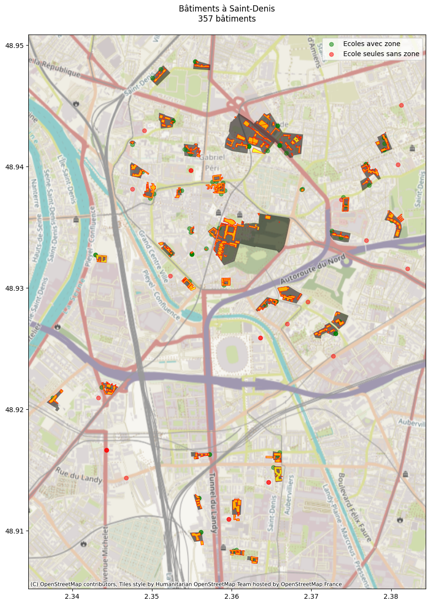
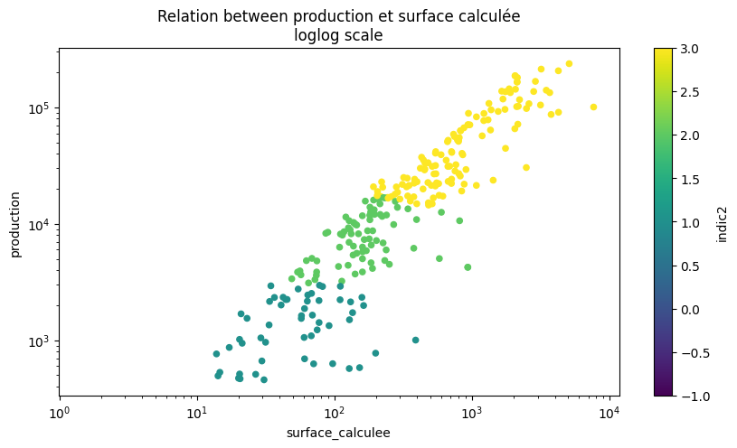
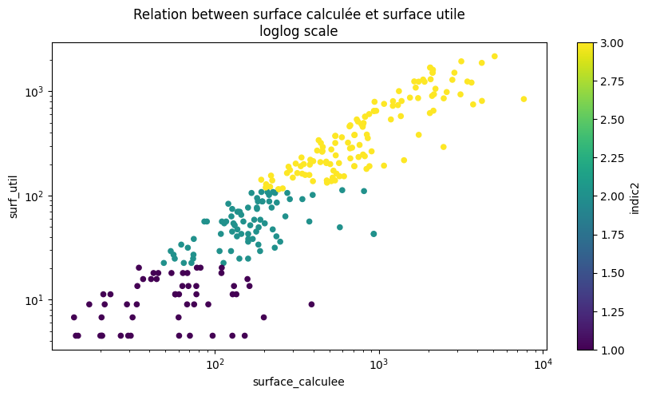
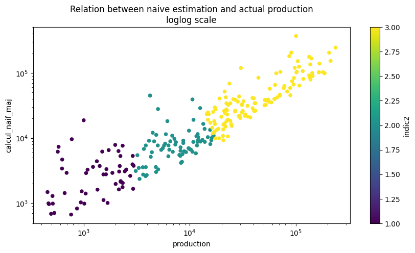
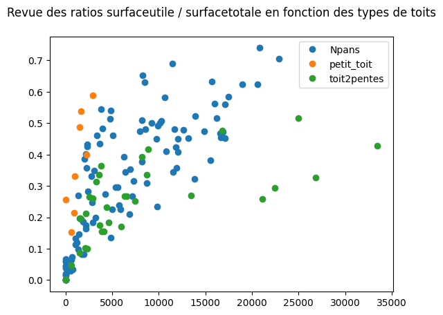
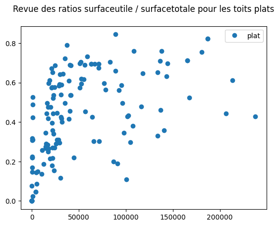

```python
import geopandas as gpd
from pathlib import Path
import matplotlib.pyplot as plt
import contextily as cx
import fiona

# Potentiel solaire package
from potentiel_solaire.constants import DATA_FOLDER
```


```python
# Executer ci dessous ci besoin pour récupérer les données
# !extract-sample-data
# Et pour sauver une version markdown des notebooks, utiliser
# jupyter nbconvert verif_haut_niveau.ipynb --to markdown --output-dir=exports/
```


```python
src = DATA_FOLDER / "saint_denis_reference_data.gpkg"
layers = fiona.listlayers(src)

for layer in layers:
    gdf = gpd.read_file(src, layer=layer)
    print(f"* Couche: {layer} avec {len(gdf)} éléments.")
```

    * Couche: annuaire_education avec 88 éléments.
    * Couche: annuaire_education_sans_zone avec 24 éléments.
    * Couche: bdtopo_education avec 49 éléments.
    * Couche: bdtopo_batiment avec 437 éléments.
    * Couche: cadastre_parcellaire avec 477 éléments.
    * Couche: potentielsolaire_bati avec 496 éléments.
    * Couche: potentielsolaire_toitures avec 357 éléments.
    * Couche: perimetre_st_denis avec 1 éléments.
    * Couche: identifiers avec 88 éléments.


```python
zones = gpd.read_file(src, layer="bdtopo_education")
ecoles = gpd.read_file(src, layer="annuaire_education")
ecoles_seules = gpd.read_file(src, layer="annuaire_education_sans_zone") 
potentiel = gpd.read_file(src, layer="potentielsolaire_toitures")
batiments_ecoles = gpd.read_file(src, layer="bdtopo_batiment")
```


```python
fig1, ax1 = plt.subplots(figsize=(15, 15))
zones.plot(ax=ax1, color='black', alpha=0.5, label='Zones')
ecoles.plot(ax=ax1, color='green', alpha=0.5, label='Ecoles avec zone')
ecoles_seules.plot(ax=ax1, color='red', alpha=0.5, label='Ecole seules sans zone')
batiments_ecoles.plot(ax=ax1, facecolor='yellow', edgecolor='red', linewidth=0.5, alpha=0.8, label='Saint-Denis')
potentiel.plot(ax=ax1, facecolor='orange', edgecolor='red', linewidth=0.5, alpha=0.8, label='Saint-Denis')
cx.add_basemap(ax1, crs=zones.crs, zoom=14)
ax1.set_title(f"Bâtiments à Saint-Denis\n{len(potentiel)} bâtiments", pad=20)
ax1.legend()
plt.show()
```

    /tmp/ipykernel_287957/4027241553.py:9: UserWarning: Legend does not support handles for PatchCollection instances.
    See: https://matplotlib.org/stable/tutorials/intermediate/legend_guide.html#implementing-a-custom-legend-handler
      ax1.legend()


    

    


# Premiere estimation

France: 1000 kWh/m2/an  à 1900 kWh/m2/an


```python
gdf = potentiel

gdb = batiments_ecoles
```


```python
batiments_calcules = gdf[list(gdf.columns)[:18]+["geometry"]]
batiments_calcules = batiments_calcules.rename(columns={"id": "cleabs"})
batiments_reference = gdb
batiments_reference = batiments_reference.rename(columns={"cleabs_left__bat": "cleabs"})
communs = list(set(batiments_calcules.cleabs) & set(batiments_reference.cleabs))
batiments_reference = batiments_reference[batiments_reference.cleabs.isin(communs)]
batiments_calcules = batiments_calcules[batiments_calcules.cleabs.isin(communs)]


# On calcule les surfaces
batiments_calcules = batiments_calcules.to_crs(epsg=6933)
batiments_calcules["surface_calculee"] = batiments_calcules.area
batiments_calcules = batiments_calcules.to_crs(epsg=4326)

batiments_reference = batiments_reference.to_crs(epsg=6933)
batiments_reference["surface_calculee"] = batiments_reference.area
batiments_reference = batiments_reference.to_crs(epsg=4326)
```


```python
batiments_calcules["calcul_naif"] = 1100*batiments_calcules["surface_calculee"]
```


```python
batiments_calcules = batiments_calcules[["surface_calculee", "surf_util", "production", "calcul_naif","moyenne2", "indic2","forme",  "gisement"	,"eq_pano",	"eq_surf"	,"cleabs", "geometry"]]
test = batiments_calcules[batiments_calcules.surf_util > 0]
test["ratio"] = test["production"] / test["calcul_naif"]
ratio = test["ratio"].mean()
batiments_calcules["calcul_naif"] = 1100*batiments_calcules["surface_calculee"]
batiments_calcules["calcul_naif_maj"] = 1100*batiments_calcules["surface_calculee"]*ratio
batiments_calcules["ratio_surface"] = batiments_calcules["surf_util"]/batiments_calcules["surface_calculee"]
batiments_calcules
```

    /home/kelu/projets/13_potentiel_solaire/algorithme/.venv/lib/python3.10/site-packages/geopandas/geodataframe.py:1819: SettingWithCopyWarning: 
    A value is trying to be set on a copy of a slice from a DataFrame.
    Try using .loc[row_indexer,col_indexer] = value instead
    
    See the caveats in the documentation: https://pandas.pydata.org/pandas-docs/stable/user_guide/indexing.html#returning-a-view-versus-a-copy
      super().__setitem__(key, value)


<div>
<style scoped>
    .dataframe tbody tr th:only-of-type {
        vertical-align: middle;
    }

    .dataframe tbody tr th {
        vertical-align: top;
    }

    .dataframe thead th {
        text-align: right;
    }
</style>
<table border="1" class="dataframe">
  <thead>
    <tr style="text-align: right;">
      <th></th>
      <th>surface_calculee</th>
      <th>surf_util</th>
      <th>production</th>
      <th>calcul_naif</th>
      <th>moyenne2</th>
      <th>indic2</th>
      <th>forme</th>
      <th>gisement</th>
      <th>eq_pano</th>
      <th>eq_surf</th>
      <th>cleabs</th>
      <th>geometry</th>
      <th>calcul_naif_maj</th>
      <th>ratio_surface</th>
    </tr>
  </thead>
  <tbody>
    <tr>
      <th>0</th>
      <td>3182.864620</td>
      <td>1944.00</td>
      <td>213541.062838</td>
      <td>3.501151e+06</td>
      <td>1205.511696</td>
      <td>3</td>
      <td>plat</td>
      <td>important</td>
      <td>plus de 50 panneaux</td>
      <td>plus de 115 m2</td>
      <td>BATIMENT0000000318256828</td>
      <td>POLYGON ((2.36719 48.93004, 2.36696 48.93002, ...</td>
      <td>153562.836115</td>
      <td>0.610771</td>
    </tr>
    <tr>
      <th>1</th>
      <td>4253.467615</td>
      <td>810.00</td>
      <td>90874.379954</td>
      <td>4.678814e+06</td>
      <td>1231.240041</td>
      <td>3</td>
      <td>plat</td>
      <td>important</td>
      <td>plus de 50 panneaux</td>
      <td>plus de 115 m2</td>
      <td>BATIMENT0000000243404073</td>
      <td>POLYGON ((2.36013 48.91242, 2.36015 48.91213, ...</td>
      <td>205215.938582</td>
      <td>0.190433</td>
    </tr>
    <tr>
      <th>2</th>
      <td>128.561045</td>
      <td>2.25</td>
      <td>0.000000</td>
      <td>1.414171e+05</td>
      <td>NaN</td>
      <td>-1</td>
      <td>Npans</td>
      <td>Non favorable</td>
      <td>Non favorable</td>
      <td>Non favorable</td>
      <td>BATIMENT0000000229477227</td>
      <td>POLYGON ((2.35275 48.94371, 2.35246 48.94377, ...</td>
      <td>6202.651070</td>
      <td>0.017501</td>
    </tr>
    <tr>
      <th>3</th>
      <td>3146.850632</td>
      <td>936.00</td>
      <td>104887.667195</td>
      <td>3.461536e+06</td>
      <td>1229.801070</td>
      <td>3</td>
      <td>plat</td>
      <td>important</td>
      <td>plus de 50 panneaux</td>
      <td>plus de 115 m2</td>
      <td>BATIMENT0000000002629660</td>
      <td>POLYGON ((2.34956 48.93933, 2.34964 48.93942, ...</td>
      <td>151825.278652</td>
      <td>0.297440</td>
    </tr>
    <tr>
      <th>4</th>
      <td>552.109173</td>
      <td>162.00</td>
      <td>22486.547854</td>
      <td>6.073201e+05</td>
      <td>1134.034730</td>
      <td>3</td>
      <td>toit2pentes</td>
      <td>important</td>
      <td>plus de 50 panneaux</td>
      <td>plus de 115 m2</td>
      <td>BATIMENT0000000229478106</td>
      <td>POLYGON ((2.38134 48.93547, 2.38129 48.93551, ...</td>
      <td>26637.466764</td>
      <td>0.293420</td>
    </tr>
    <tr>
      <th>...</th>
      <td>...</td>
      <td>...</td>
      <td>...</td>
      <td>...</td>
      <td>...</td>
      <td>...</td>
      <td>...</td>
      <td>...</td>
      <td>...</td>
      <td>...</td>
      <td>...</td>
      <td>...</td>
      <td>...</td>
      <td>...</td>
    </tr>
    <tr>
      <th>349</th>
      <td>20.386765</td>
      <td>6.75</td>
      <td>1016.122389</td>
      <td>2.242544e+04</td>
      <td>1229.874593</td>
      <td>1</td>
      <td>petit_toit</td>
      <td>faible</td>
      <td>2 à 9 panneaux</td>
      <td>entre 4.5 et 20 m2</td>
      <td>BATIMENT0000000243407957</td>
      <td>POLYGON ((2.36258 48.9433, 2.36253 48.94327, 2...</td>
      <td>983.594895</td>
      <td>0.331097</td>
    </tr>
    <tr>
      <th>350</th>
      <td>31.507794</td>
      <td>6.75</td>
      <td>959.893115</td>
      <td>3.465857e+04</td>
      <td>1161.816890</td>
      <td>1</td>
      <td>petit_toit</td>
      <td>faible</td>
      <td>2 à 9 panneaux</td>
      <td>entre 4.5 et 20 m2</td>
      <td>BATIMENT0000000243408047</td>
      <td>POLYGON ((2.36454 48.94175, 2.36454 48.94174, ...</td>
      <td>1520.148276</td>
      <td>0.214233</td>
    </tr>
    <tr>
      <th>351</th>
      <td>21.832447</td>
      <td>0.00</td>
      <td>0.000000</td>
      <td>2.401569e+04</td>
      <td>NaN</td>
      <td>-1</td>
      <td>petit_toit</td>
      <td>Non favorable</td>
      <td>Non favorable</td>
      <td>Non favorable</td>
      <td>BATIMENT0000000243404353</td>
      <td>POLYGON ((2.37179 48.92651, 2.37176 48.9265, 2...</td>
      <td>1053.344335</td>
      <td>0.000000</td>
    </tr>
    <tr>
      <th>355</th>
      <td>782.855874</td>
      <td>483.75</td>
      <td>52563.953253</td>
      <td>8.611415e+05</td>
      <td>1192.486116</td>
      <td>3</td>
      <td>plat</td>
      <td>important</td>
      <td>plus de 50 panneaux</td>
      <td>plus de 115 m2</td>
      <td>BATIMENT0000000353683846</td>
      <td>POLYGON ((2.36253 48.90733, 2.36314 48.90729, ...</td>
      <td>37770.242428</td>
      <td>0.617930</td>
    </tr>
    <tr>
      <th>356</th>
      <td>513.065225</td>
      <td>137.25</td>
      <td>14854.776148</td>
      <td>5.643717e+05</td>
      <td>1187.791047</td>
      <td>3</td>
      <td>plat</td>
      <td>important</td>
      <td>plus de 50 panneaux</td>
      <td>plus de 115 m2</td>
      <td>BATIMENT0000000353684505</td>
      <td>POLYGON ((2.37993 48.93571, 2.37987 48.93554, ...</td>
      <td>24753.723617</td>
      <td>0.267510</td>
    </tr>
  </tbody>
</table>
<p>308 rows × 14 columns</p>
</div>


```python
batiments_calcules.plot.scatter(x="surface_calculee",y="production",c="indic2",colormap='viridis',\
    title='Relation between production et surface calculée\nloglog scale', \
    logx=True, logy=True,
    figsize = (10,5))
```


    <Axes: title={'center': 'Relation between production et surface calculée\nloglog scale'}, xlabel='surface_calculee', ylabel='production'>


    

    


```python
batiments_calcules[batiments_calcules.indic2 > 0].plot.scatter(x="surface_calculee",y="surf_util",c="indic2",colormap='viridis', \
    title='Relation between surface calculée et surface utile\nloglog scale', \
    logx=True, logy=True,
    figsize = (10,5))
```


    <Axes: title={'center': 'Relation between surface calculée et surface utile\nloglog scale'}, xlabel='surface_calculee', ylabel='surf_util'>


    

    


```python
batiments_calcules[batiments_calcules.indic2 > 0].plot.scatter( \
    x="production",y="calcul_naif_maj",c="indic2",colormap='viridis', \
    title='Relation between naive estimation and actual production\nloglog scale', \
    logx=True, logy=True,
    figsize = (10,5))
```


    <Axes: title={'center': 'Relation between naive estimation and actual production\nloglog scale'}, xlabel='production', ylabel='calcul_naif_maj'>


    

    


```python
batiments_calcules.forme.unique()
```


    array(['plat', 'Npans', 'toit2pentes', 'petit_toit'], dtype=object)


```python
batiments_calcules.groupby('forme')
```


    <pandas.core.groupby.generic.DataFrameGroupBy object at 0x7726ef6b2ce0>


```python
import matplotlib.pyplot as plt
import numpy as np
import pandas as pd


groups = batiments_calcules.groupby('forme')

# Plot
fig, ax = plt.subplots()
ax.margins(0.05) # Optional, just adds 5% padding to the autoscaling
for name, group in groups:
    if name == "plat":
        pass
    else:
        ax.plot(group.production, group.ratio_surface, marker='o', linestyle='', label=name)
ax.legend()
plt.title("Revue des ratios surfaceutile / surfacetotale en fonction des types de toits\n")
plt.show()
```


    

    


```python
groups = batiments_calcules.groupby('forme')

# Plot
fig, ax = plt.subplots()
ax.margins(0.05) # Optional, just adds 5% padding to the autoscaling
for name, group in groups:
    if name == "plat":
        ax.plot(group.production, group.ratio_surface, marker='o', linestyle='', label=name)
ax.legend()
plt.title("Revue des ratios surfaceutile / surfacetotale pour les toits plats\n")
plt.show()
```


    

    

