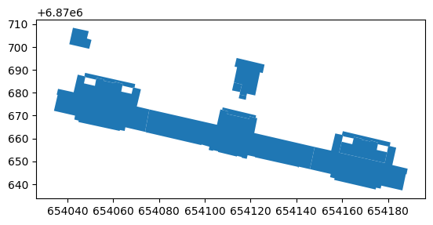
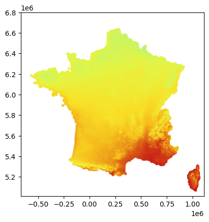
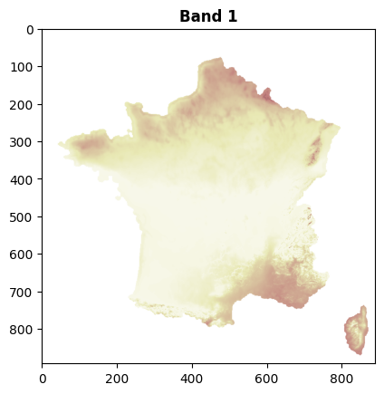
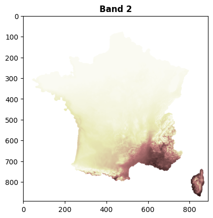
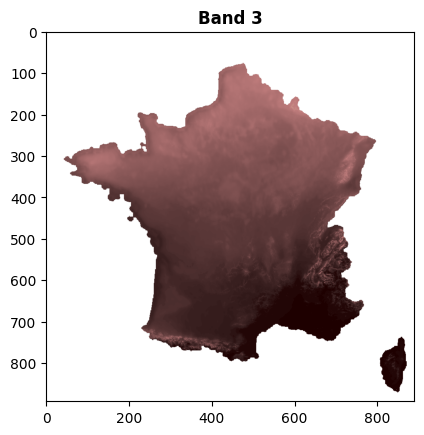
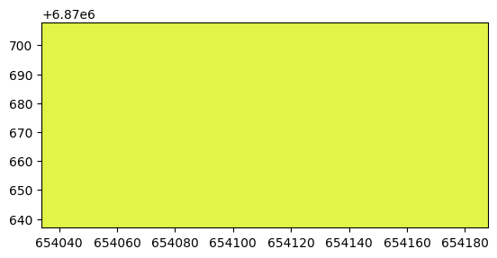
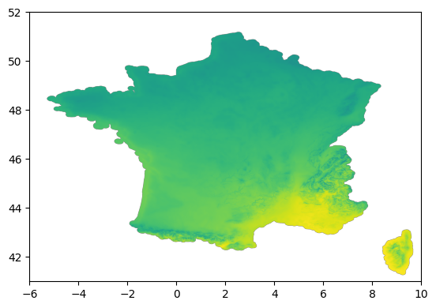

```python
%load_ext autoreload
%autoreload 2
```

# Exploration WMS de la couche potentiel solaire


```python
# Executer ci dessous ci besoin pour récupérer les données
# !extract-sample-data
# Et pour sauver une version markdown des notebooks, utiliser
# jupyter nbconvert wms_potentiel_solaire.ipynb --to markdown --output-dir=exports/
```


```python
from owslib.wms import WebMapService

import geopandas as gpd
import pandas as pd
import matplotlib.pyplot as plt
import contextily as cx
from shapely.affinity import translate
from shapely.ops import unary_union
from shapely import intersection
from pathlib import Path
import numpy as np

import warnings
warnings.filterwarnings('ignore') 
```


```python
import rasterio
from io import BytesIO
from rasterio.plot import show
from rasterio import MemoryFile
from rasterio.plot import show
```


```python
import owslib
owslib.__version__
```


    '0.32.1'


# Récupération data d'une école


```python
DATA_FOLDER = Path("../data")

saint_denis_path = DATA_FOLDER / "saint_denis_reference_data.gpkg"

ecoles = gpd.read_file(saint_denis_path, layer="bdtopo_education").to_crs(2154)
batiments = gpd.read_file(saint_denis_path, layer="bdtopo_batiment").to_crs(2154)

ID = "SURFACTI0000000002555648"

batiments_ecole = batiments[batiments.cleabs_left__zone == ID]
boite = batiments_ecole.geometry.total_bounds
batiments_ecole.plot()
```


    <Axes: >


    

    


# Definitions WMS


```python
# https://geoservices.ign.fr/services-web-experts-energies-renouvelables
# url = 'https://data.geopf.fr/annexes/ressources/wms-r/enr.xml'
url = "https://data.geopf.fr/wms-r/wms?SERVICE=WMS&"
wms = WebMapService(url, version='1.3.0')
layer= 'IRRADIATION.SOLAIRE'
```

# On commence par la France


```python
minx = -667916
maxx = 1113194
miny = 5012341
maxy = 6800125
espg = "3857"
Y = (maxy-miny)//2000
X = (maxx-minx)//2000
print(X,Y)
```

    890 893


```python
img = wms.getmap(layers = [layer], srs = 'EPSG:3857', bbox = [minx,miny,maxx,maxy] , size = (X, Y), format= 'image/geotiff',transparent=True,mode='32bit')
```


```python
with MemoryFile(img) as memfile:
    with memfile.open() as dataset:
        metas = dataset.meta
        show(dataset)
```


    

    


```python
allImgs = []
with rasterio.open(BytesIO(img.read())) as r:
    for k in range(3):
        thing = r.read(k+1)
        allImgs.append(thing)
        show(thing, cmap='pink',title="Band "+str(k+1))
```


    

    


    

    


    

    


```python
metas
```


    {'driver': 'GTiff',
     'dtype': 'uint8',
     'nodata': None,
     'width': 890,
     'height': 893,
     'count': 4,
     'crs': CRS.from_wkt('PROJCS["EPSG:3857",GEOGCS["unknown",DATUM["unnamed",SPHEROID["unnamed",6378137,0]],PRIMEM["Greenwich",0],UNIT["degree",0.0174532925199433,AUTHORITY["EPSG","9122"]]],PROJECTION["Mercator_1SP"],PARAMETER["central_meridian",0],PARAMETER["scale_factor",1],PARAMETER["false_easting",0],PARAMETER["false_northing",0],UNIT["metre",1,AUTHORITY["EPSG","9001"]],AXIS["Easting",EAST],AXIS["Northing",NORTH]]'),
     'transform': Affine(2001.247191011236, 0.0, -667916.0,
            0.0, -2001.9977603583427, 6800125.0)}


On a bien la France mais pas l'échelle.

# Pour l'école


```python
print(boite)

x1new = int(boite[0])
x2new = int(boite[2])

y1new =  int(boite[1])
y2new =  int(boite[3])

X = (x2new - x1new)*5
Y = (y2new - y1new)*5

layer= 'IRRADIATION.SOLAIRE'
#layer= "POTENTIEL.VENT.140M"
imgEcole = wms.getmap(layers = [layer], srs = 'EPSG:2154', bbox = [x1new,y1new,x2new,y2new] , size = (X, Y), format= 'image/geotiff')

with MemoryFile(imgEcole) as memfile:
     with memfile.open() as dataset:
            A = dataset
            show(dataset)
```

    [ 654034.1 6870637.3  654188.6 6870708.4]


    

    


# Potentiel solaire: Fichier statique


```python
import os
import rasterio.mask
```


```python
batiments_ecole2 = batiments_ecole.copy()
geo = batiments_ecole.to_crs(epsg=6933).buffer(2000) 
batiments_ecole2["geometry"] = geo
batiments_ecole2 = batiments_ecole2.to_crs(epsg=4326)
```

## Verifier à l'échelle de la France


```python

tile = "/ENR_1-0_IRR-SOL_TIFF_WGS84G_FXX_2023-10-01/1_DONNEES_LIVRAISON/GlobalHorizontalIrradiation.tif"
path = DATA_FOLDER / tile
with rasterio.open("../data/"+str(path)) as img:
    print(img.crs)
    show(img)
    #out_image, out_transform = rasterio.mask.mask(img, zone.geometry, crop=True)
    #out_image, out_transform = rasterio.mask.mask(img, batiments_ecole.geometry, crop=True)
    #out_meta = img.meta
    #out_image = img.read()
    
```

    EPSG:4326


    

    


```python
geotiff_cached = "../data/cache/pot/"+ID+".masked.tif"
os.makedirs("../data/cache/pot", exist_ok=True)

if not os.path.isfile(geotiff_cached):
    zone = batiments_ecole2## buffer de 2km
    zone.to_crs(epsg=4326)
    tile = "/ENR_1-0_IRR-SOL_TIFF_WGS84G_FXX_2023-10-01/1_DONNEES_LIVRAISON/GlobalHorizontalIrradiation.tif"
    path = DATA_FOLDER / tile
    with rasterio.open("../data/"+str(path)) as img:
        print(img.crs)
        #show(img)
        out_image, out_transform = rasterio.mask.mask(img, zone.geometry, crop=True)
        #out_image, out_transform = rasterio.mask.mask(img, batiments_ecole.geometry, crop=True)
        #out_meta = img.meta
        #out_image = img.read()
        
```

    EPSG:4326


Potentiel moyen


```python
out_image[np.isnan(out_image)] = 0
avg = np.mean(out_image[out_image > 100])
print("Ensoleillement moyen:",avg,"kWh/m2/an")
```

    Ensoleillement moyen: 1141.3536 kWh/m2/an


# Assemblage pour une école


```python
def surface_utile(surfacetotale):
    if surfacetotale < 500:
        ratio = 0.4*surfacetotale/5000+0.2
        if surfacetotale > 100:
            return ratio*surfacetotale
    else:
        return surfacetotale*0.6
    return 0
        
```


```python
src = DATA_FOLDER / "saint_denis_reference_data.gpkg"
potentiel = gpd.read_file(src, layer="potentielsolaire_toitures")
potentiel_ecole = potentiel[potentiel.id.isin(batiments_ecole.cleabs_left__bat)]
```


```python
# hypothese
rendement = 0.1
```


```python
potentiel_ecole = potentiel_ecole[["id",'st_areashape',"eq_pano","eq_surf",'surf_util','moyenne2','production',"geometry",'st_lengthshape']]
potentiel_ecole["surf_utile_calculee"] = potentiel_ecole['st_areashape'].apply(lambda x: surface_utile(x) )
potentiel_ecole["production_calculee"] = avg*potentiel_ecole["surf_utile_calculee"]*rendement
potentiel_ecole["fit"] = potentiel_ecole.production_calculee / potentiel_ecole.production
potentiel_ecole["IRR"] = avg 
potentiel_ecole[["id",'surf_util',"surf_utile_calculee","moyenne2",'IRR','production','production_calculee',"fit"]]
```


<div>
<style scoped>
    .dataframe tbody tr th:only-of-type {
        vertical-align: middle;
    }

    .dataframe tbody tr th {
        vertical-align: top;
    }

    .dataframe thead th {
        text-align: right;
    }
</style>
<table border="1" class="dataframe">
  <thead>
    <tr style="text-align: right;">
      <th></th>
      <th>id</th>
      <th>surf_util</th>
      <th>surf_utile_calculee</th>
      <th>moyenne2</th>
      <th>IRR</th>
      <th>production</th>
      <th>production_calculee</th>
      <th>fit</th>
    </tr>
  </thead>
  <tbody>
    <tr>
      <th>155</th>
      <td>BATIMENT0000000243405820</td>
      <td>276.75</td>
      <td>307.863000</td>
      <td>1235.103759</td>
      <td>1141.353638</td>
      <td>31146.179638</td>
      <td>35138.055496</td>
      <td>1.128166</td>
    </tr>
    <tr>
      <th>157</th>
      <td>BATIMENT0000000243405817</td>
      <td>0.00</td>
      <td>0.000000</td>
      <td>NaN</td>
      <td>1141.353638</td>
      <td>0.000000</td>
      <td>0.000000</td>
      <td>NaN</td>
    </tr>
    <tr>
      <th>158</th>
      <td>BATIMENT0000000243405818</td>
      <td>605.25</td>
      <td>523.773000</td>
      <td>1211.635309</td>
      <td>1141.353638</td>
      <td>66822.147713</td>
      <td>59781.021888</td>
      <td>0.894629</td>
    </tr>
    <tr>
      <th>159</th>
      <td>BATIMENT0000000243405827</td>
      <td>0.00</td>
      <td>0.000000</td>
      <td>NaN</td>
      <td>1141.353638</td>
      <td>0.000000</td>
      <td>0.000000</td>
      <td>NaN</td>
    </tr>
    <tr>
      <th>160</th>
      <td>BATIMENT0000000243405819</td>
      <td>321.75</td>
      <td>388.971000</td>
      <td>1200.143661</td>
      <td>1141.353638</td>
      <td>35185.643833</td>
      <td>44395.346581</td>
      <td>1.261746</td>
    </tr>
    <tr>
      <th>161</th>
      <td>BATIMENT0000000243405821</td>
      <td>2.25</td>
      <td>28.041675</td>
      <td>NaN</td>
      <td>1141.353638</td>
      <td>0.000000</td>
      <td>3200.546749</td>
      <td>inf</td>
    </tr>
    <tr>
      <th>162</th>
      <td>BATIMENT0000000243405822</td>
      <td>2.25</td>
      <td>0.000000</td>
      <td>NaN</td>
      <td>1141.353638</td>
      <td>0.000000</td>
      <td>0.000000</td>
      <td>NaN</td>
    </tr>
    <tr>
      <th>163</th>
      <td>BATIMENT0000000243405823</td>
      <td>0.00</td>
      <td>0.000000</td>
      <td>NaN</td>
      <td>1141.353638</td>
      <td>0.000000</td>
      <td>0.000000</td>
      <td>NaN</td>
    </tr>
    <tr>
      <th>164</th>
      <td>BATIMENT0000000243405826</td>
      <td>0.00</td>
      <td>0.000000</td>
      <td>NaN</td>
      <td>1141.353638</td>
      <td>0.000000</td>
      <td>0.000000</td>
      <td>NaN</td>
    </tr>
    <tr>
      <th>256</th>
      <td>BATIMENT0000000243405828</td>
      <td>42.75</td>
      <td>30.695392</td>
      <td>1066.866717</td>
      <td>1141.353638</td>
      <td>5582.486783</td>
      <td>3503.429765</td>
      <td>0.627575</td>
    </tr>
    <tr>
      <th>311</th>
      <td>BATIMENT0000000243405871</td>
      <td>0.00</td>
      <td>0.000000</td>
      <td>NaN</td>
      <td>1141.353638</td>
      <td>0.000000</td>
      <td>0.000000</td>
      <td>NaN</td>
    </tr>
  </tbody>
</table>
</div>


```python
total_ecole         = potentiel_ecole.production.sum()
total_ecole_calcule = potentiel_ecole.production_calculee.sum()
print("# Verification des potentiels pour l'école:",ID,"\n")
print("* BDD Potentiel solaire\t",int(total_ecole),"kWh/an")
print("* Estimation ordre 0\t",int(total_ecole_calcule),"kWh/an")
print("* Tentative accuracy\t",int(total_ecole/total_ecole_calcule*100),"%")
```

    # Verification des potentiels pour l'école: SURFACTI0000000002555648 
    
    * BDD Potentiel solaire	 138736 kWh/an
    * Estimation ordre 0	 146018 kWh/an
    * Tentative accuracy	 95 %

