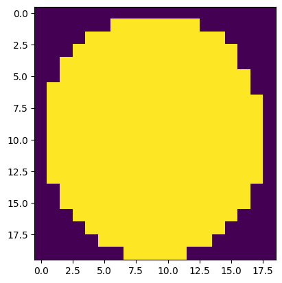

```python
%load_ext autoreload
%autoreload 2
```

# Exploration WMS de la couche potentiel solaire


```python
# Executer ci dessous ci besoin pour récupérer les données
# !extract-sample-data
# Et pour sauver une version markdown des notebooks, utiliser
# jupyter nbconvert wms_potentiel_solaire.ipynb --to markdown --output-dir=exports/
```


```python
from owslib.wms import WebMapService

import geopandas as gpd
import pandas as pd
import matplotlib.pyplot as plt
import contextily as cx
from shapely.affinity import translate
from shapely.ops import unary_union
from shapely import intersection
from pathlib import Path
import numpy as np

import warnings
warnings.filterwarnings('ignore') 
```


```python
import rasterio
from io import BytesIO
from rasterio.plot import show
from rasterio import MemoryFile
from rasterio.plot import show
```


```python
import owslib
owslib.__version__
```


    '0.32.1'


# Récupération data d'une école


```python
DATA_FOLDER = Path("../data")

saint_denis_path = DATA_FOLDER / "saint_denis_reference_data.gpkg"

ecoles = gpd.read_file(saint_denis_path, layer="bdtopo_education").to_crs(2154)
batiments = gpd.read_file(saint_denis_path, layer="bdtopo_batiment").to_crs(2154)

ID = "SURFACTI0000000002555648"

batiments_ecole = batiments[batiments.cleabs_left__zone == ID]
boite = batiments_ecole.geometry.total_bounds
batiments_ecole.plot()
```


    <Axes: >


    

    


# Definitions WMS


```python
# https://geoservices.ign.fr/services-web-experts-energies-renouvelables
# url = 'https://data.geopf.fr/annexes/ressources/wms-r/enr.xml'
url = "https://data.geopf.fr/wms-r/wms?SERVICE=WMS&"
wms = WebMapService(url, version='1.3.0')
layer= 'IRRADIATION.SOLAIRE'
```

# On commence par la France


```python
minx = -667916
maxx = 1113194
miny = 5012341
maxy = 6800125
espg = "3857"
Y = (maxy-miny)//2000
X = (maxx-minx)//2000
print(X,Y)
```

    890 893


```python
img = wms.getmap(layers = [layer], srs = 'EPSG:3857', bbox = [minx,miny,maxx,maxy] , size = (X, Y), format= 'image/geotiff',transparent=True,mode='32bit')
```


```python
with MemoryFile(img) as memfile:
    with memfile.open() as dataset:
        metas = dataset.meta
        show(dataset)
```


    

    


```python
allImgs = []
with rasterio.open(BytesIO(img.read())) as r:
    for k in range(3):
        thing = r.read(k+1)
        allImgs.append(thing)
        show(thing, cmap='pink',title="Band "+str(k+1))
```


    

    


    

    


    

    


```python
metas
```


    {'driver': 'GTiff',
     'dtype': 'uint8',
     'nodata': None,
     'width': 890,
     'height': 893,
     'count': 4,
     'crs': CRS.from_wkt('PROJCS["EPSG:3857",GEOGCS["unknown",DATUM["unnamed",SPHEROID["unnamed",6378137,0]],PRIMEM["Greenwich",0],UNIT["degree",0.0174532925199433,AUTHORITY["EPSG","9122"]]],PROJECTION["Mercator_1SP"],PARAMETER["central_meridian",0],PARAMETER["scale_factor",1],PARAMETER["false_easting",0],PARAMETER["false_northing",0],UNIT["metre",1,AUTHORITY["EPSG","9001"]],AXIS["Easting",EAST],AXIS["Northing",NORTH]]'),
     'transform': Affine(2001.247191011236, 0.0, -667916.0,
            0.0, -2001.9977603583427, 6800125.0)}


On a bien la France mais pas l'échelle.

# Pour l'école


```python
print(boite)

x1new = int(boite[0])
x2new = int(boite[2])

y1new =  int(boite[1])
y2new =  int(boite[3])

X = (x2new - x1new)*5
Y = (y2new - y1new)*5

layer= 'IRRADIATION.SOLAIRE'
#layer= "POTENTIEL.VENT.140M"
imgEcole = wms.getmap(layers = [layer], srs = 'EPSG:2154', bbox = [x1new,y1new,x2new,y2new] , size = (X, Y), format= 'image/geotiff')

with MemoryFile(imgEcole) as memfile:
     with memfile.open() as dataset:
            A = dataset
            show(dataset)
```

    [ 654034.1 6870637.3  654188.6 6870708.4]


    

    


# Fichier statique


```python
import os
import rasterio.mask
```


```python
batiments_ecole2 = batiments_ecole.copy()
geo = batiments_ecole.to_crs(epsg=6933).buffer(2000) 
batiments_ecole2["geometry"] = geo
batiments_ecole2 = batiments_ecole2.to_crs(epsg=4326)
batiments_ecole2
```


<div>
<style scoped>
    .dataframe tbody tr th:only-of-type {
        vertical-align: middle;
    }

    .dataframe tbody tr th {
        vertical-align: top;
    }

    .dataframe thead th {
        text-align: right;
    }
</style>
<table border="1" class="dataframe">
  <thead>
    <tr style="text-align: right;">
      <th></th>
      <th>cleabs_left__bat</th>
      <th>nature__bat</th>
      <th>usage_1</th>
      <th>usage_2</th>
      <th>construction_legere</th>
      <th>etat_de_l_objet__bat</th>
      <th>date_creation_left__bat</th>
      <th>date_modification_left__bat</th>
      <th>date_d_apparition_left__bat</th>
      <th>date_de_confirmation_left__bat</th>
      <th>...</th>
      <th>chef_lieu_de_departement__zone</th>
      <th>chef_lieu_de_region__zone</th>
      <th>capitale_d_etat__zone</th>
      <th>date_du_recensement__zone</th>
      <th>organisme_recenseur__zone</th>
      <th>codes_siren_des_epci__zone</th>
      <th>lien_vers_chef_lieu__zone</th>
      <th>liens_vers_autorite_administrative__zone</th>
      <th>code_siren__zone</th>
      <th>geometry</th>
    </tr>
  </thead>
  <tbody>
    <tr>
      <th>310</th>
      <td>BATIMENT0000000243405820</td>
      <td>Indifférenciée</td>
      <td>Commercial et services</td>
      <td>None</td>
      <td>False</td>
      <td>En service</td>
      <td>2010-09-06 11:57:20.197</td>
      <td>2019-01-09 13:12:02.057</td>
      <td>None</td>
      <td>NaT</td>
      <td>...</td>
      <td>False</td>
      <td>False</td>
      <td>False</td>
      <td>2021-01-01</td>
      <td>INSEE</td>
      <td>200054781/200057867</td>
      <td>PAIHABIT0000000002597636</td>
      <td>SURFACTI0000000002556769</td>
      <td>219300662</td>
      <td>POLYGON ((2.3546 48.94213, 2.35463 48.9422, 2....</td>
    </tr>
    <tr>
      <th>311</th>
      <td>BATIMENT0000000243405818</td>
      <td>Indifférenciée</td>
      <td>Commercial et services</td>
      <td>None</td>
      <td>False</td>
      <td>En service</td>
      <td>2010-09-06 11:57:20.197</td>
      <td>2019-01-09 13:12:02.057</td>
      <td>None</td>
      <td>NaT</td>
      <td>...</td>
      <td>False</td>
      <td>False</td>
      <td>False</td>
      <td>2021-01-01</td>
      <td>INSEE</td>
      <td>200054781/200057867</td>
      <td>PAIHABIT0000000002597636</td>
      <td>SURFACTI0000000002556769</td>
      <td>219300662</td>
      <td>POLYGON ((2.35242 48.93476, 2.35242 48.93484, ...</td>
    </tr>
    <tr>
      <th>312</th>
      <td>BATIMENT0000000243405821</td>
      <td>Indifférenciée</td>
      <td>Commercial et services</td>
      <td>None</td>
      <td>False</td>
      <td>En service</td>
      <td>2010-09-06 11:57:20.197</td>
      <td>2019-01-09 13:12:02.057</td>
      <td>None</td>
      <td>NaT</td>
      <td>...</td>
      <td>False</td>
      <td>False</td>
      <td>False</td>
      <td>2021-01-01</td>
      <td>INSEE</td>
      <td>200054781/200057867</td>
      <td>PAIHABIT0000000002597636</td>
      <td>SURFACTI0000000002556769</td>
      <td>219300662</td>
      <td>POLYGON ((2.38476 48.95484, 2.38553 48.95435, ...</td>
    </tr>
    <tr>
      <th>313</th>
      <td>BATIMENT0000000243405822</td>
      <td>Indifférenciée</td>
      <td>Commercial et services</td>
      <td>None</td>
      <td>False</td>
      <td>En service</td>
      <td>2010-09-06 11:57:20.197</td>
      <td>2019-01-09 13:12:02.057</td>
      <td>None</td>
      <td>NaT</td>
      <td>...</td>
      <td>False</td>
      <td>False</td>
      <td>False</td>
      <td>2021-01-01</td>
      <td>INSEE</td>
      <td>200054781/200057867</td>
      <td>PAIHABIT0000000002597636</td>
      <td>SURFACTI0000000002556769</td>
      <td>219300662</td>
      <td>POLYGON ((2.37807 48.91091, 2.37806 48.91091, ...</td>
    </tr>
    <tr>
      <th>314</th>
      <td>BATIMENT0000000243405819</td>
      <td>Indifférenciée</td>
      <td>Commercial et services</td>
      <td>None</td>
      <td>False</td>
      <td>En service</td>
      <td>2010-09-06 11:57:20.197</td>
      <td>2019-01-09 13:12:02.057</td>
      <td>None</td>
      <td>NaT</td>
      <td>...</td>
      <td>False</td>
      <td>False</td>
      <td>False</td>
      <td>2021-01-01</td>
      <td>INSEE</td>
      <td>200054781/200057867</td>
      <td>PAIHABIT0000000002597636</td>
      <td>SURFACTI0000000002556769</td>
      <td>219300662</td>
      <td>POLYGON ((2.3728 48.91063, 2.37265 48.91063, 2...</td>
    </tr>
    <tr>
      <th>315</th>
      <td>BATIMENT0000000243405817</td>
      <td>Indifférenciée</td>
      <td>Commercial et services</td>
      <td>None</td>
      <td>False</td>
      <td>En service</td>
      <td>2010-09-06 11:57:20.197</td>
      <td>2019-01-09 13:12:02.057</td>
      <td>None</td>
      <td>NaT</td>
      <td>...</td>
      <td>False</td>
      <td>False</td>
      <td>False</td>
      <td>2021-01-01</td>
      <td>INSEE</td>
      <td>200054781/200057867</td>
      <td>PAIHABIT0000000002597636</td>
      <td>SURFACTI0000000002556769</td>
      <td>219300662</td>
      <td>POLYGON ((2.35375 48.94122, 2.35375 48.94123, ...</td>
    </tr>
    <tr>
      <th>316</th>
      <td>BATIMENT0000000243405827</td>
      <td>Indifférenciée</td>
      <td>Commercial et services</td>
      <td>None</td>
      <td>False</td>
      <td>En service</td>
      <td>2010-09-06 11:57:20.197</td>
      <td>2019-01-09 13:12:02.057</td>
      <td>None</td>
      <td>NaT</td>
      <td>...</td>
      <td>False</td>
      <td>False</td>
      <td>False</td>
      <td>2021-01-01</td>
      <td>INSEE</td>
      <td>200054781/200057867</td>
      <td>PAIHABIT0000000002597636</td>
      <td>SURFACTI0000000002556769</td>
      <td>219300662</td>
      <td>POLYGON ((2.37598 48.958, 2.37602 48.95799, 2....</td>
    </tr>
    <tr>
      <th>317</th>
      <td>BATIMENT0000000243405828</td>
      <td>Indifférenciée</td>
      <td>Commercial et services</td>
      <td>None</td>
      <td>False</td>
      <td>En service</td>
      <td>2010-09-06 11:57:20.197</td>
      <td>2019-01-09 13:12:02.057</td>
      <td>None</td>
      <td>NaT</td>
      <td>...</td>
      <td>False</td>
      <td>False</td>
      <td>False</td>
      <td>2021-01-01</td>
      <td>INSEE</td>
      <td>200054781/200057867</td>
      <td>PAIHABIT0000000002597636</td>
      <td>SURFACTI0000000002556769</td>
      <td>219300662</td>
      <td>POLYGON ((2.35779 48.91927, 2.35775 48.91932, ...</td>
    </tr>
    <tr>
      <th>318</th>
      <td>BATIMENT0000000243405826</td>
      <td>Indifférenciée</td>
      <td>Commercial et services</td>
      <td>None</td>
      <td>False</td>
      <td>En service</td>
      <td>2010-09-06 11:57:20.197</td>
      <td>2019-01-09 13:12:02.057</td>
      <td>None</td>
      <td>NaT</td>
      <td>...</td>
      <td>False</td>
      <td>False</td>
      <td>False</td>
      <td>2021-01-01</td>
      <td>INSEE</td>
      <td>200054781/200057867</td>
      <td>PAIHABIT0000000002597636</td>
      <td>SURFACTI0000000002556769</td>
      <td>219300662</td>
      <td>POLYGON ((2.37142 48.91093, 2.37138 48.91093, ...</td>
    </tr>
    <tr>
      <th>319</th>
      <td>BATIMENT0000000243405823</td>
      <td>Indifférenciée</td>
      <td>Commercial et services</td>
      <td>None</td>
      <td>False</td>
      <td>En service</td>
      <td>2010-09-06 11:57:20.197</td>
      <td>2019-01-09 13:12:02.057</td>
      <td>None</td>
      <td>NaT</td>
      <td>...</td>
      <td>False</td>
      <td>False</td>
      <td>False</td>
      <td>2021-01-01</td>
      <td>INSEE</td>
      <td>200054781/200057867</td>
      <td>PAIHABIT0000000002597636</td>
      <td>SURFACTI0000000002556769</td>
      <td>219300662</td>
      <td>POLYGON ((2.3531 48.94199, 2.35311 48.94201, 2...</td>
    </tr>
    <tr>
      <th>320</th>
      <td>BATIMENT0000000243405871</td>
      <td>Indifférenciée</td>
      <td>Commercial et services</td>
      <td>None</td>
      <td>False</td>
      <td>En service</td>
      <td>2010-09-06 11:57:20.197</td>
      <td>2022-07-30 23:16:38.938</td>
      <td>None</td>
      <td>NaT</td>
      <td>...</td>
      <td>False</td>
      <td>False</td>
      <td>False</td>
      <td>2021-01-01</td>
      <td>INSEE</td>
      <td>200054781/200057867</td>
      <td>PAIHABIT0000000002597636</td>
      <td>SURFACTI0000000002556769</td>
      <td>219300662</td>
      <td>POLYGON ((2.39086 48.94631, 2.39088 48.94628, ...</td>
    </tr>
  </tbody>
</table>
<p>11 rows × 101 columns</p>
</div>


```python
geotiff_cached = "../data/cache/pot/"+ID+".masked.tif"
os.makedirs("../data/cache/pot", exist_ok=True)

if not os.path.isfile(geotiff_cached):
    zone = batiments_ecole2## buffer de 2km
    zone.to_crs(epsg=4326)
    tile = "/ENR_1-0_IRR-SOL_TIFF_WGS84G_FXX_2023-10-01/1_DONNEES_LIVRAISON/GlobalHorizontalIrradiation.tif"
    path = DATA_FOLDER / tile
    with rasterio.open("../data/"+str(path)) as img:
        print(img.crs)
        #show(img)
        out_image, out_transform = rasterio.mask.mask(img, zone.geometry, crop=True)
        #out_image, out_transform = rasterio.mask.mask(img, batiments_ecole.geometry, crop=True)
        #out_meta = img.meta
        #out_image = img.read()
        
```

    EPSG:4326


Potentiel moyen


```python
show(out_image)
```


    

    


    <Axes: >


```python
out_image[np.isnan(out_image)] = 0
np.mean(out_image[np.nonzero(out_image)])

```


    np.float32(789.9368)


