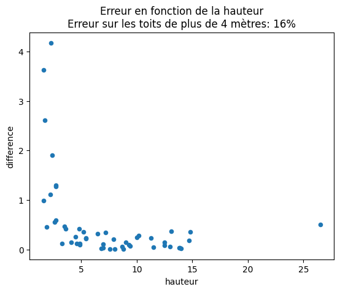

```python
%load_ext autoreload
%autoreload 2
```


```python
from pathlib import Path
import geopandas as gpd
import os
import pandas as pd
import numpy as np
import matplotlib.pyplot as plt
from tqdm import tqdm
tqdm.pandas()

```


```python
# Past legacy from tests. Kept here for testing purposes only.
from owslib.wms import WebMapService
from rasterio import MemoryFile
import rasterio.mask
import geopandas as gpd
```


```python
# Potentiel solaire package
from potentiel_solaire.constants import DATA_FOLDER
from potentiel_solaire.features.roof_attributes import recuperation_mnh_batiment, recuperation_mns_batiment
```


```python
# Executer ci dessous ci besoin pour récupérer les données
# !extract-sample-data
# Et pour sauver une version markdown des notebooks, utiliser
# jupyter nbconvert wns_hauteur.ipynb --to markdown --output-dir=exports/
```


```python


def getMesureMNHToit(row, cache_file="cache.gpkg", layercache="cache_hauteur",
                     valeur="hauteur_calculee"):

    values = ["hauteur_calculee", "hauteur_std-dev", "hauteur_min",
              "hauteur_max", "hauteur_median","mns_std-dev"]
    if valeur not in values:
        return -1
    row = gpd.GeoDataFrame(row).T
    row = gpd.GeoDataFrame(row, geometry="geometry")
    if "cleabs_left__bat" in row.columns:
        row = row.rename(columns={"cleabs_left__bat": "cleabs"})
    cache_h = DATA_FOLDER / cache_file

    if os.path.isfile(str(cache_h)):
        gdf = gpd.read_file(cache_h, layer=layercache)
        existing = gdf["cleabs"].unique()
    else:
        existing = []
    row = row[["cleabs", "hauteur", "geometry"]]

    cols = ["cleabs", "hauteur_calculee", "hauteur", "geometry",
            "hauteur_std-dev", "hauteur_min", "hauteur_max", "hauteur_median","mns_std-dev"]

    if row["cleabs"].iloc[0] in existing:
        v = gdf[gdf.cleabs == row["cleabs"].iloc[0]][valeur].iloc[0]
        return v
    else:
        mnh = recuperation_mnh_batiment(row)
        mns = recuperation_mns_batiment(row)
        row["hauteur_calculee"] = np.average(mnh[np.nonzero(mnh)])
        row["hauteur_std-dev"] = np.std(mnh[np.nonzero(mnh)])
        row["mns_std-dev"] = np.std(mns[np.nonzero(mns)])
        row["hauteur_min"] = np.min(mnh[np.nonzero(mnh)])
        row["hauteur_max"] = np.max(mnh[np.nonzero(mnh)])
        row["hauteur_median"] = np.median(mnh[np.nonzero(mnh)])

        if len(existing):
            gtotal = pd.concat([gdf, row[cols]])
            gtotal.to_file(cache_h, layer=layercache, driver="GPKG")
        else:
            gtotal = row[cols]
            gtotal.to_file(cache_h, layer=layercache, driver="GPKG")

    return row[valeur]

```

#### Test sur les batiments de St Denis, qui n'ont pas de hauteur


```python
saint_denis_path = DATA_FOLDER / "saint_denis_reference_data.gpkg"
batiments = gpd.read_file(saint_denis_path, layer="bdtopo_batiment").to_crs(2154)
batiments = batiments.to_crs(2154)
```


```python
batiments_de_test = pd.concat([batiments[batiments.hauteur.isna()].head(50),batiments[~batiments.hauteur.isna()].head(50)]).to_crs(2154)
for measure in ["hauteur_calculee", "hauteur_std-dev","mns_std-dev"]:
    batiments_de_test[measure] = \
        batiments_de_test.progress_apply(lambda batiment:\
        getMesureMNHToit(batiment, valeur=measure), axis = 1)
# Pourquoi du caching? Les calls prennent 5s par batiment sans cache ce qui impacte le temps de calcul
batiments_de_test[["cleabs_left__bat","hauteur","hauteur_calculee", "hauteur_std-dev","mns_std-dev"]]
```

    100%|██████████| 100/100 [00:04<00:00, 21.62it/s]
    100%|██████████| 100/100 [00:04<00:00, 22.23it/s]
    100%|██████████| 100/100 [00:04<00:00, 23.80it/s]


<div>
<style scoped>
    .dataframe tbody tr th:only-of-type {
        vertical-align: middle;
    }

    .dataframe tbody tr th {
        vertical-align: top;
    }

    .dataframe thead th {
        text-align: right;
    }
</style>
<table border="1" class="dataframe">
  <thead>
    <tr style="text-align: right;">
      <th></th>
      <th>cleabs_left__bat</th>
      <th>hauteur</th>
      <th>hauteur_calculee</th>
      <th>hauteur_std-dev</th>
      <th>mns_std-dev</th>
    </tr>
  </thead>
  <tbody>
    <tr>
      <th>3</th>
      <td>BATIMENT0000000243403399</td>
      <td>NaN</td>
      <td>11.029757</td>
      <td>0.067987</td>
      <td>0.067987</td>
    </tr>
    <tr>
      <th>4</th>
      <td>BATIMENT0000000243403625</td>
      <td>NaN</td>
      <td>6.658521</td>
      <td>2.384741</td>
      <td>2.401657</td>
    </tr>
    <tr>
      <th>9</th>
      <td>BATIMENT0000000243399213</td>
      <td>NaN</td>
      <td>9.085352</td>
      <td>3.031133</td>
      <td>3.039754</td>
    </tr>
    <tr>
      <th>21</th>
      <td>BATIMENT0000000243399192</td>
      <td>NaN</td>
      <td>15.689178</td>
      <td>0.720638</td>
      <td>0.747832</td>
    </tr>
    <tr>
      <th>22</th>
      <td>BATIMENT0000000243399193</td>
      <td>NaN</td>
      <td>8.944949</td>
      <td>3.632601</td>
      <td>3.621020</td>
    </tr>
    <tr>
      <th>...</th>
      <td>...</td>
      <td>...</td>
      <td>...</td>
      <td>...</td>
      <td>...</td>
    </tr>
    <tr>
      <th>57</th>
      <td>BATIMENT0000002005316846</td>
      <td>8.8</td>
      <td>8.908059</td>
      <td>2.549423</td>
      <td>2.561931</td>
    </tr>
    <tr>
      <th>58</th>
      <td>BATIMENT0000000318256795</td>
      <td>2.7</td>
      <td>4.304110</td>
      <td>3.272367</td>
      <td>3.270343</td>
    </tr>
    <tr>
      <th>59</th>
      <td>BATIMENT0000000243401942</td>
      <td>9.3</td>
      <td>10.166159</td>
      <td>3.535393</td>
      <td>3.419895</td>
    </tr>
    <tr>
      <th>60</th>
      <td>BATIMENT0000000243401947</td>
      <td>13.0</td>
      <td>12.285078</td>
      <td>2.676683</td>
      <td>2.704555</td>
    </tr>
    <tr>
      <th>61</th>
      <td>BATIMENT0000000243401948</td>
      <td>12.5</td>
      <td>10.716463</td>
      <td>3.483513</td>
      <td>3.478312</td>
    </tr>
  </tbody>
</table>
<p>100 rows × 5 columns</p>
</div>


#### Les erreurs sont "elevées" sur les petits batiments, la précision est meilleure sur les plus grands bâtiments


```python
check = batiments_de_test[~batiments_de_test.hauteur.isna()]
```


```python
identity_line = np.linspace(check.hauteur.min(),
                            check.hauteur.max())

check.plot.scatter(x="hauteur",y="hauteur_calculee",title="Comparaison hauteur calculée / hauteur 'reelle'")
plt.plot(identity_line, identity_line, color="red", linestyle="dashed", linewidth=1.0)
```


    [<matplotlib.lines.Line2D at 0x7ef23cf5f5b0>]


    

    


#### Représentation des erreurs


```python
def getAccuracy(row):
    acc = np.abs(row["hauteur"]-row["hauteur_calculee"])/np.abs(row["hauteur"])
    return float(acc)
```


```python
check["difference"] = check.apply(lambda batiment: getAccuracy(batiment), axis = 1)
```

    /home/kelu/projets/13_potentiel_solaire/algorithme/.venv/lib/python3.10/site-packages/geopandas/geodataframe.py:1819: SettingWithCopyWarning: 
    A value is trying to be set on a copy of a slice from a DataFrame.
    Try using .loc[row_indexer,col_indexer] = value instead
    
    See the caveats in the documentation: https://pandas.pydata.org/pandas-docs/stable/user_guide/indexing.html#returning-a-view-versus-a-copy
      super().__setitem__(key, value)


```python
detail = "Erreur sur les toits de plus de 4 mètres: "+str(int(100*check["difference"][check.hauteur > 4 ].mean()))+"%"
check.plot.scatter(x="hauteur",y="difference",title="Erreur en fonction de la hauteur\n"+detail)
```


    <Axes: title={'center': 'Erreur en fonction de la hauteur\nErreur sur les toits de plus de 4 mètres: 16%'}, xlabel='hauteur', ylabel='difference'>


    

    


#### Test avec les pentes de toit


```python
toits = gpd.read_file(saint_denis_path, layer="potentielsolaire_toitures").to_crs(2154)
toits = toits[toits.id.isin(check.cleabs_left__bat.unique())][["id","forme"]]
# can be "hauteur_std-dev" instead of mns to get mnh instead of mns
dataset_test = check[["cleabs_left__bat","mns_std-dev","hauteur_calculee"]]
dataset_test.columns = ["id","stdev","h"]
toits = toits.merge(dataset_test,on="id",how="inner")
```

#### test non concluant..


```python
colors = {'plat':'blue', 'Npans':'orange', 'toit2pentes':'green', 'petit_toit':'red'}

fig, ax = plt.subplots(figsize=(6, 6))
grouped = toits.groupby('forme')
for key, group in grouped:
    group.plot.scatter(ax=ax, x='h', y='stdev', label=key, color=colors[key])
plt.show()
```


    

    

