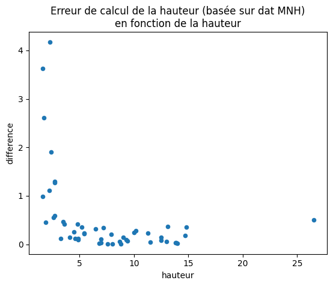

```python
%load_ext autoreload
%autoreload 2
```

    The autoreload extension is already loaded. To reload it, use:
      %reload_ext autoreload


```python
from pathlib import Path
import geopandas as gpd
import pandas as pd
import numpy as np
import warnings
from tqdm import tqdm
tqdm.pandas()

```


```python
# Potentiel solaire package
from potentiel_solaire.constants import DATA_FOLDER
from potentiel_solaire.features.roof_attributes import getHauteurBatiment
```

#### Test sur les batiments de St Denis, qui n'ont pas de hauteur


```python
saint_denis_path = DATA_FOLDER / "saint_denis_reference_data.gpkg"
batiments = gpd.read_file(saint_denis_path, layer="bdtopo_batiment").to_crs(2154)
batiments = batiments.to_crs(2154)
```


```python
batiments_de_test = pd.concat([batiments[batiments.hauteur.isna()].head(50),batiments[~batiments.hauteur.isna()].head(50)])
batiments_de_test["hauteur_calculee"] = batiments_de_test.progress_apply(lambda batiment: getHauteurBatiment(batiment), axis = 1)
batiments_de_test[["cleabs_left__bat","hauteur","hauteur_calculee"]]
```

    100%|██████████| 100/100 [02:20<00:00,  1.41s/it]


<div>
<style scoped>
    .dataframe tbody tr th:only-of-type {
        vertical-align: middle;
    }

    .dataframe tbody tr th {
        vertical-align: top;
    }

    .dataframe thead th {
        text-align: right;
    }
</style>
<table border="1" class="dataframe">
  <thead>
    <tr style="text-align: right;">
      <th></th>
      <th>cleabs_left__bat</th>
      <th>hauteur</th>
      <th>hauteur_calculee</th>
    </tr>
  </thead>
  <tbody>
    <tr>
      <th>3</th>
      <td>BATIMENT0000000243403399</td>
      <td>NaN</td>
      <td>11.029757</td>
    </tr>
    <tr>
      <th>4</th>
      <td>BATIMENT0000000243403625</td>
      <td>NaN</td>
      <td>6.658521</td>
    </tr>
    <tr>
      <th>9</th>
      <td>BATIMENT0000000243399213</td>
      <td>NaN</td>
      <td>9.085352</td>
    </tr>
    <tr>
      <th>21</th>
      <td>BATIMENT0000000243399192</td>
      <td>NaN</td>
      <td>15.689178</td>
    </tr>
    <tr>
      <th>22</th>
      <td>BATIMENT0000000243399193</td>
      <td>NaN</td>
      <td>8.944949</td>
    </tr>
    <tr>
      <th>...</th>
      <td>...</td>
      <td>...</td>
      <td>...</td>
    </tr>
    <tr>
      <th>57</th>
      <td>BATIMENT0000002005316846</td>
      <td>8.8</td>
      <td>8.908059</td>
    </tr>
    <tr>
      <th>58</th>
      <td>BATIMENT0000000318256795</td>
      <td>2.7</td>
      <td>4.304110</td>
    </tr>
    <tr>
      <th>59</th>
      <td>BATIMENT0000000243401942</td>
      <td>9.3</td>
      <td>10.166159</td>
    </tr>
    <tr>
      <th>60</th>
      <td>BATIMENT0000000243401947</td>
      <td>13.0</td>
      <td>12.285078</td>
    </tr>
    <tr>
      <th>61</th>
      <td>BATIMENT0000000243401948</td>
      <td>12.5</td>
      <td>10.716463</td>
    </tr>
  </tbody>
</table>
<p>100 rows × 3 columns</p>
</div>


```python
def getAccuracy(row):
    return np.abs(row["hauteur"]-row["hauteur_calculee"])/np.abs(row["hauteur"])
```

#### Les erreurs sont "elevées" sur les petits batiments, la précision est meilleure sur les plus grands bâtiments


```python
check = batiments_de_test[~batiments_de_test.hauteur.isna()]
check["difference"] = check.apply(lambda batiment: getAccuracy(batiment), axis = 1)
check[["cleabs_left__bat","hauteur","hauteur_calculee","difference"]].plot.scatter(x="hauteur",y="difference",title="Erreur de calcul de la hauteur (basée sur dat MNH)\nen fonction de la hauteur")
```


    <Axes: title={'center': 'Erreur de calcul de la hauteur (basée sur dat MNH)\nen fonction de la hauteur'}, xlabel='hauteur', ylabel='difference'>


    

    


```python
check.plot.scatter(x="hauteur",y="hauteur_calculee",title="Comparaison hauteur calculée / hauteur 'reelle'")
```


    <Axes: title={'center': "Comparaison hauteur calculée / hauteur 'reelle'"}, xlabel='hauteur', ylabel='hauteur_calculee'>


    

    

