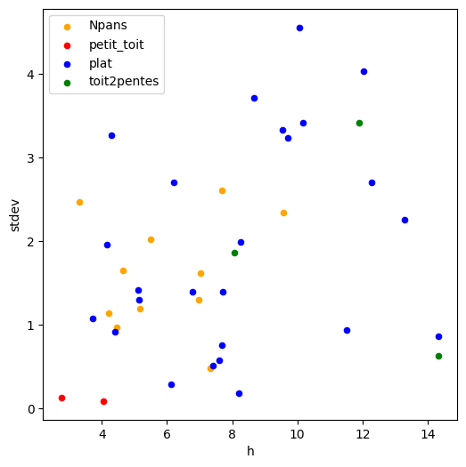

```python
%load_ext autoreload
%autoreload 2
```


```python
from pathlib import Path
from shapely import wkt
import os
import rasterio.mask
import geopandas as gpd
import pandas as pd
import numpy as np
import matplotlib.pyplot as plt
from tqdm import tqdm
import hashlib
tqdm.pandas()

```


```python
# Potentiel solaire package
from potentiel_solaire.constants import DATA_FOLDER
from potentiel_solaire.features.roof_attributes import recuperation_mnh_batiment, recuperation_mns_batiment, recuperation_mnx_batiment
```


```python
# Executer ci dessous ci besoin pour récupérer les données
# !extract-sample-data
# Et pour sauver une version markdown des notebooks, utiliser
# jupyter nbconvert wns_hauteur.ipynb --to markdown --output-dir=exports/
```


```python
saint_denis_path = DATA_FOLDER / "saint_denis_reference_data.gpkg"
batiments = gpd.read_file(saint_denis_path, layer="bdtopo_batiment").to_crs(2154)
batiments = batiments.to_crs(2154)
```

# Testing caching


```python
%%timeit -n3 -r2
# Takes 2s
recuperation_mnx_batiment(batiments[1:2], srs = 'EPSG:2154', layer = "ELEVATION.ELEVATIONGRIDCOVERAGE.HIGHRES", cache=False)
```

    1.66 s ± 138 ms per loop (mean ± std. dev. of 2 runs, 3 loops each)


```python
%%timeit -n3
# Takes 0.0s
recuperation_mnx_batiment(batiments[1:2], srs = 'EPSG:2154', layer = "ELEVATION.ELEVATIONGRIDCOVERAGE.HIGHRES", cache=True)
```

    23.9 ms ± 1.9 ms per loop (mean ± std. dev. of 7 runs, 3 loops each)


# Testing parameters


```python
def getMesureMNHToit(row, valeur="hauteur_calculee"):

    values = ["hauteur_calculee", "hauteur_std-dev", "hauteur_min",
              "hauteur_max", "hauteur_median","mns_std-dev"]
    if valeur not in values:
        return -1
    row = gpd.GeoDataFrame(row).T
    row = gpd.GeoDataFrame(row, geometry="geometry")

    mnh = recuperation_mnh_batiment(row, cache=True)
    mns = recuperation_mns_batiment(row, cache=True)
    row["hauteur_calculee"] = np.average(mnh[np.nonzero(mnh)])
    row["hauteur_std-dev"] = np.std(mnh[np.nonzero(mnh)])
    row["mns_std-dev"] = np.std(mns[np.nonzero(mns)])
    row["hauteur_min"] = np.min(mnh[np.nonzero(mnh)])
    row["hauteur_max"] = np.max(mnh[np.nonzero(mnh)])
    row["hauteur_median"] = np.median(mnh[np.nonzero(mnh)])

    return row[valeur].iloc[0]

```

#### Test sur les batiments de St Denis, qui n'ont pas de hauteur


```python
batiments_de_test = pd.concat([batiments[batiments.hauteur.isna()].head(50),batiments[~batiments.hauteur.isna()].head(50)]).to_crs(2154)
for measure in ["hauteur_calculee", "hauteur_std-dev","mns_std-dev"]:
    batiments_de_test[measure] = \
        batiments_de_test.progress_apply(lambda batiment:\
        getMesureMNHToit(batiment, valeur=measure), axis = 1)
# Pourquoi du caching? Les calls prennent qques par batiment sans cache ce qui impacte le temps de calcul
batiments_de_test[["cleabs_left__bat","hauteur","hauteur_calculee", "hauteur_std-dev","mns_std-dev"]]
```

    100%|██████████| 100/100 [00:07<00:00, 13.54it/s]
    100%|██████████| 100/100 [00:07<00:00, 12.87it/s]
     76%|███████▌  | 76/100 [00:06<00:01, 12.47it/s]

#### Les erreurs sont "elevées" sur les petits batiments, la précision est meilleure sur les plus grands bâtiments


```python
check = batiments_de_test[~batiments_de_test.hauteur.isna()]
```


```python
identity_line = np.linspace(check.hauteur.min(),
                            check.hauteur.max())

check.plot.scatter(x="hauteur",y="hauteur_calculee",title="Comparaison hauteur calculée / hauteur 'reelle'")
plt.plot(identity_line, identity_line, color="red", linestyle="dashed", linewidth=1.0)
```


    [<matplotlib.lines.Line2D at 0x7fbe66d9fd00>]


    

    


#### Représentation des erreurs


```python
def getAccuracy(row):
    acc = np.abs(row["hauteur"]-row["hauteur_calculee"])/np.abs(row["hauteur"])
    return float(acc)
```


```python
check["difference"] = check.apply(lambda batiment: getAccuracy(batiment), axis = 1)
```

    /home/kelu/projets/13_potentiel_solaire/algorithme/.venv/lib/python3.10/site-packages/geopandas/geodataframe.py:1819: SettingWithCopyWarning: 
    A value is trying to be set on a copy of a slice from a DataFrame.
    Try using .loc[row_indexer,col_indexer] = value instead
    
    See the caveats in the documentation: https://pandas.pydata.org/pandas-docs/stable/user_guide/indexing.html#returning-a-view-versus-a-copy
      super().__setitem__(key, value)


```python
detail = "Erreur sur les toits de plus de 4 mètres: "+str(int(100*check["difference"][check.hauteur > 4 ].mean()))+"%"
check.plot.scatter(x="hauteur",y="difference",title="Erreur en fonction de la hauteur\n"+detail)
```


    <Axes: title={'center': 'Erreur en fonction de la hauteur\nErreur sur les toits de plus de 4 mètres: 16%'}, xlabel='hauteur', ylabel='difference'>


    

    


#### Test avec les pentes de toit


```python
toits = gpd.read_file(saint_denis_path, layer="potentielsolaire_toitures").to_crs(2154)
toits = toits[toits.id.isin(check.cleabs_left__bat.unique())][["id","forme"]]
# can be "hauteur_std-dev" instead of mns to get mnh instead of mns
dataset_test = check[["cleabs_left__bat","mns_std-dev","hauteur_calculee"]]
dataset_test.columns = ["id","stdev","h"]
toits = toits.merge(dataset_test,on="id",how="inner")
```

#### test non concluant..


```python
colors = {'plat':'blue', 'Npans':'orange', 'toit2pentes':'green', 'petit_toit':'red'}

fig, ax = plt.subplots(figsize=(6, 6))
grouped = toits.groupby('forme')
for key, group in grouped:
    group.plot.scatter(ax=ax, x='h', y='stdev', label=key, color=colors[key])
plt.show()
```


    

    

