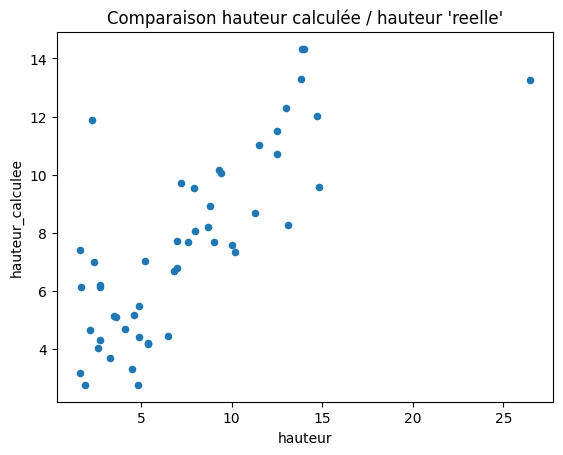

```python
%load_ext autoreload
%autoreload 2
```

    The autoreload extension is already loaded. To reload it, use:
      %reload_ext autoreload


```python
from pathlib import Path
import geopandas as gpd
import pandas as pd
import numpy as np
from tqdm import tqdm
tqdm.pandas()

```


```python
# Potentiel solaire package
from potentiel_solaire.constants import DATA_FOLDER
from potentiel_solaire.features.roof_attributes import getMesureMNSToit
```

#### Test sur les batiments de St Denis, qui n'ont pas de hauteur


```python
saint_denis_path = DATA_FOLDER / "saint_denis_reference_data.gpkg"
batiments = gpd.read_file(saint_denis_path, layer="bdtopo_batiment").to_crs(2154)
batiments = batiments.to_crs(2154)
```


```python
batiments_de_test = pd.concat([batiments[batiments.hauteur.isna()].head(50),batiments[~batiments.hauteur.isna()].head(50)])
batiments_de_test["hauteur_calculee"] = batiments_de_test.progress_apply(lambda batiment: getMesureMNSToit(batiment)[0], axis = 1)
batiments_de_test["hauteur_std-dev"] = batiments_de_test.progress_apply(lambda batiment: getMesureMNSToit(batiment)[1], axis = 1)
batiments_de_test[["cleabs_left__bat","hauteur","hauteur_calculee", "hauteur_std-dev"]]
```

      0%|          | 0/100 [00:00<?, ?it/s]

    100%|██████████| 100/100 [00:05<00:00, 17.21it/s]
    100%|██████████| 100/100 [00:04<00:00, 21.43it/s]


<div>
<style scoped>
    .dataframe tbody tr th:only-of-type {
        vertical-align: middle;
    }

    .dataframe tbody tr th {
        vertical-align: top;
    }

    .dataframe thead th {
        text-align: right;
    }
</style>
<table border="1" class="dataframe">
  <thead>
    <tr style="text-align: right;">
      <th></th>
      <th>cleabs_left__bat</th>
      <th>hauteur</th>
      <th>hauteur_calculee</th>
      <th>hauteur_std-dev</th>
    </tr>
  </thead>
  <tbody>
    <tr>
      <th>3</th>
      <td>BATIMENT0000000243403399</td>
      <td>NaN</td>
      <td>11.029757</td>
      <td>0.067987</td>
    </tr>
    <tr>
      <th>4</th>
      <td>BATIMENT0000000243403625</td>
      <td>NaN</td>
      <td>6.658521</td>
      <td>2.384741</td>
    </tr>
    <tr>
      <th>9</th>
      <td>BATIMENT0000000243399213</td>
      <td>NaN</td>
      <td>9.085352</td>
      <td>3.031133</td>
    </tr>
    <tr>
      <th>21</th>
      <td>BATIMENT0000000243399192</td>
      <td>NaN</td>
      <td>15.689178</td>
      <td>0.720638</td>
    </tr>
    <tr>
      <th>22</th>
      <td>BATIMENT0000000243399193</td>
      <td>NaN</td>
      <td>8.944949</td>
      <td>3.632601</td>
    </tr>
    <tr>
      <th>...</th>
      <td>...</td>
      <td>...</td>
      <td>...</td>
      <td>...</td>
    </tr>
    <tr>
      <th>57</th>
      <td>BATIMENT0000002005316846</td>
      <td>8.8</td>
      <td>8.908059</td>
      <td>2.549423</td>
    </tr>
    <tr>
      <th>58</th>
      <td>BATIMENT0000000318256795</td>
      <td>2.7</td>
      <td>4.304110</td>
      <td>3.272367</td>
    </tr>
    <tr>
      <th>59</th>
      <td>BATIMENT0000000243401942</td>
      <td>9.3</td>
      <td>10.166159</td>
      <td>3.535393</td>
    </tr>
    <tr>
      <th>60</th>
      <td>BATIMENT0000000243401947</td>
      <td>13.0</td>
      <td>12.285078</td>
      <td>2.676683</td>
    </tr>
    <tr>
      <th>61</th>
      <td>BATIMENT0000000243401948</td>
      <td>12.5</td>
      <td>10.716463</td>
      <td>3.483513</td>
    </tr>
  </tbody>
</table>
<p>100 rows × 4 columns</p>
</div>


#### Les erreurs sont "elevées" sur les petits batiments, la précision est meilleure sur les plus grands bâtiments


```python
def getAccuracy(row):
    return np.abs(row["hauteur"]-row["hauteur_calculee"])/np.abs(row["hauteur"])
```


```python
check = batiments_de_test[~batiments_de_test.hauteur.isna()]
check["difference"] = check.apply(lambda batiment: getAccuracy(batiment), axis = 1)
check[["cleabs_left__bat","hauteur","hauteur_calculee","difference"]].plot.scatter(x="hauteur",y="difference",title="Erreur de calcul de la hauteur (basée sur dat MNH)\nen fonction de la hauteur")
```

    /home/kelu/projets/13_potentiel_solaire/algorithme/.venv/lib/python3.10/site-packages/geopandas/geodataframe.py:1819: SettingWithCopyWarning: 
    A value is trying to be set on a copy of a slice from a DataFrame.
    Try using .loc[row_indexer,col_indexer] = value instead
    
    See the caveats in the documentation: https://pandas.pydata.org/pandas-docs/stable/user_guide/indexing.html#returning-a-view-versus-a-copy
      super().__setitem__(key, value)


    <Axes: title={'center': 'Erreur de calcul de la hauteur (basée sur dat MNH)\nen fonction de la hauteur'}, xlabel='hauteur', ylabel='difference'>


    

    


```python
check.plot.scatter(x="hauteur",y="hauteur_calculee",title="Comparaison hauteur calculée / hauteur 'reelle'")
```


    <Axes: title={'center': "Comparaison hauteur calculée / hauteur 'reelle'"}, xlabel='hauteur', ylabel='hauteur_calculee'>


    

    


#### Test avec les pentes de toit

import matplotlib.pyplot as plt


```python
toits = gpd.read_file(saint_denis_path, layer="potentielsolaire_toitures").to_crs(2154)
toits = toits[toits.id.isin(check.cleabs_left__bat.unique())][["id","forme"]]
dataset_test = check[["cleabs_left__bat","hauteur_std-dev","hauteur_calculee"]]
dataset_test.columns = ["id","stdev","h"]
toits = toits.merge(dataset_test,on="id",how="inner")
```

#### test non concluant..


```python
colors = {'plat':'blue', 'Npans':'orange', 'toit2pentes':'green', 'petit_toit':'red'}

fig, ax = plt.subplots(figsize=(6, 6))
grouped = toits.groupby('forme')
for key, group in grouped:
    group.plot.scatter(ax=ax, x='h', y='stdev', label=key, color=colors[key])
plt.show()
```


    

    

