# Example de liste d'écoles

## Ecole élémentaire Jean Mermoz

* Type etablissement: Ecole
* adresse_1: 50 rue Philibert Hoffmann
* nom_commune: Rosny-sous-Bois
* identifiant_de_l_etablissement: 0930341R
* Surface totale: 4366m2

### Image

## Ecole élémentaire Les Boutours

* Type etablissement: Ecole
* adresse_1: 9-11 rue Victor Hugo
* nom_commune: Rosny-sous-Bois
* identifiant_de_l_etablissement: 0932680H
* Surface totale: 3980m2

### Image

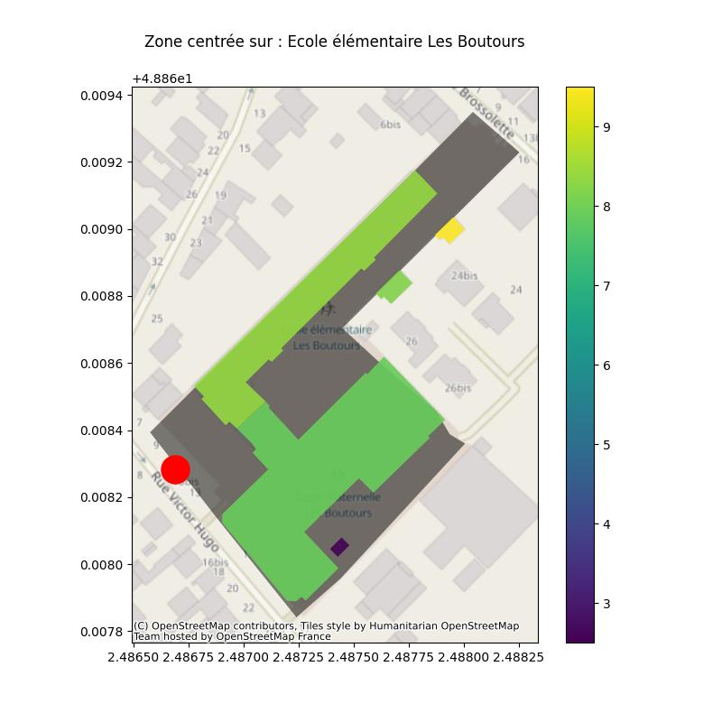

## Ecole élémentaire d'application Raspail

* Type etablissement: Ecole
* adresse_1: 27 rue des Tulipiers
* nom_commune: Rosny-sous-Bois
* identifiant_de_l_etablissement: 0930396A
* Surface totale: 1137m2

### Image

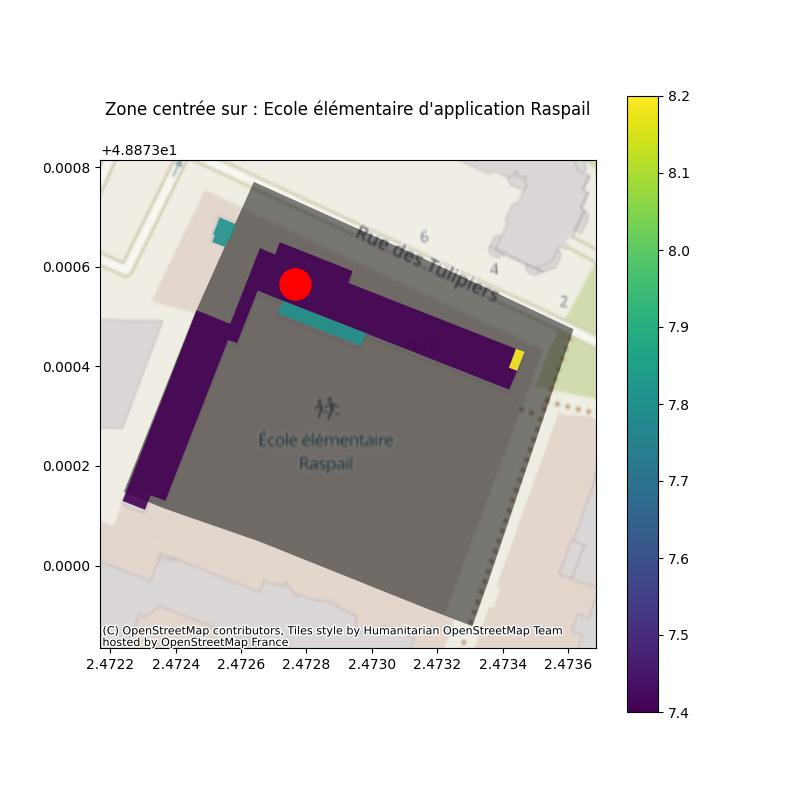

## Ecole maternelle Pauline Kergomard

* Type etablissement: Ecole
* adresse_1: 3 allée Fernand Forest
* nom_commune: Rosny-sous-Bois
* identifiant_de_l_etablissement: 0930423E
* Surface totale: 2735m2

### Image

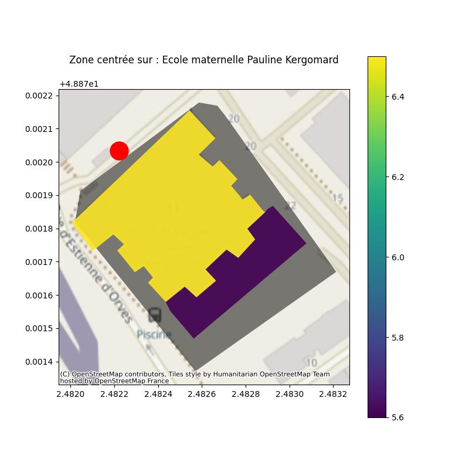

## Ecole élémentaire Félix Eboué

* Type etablissement: Ecole
* adresse_1: 50 rue Philibert Hoffmann
* nom_commune: Rosny-sous-Bois
* identifiant_de_l_etablissement: 0930548R
* Surface totale: 5234m2

### Image

## Ecole maternelle Montgolfier

* Type etablissement: Ecole
* adresse_1: 64 rue Montgolfier
* nom_commune: Villemomble
* identifiant_de_l_etablissement: 0930564H
* Surface totale: 2610m2

### Image

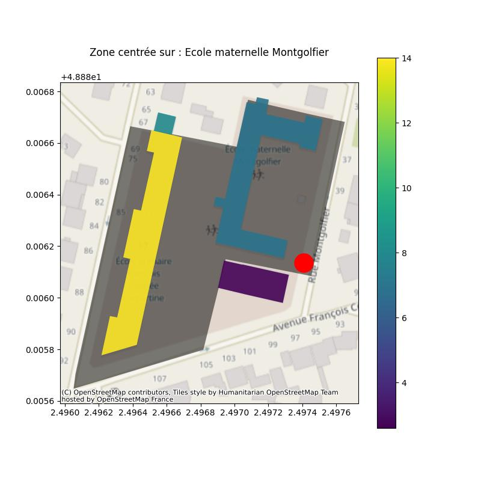

## Ecole maternelle Pré Gentil

* Type etablissement: Ecole
* adresse_1: 10 rue Henri Mondor
* nom_commune: Rosny-sous-Bois
* identifiant_de_l_etablissement: 0930585F
* Surface totale: 3041m2

### Image

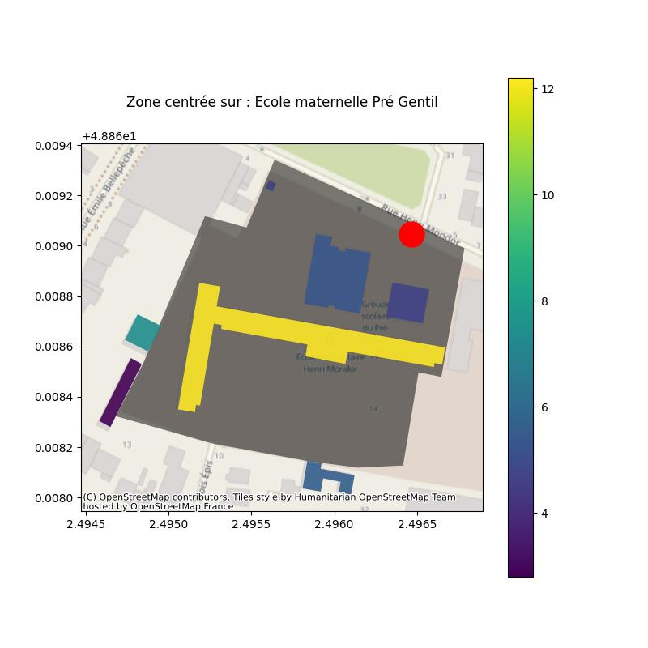

## Ecole maternelle Louis et Madeleine Odru

* Type etablissement: Ecole
* adresse_1: 5 rue  Henri Martin
* nom_commune: Montreuil
* identifiant_de_l_etablissement: 0932718Z
* Surface totale: 2869m2

### Image

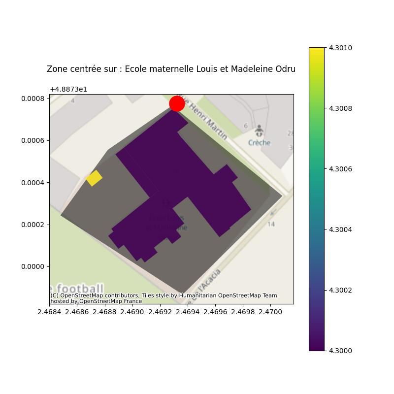

## Collège Langevin Wallon

* Type etablissement: Collège
* adresse_1: 4-6 rue Conrad Adenauer
* nom_commune: Rosny-sous-Bois
* identifiant_de_l_etablissement: 0931723T
* Surface totale: 2084m2

### Image

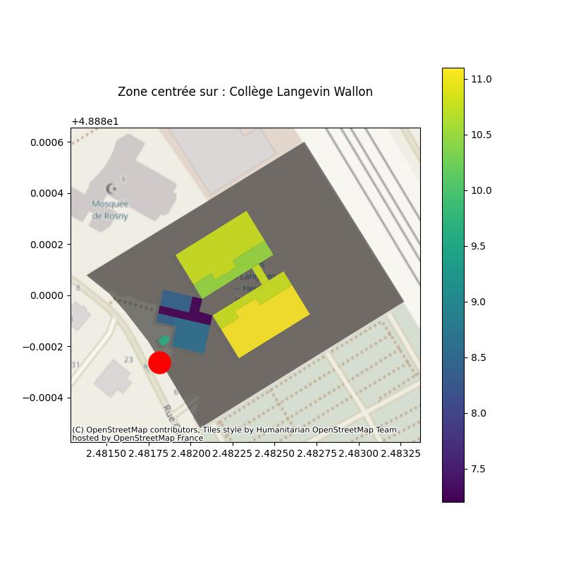

## Circonscription d'inspection du 1er degré de Rosny-sous-Bois

* Type etablissement: Service Administratif
* adresse_1: 259  BOULEVARD DE LA BOISSIERE
* nom_commune: Rosny-sous-Bois
* identifiant_de_l_etablissement: 0931045F
* Surface totale: 3493m2

### Image

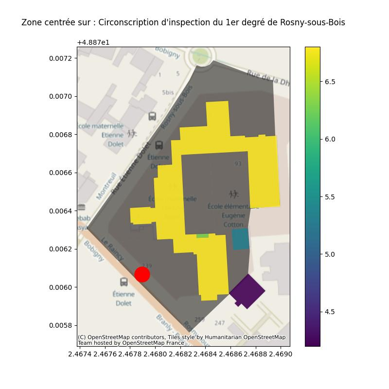

## Circonscription d'inspection du 1er degré de Gagny-Villemomble

* Type etablissement: Service Administratif
* adresse_1: 75 avenue des Limites
* nom_commune: Villemomble
* identifiant_de_l_etablissement: 0931372L
* Surface totale: 2610m2

### Image

## Ecole élémentaire Francoise Dolto

* Type etablissement: Ecole
* adresse_1: 1 parvis Samuel Paty
* nom_commune: Rosny-sous-Bois
* identifiant_de_l_etablissement: 0932819J
* Surface totale: 3293m2

### Image

## Ecole élémentaire du Centre

* Type etablissement: Ecole
* adresse_1: 8 rue Marie Bétremieux
* nom_commune: Rosny-sous-Bois
* identifiant_de_l_etablissement: 0930221K
* Surface totale: 2041m2

### Image

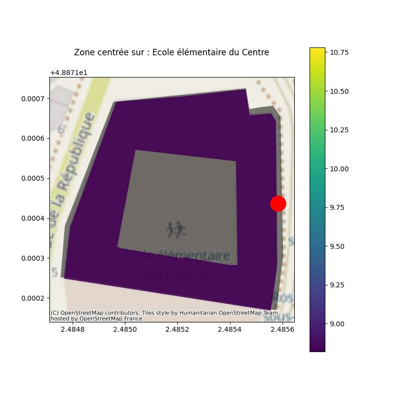

## Ecole maternelle Les Boutours

* Type etablissement: Ecole
* adresse_1: 15 rue Victor Hugo
* nom_commune: Rosny-sous-Bois
* identifiant_de_l_etablissement: 0932592M
* Surface totale: 3980m2

### Image

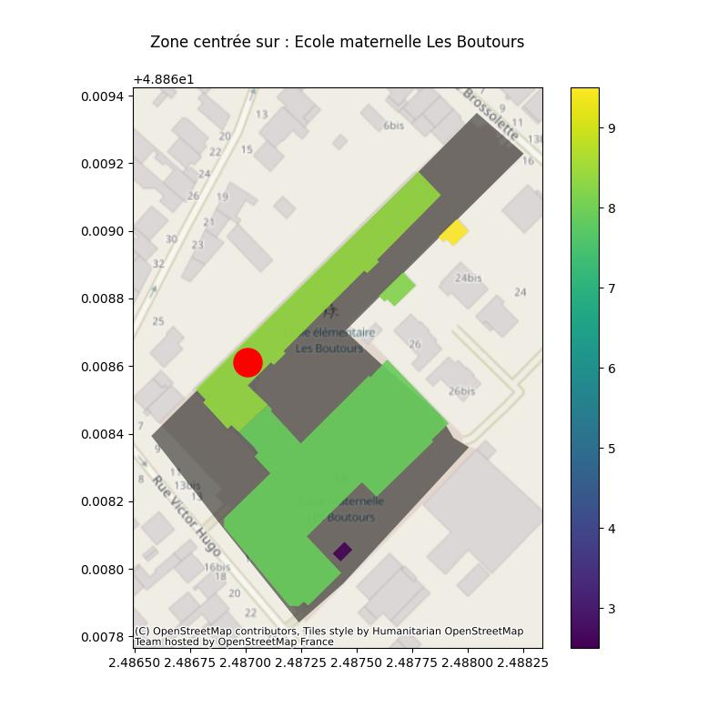

## Collège Albert Camus

* Type etablissement: Collège
* adresse_1: 22 rue Jean Allemane
* nom_commune: Rosny-sous-Bois
* identifiant_de_l_etablissement: 0930586G
* Surface totale: 6194m2

### Image

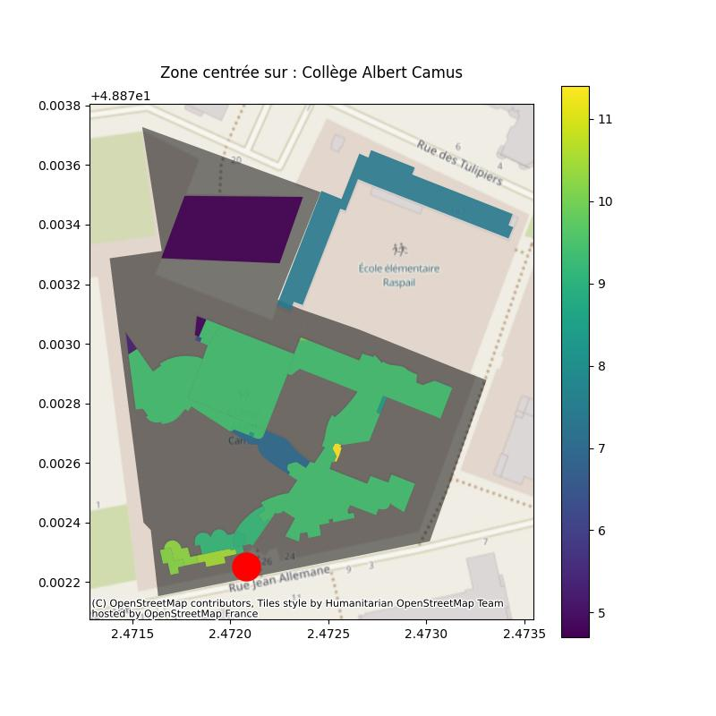

## Centre Médico-Scolaire de Rosny-sous-Bois

* Type etablissement: Service Administratif
* adresse_1: 8 rue HENRI MONDOR
* nom_commune: Rosny-sous-Bois
* identifiant_de_l_etablissement: 0932545L
* Surface totale: 3041m2

### Image

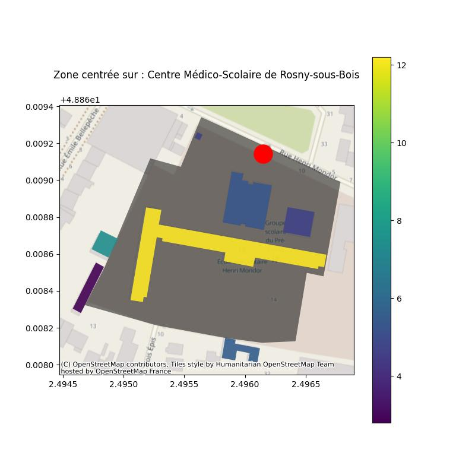

## Ecole élémentaire Romain Rolland

* Type etablissement: Ecole
* adresse_1: 56 rue des Blancs Vilains
* nom_commune: Montreuil
* identifiant_de_l_etablissement: 0930155N
* Surface totale: 3382m2

### Image

## Ecole maternelle Pierre Curie

* Type etablissement: Ecole
* adresse_1: 128 route de Villemomble
* nom_commune: Bondy
* identifiant_de_l_etablissement: 0930531X
* Surface totale: 4167m2

### Image

## Ecole élémentaire Henri Mondor

* Type etablissement: Ecole
* adresse_1: 8 rue Henri Mondor
* nom_commune: Rosny-sous-Bois
* identifiant_de_l_etablissement: 0931467P
* Surface totale: 3041m2

### Image

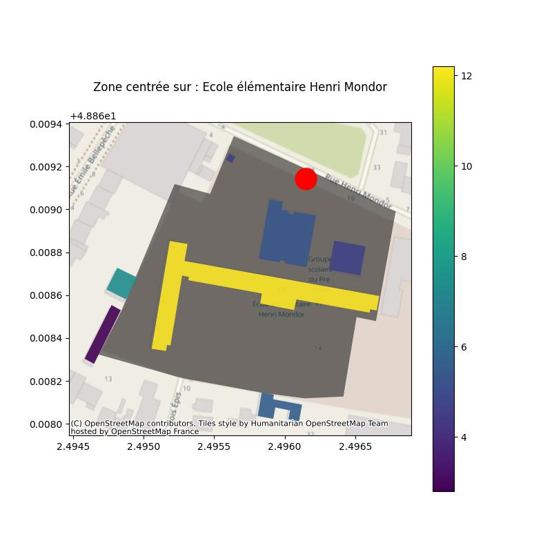

## Ecole maternelle privée Les Merveilles

* Type etablissement: Ecole
* adresse_1: 17 rue Anatole France
* nom_commune: Rosny-sous-Bois
* identifiant_de_l_etablissement: 0932556Y
* Surface totale: 88m2

### Image

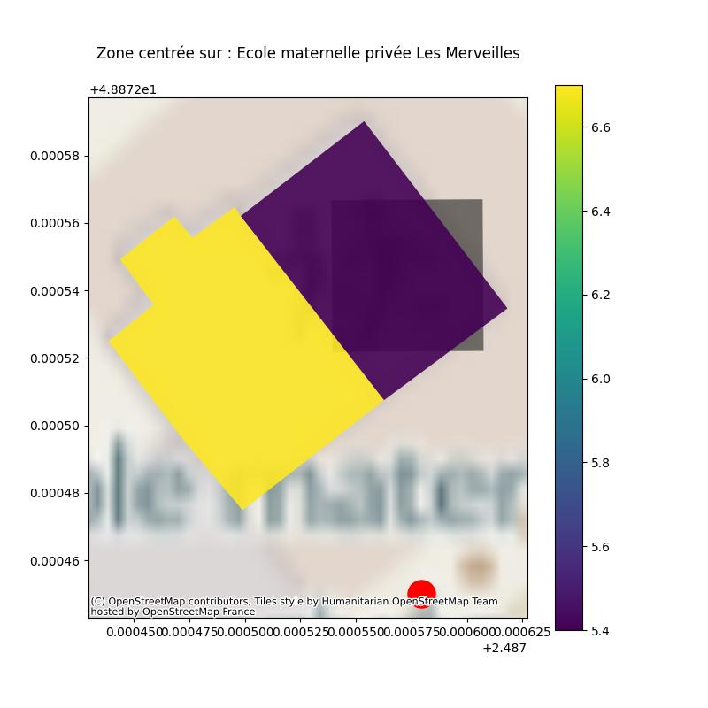

## Ecole primaire Simone Veil

* Type etablissement: Ecole
* adresse_1: 44 rue Hussenet
* nom_commune: Rosny-sous-Bois
* identifiant_de_l_etablissement: 0932764Z
* Surface totale: 1946m2

### Image

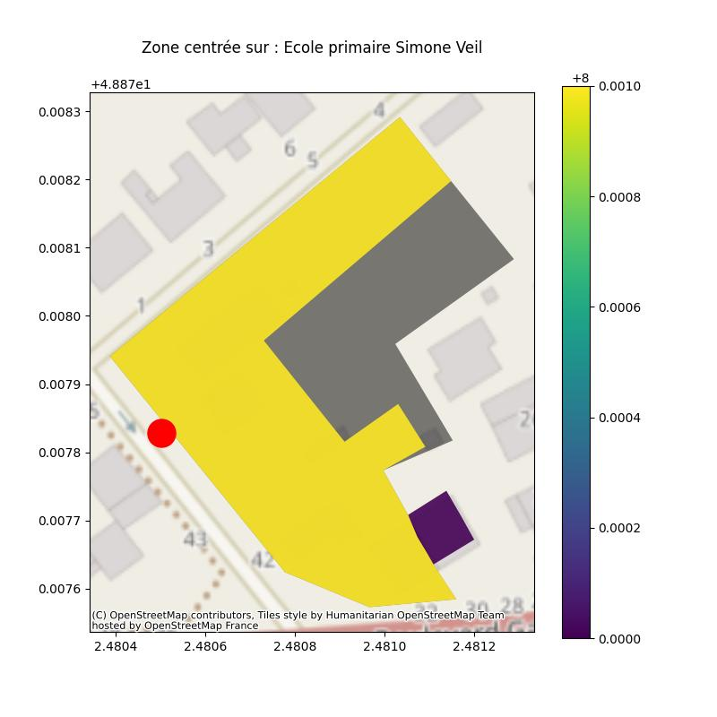

## Ecole élémentaire Jean Moulin

* Type etablissement: Ecole
* adresse_1: 9 rue Jean Moulin
* nom_commune: Rosny-sous-Bois
* identifiant_de_l_etablissement: 0930325Y
* Surface totale: 5471m2

### Image

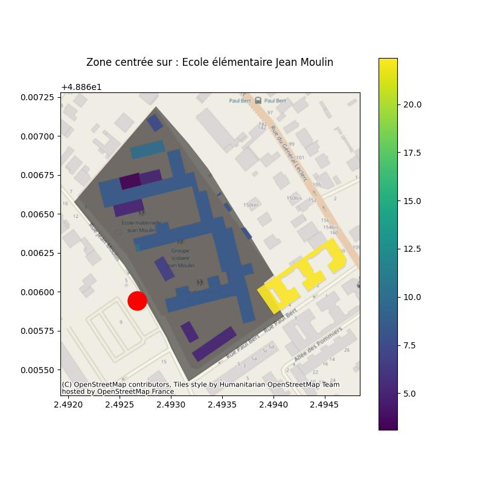

## Ecole maternelle Jean Moulin

* Type etablissement: Ecole
* adresse_1: 9 rue Jean Moulin
* nom_commune: Rosny-sous-Bois
* identifiant_de_l_etablissement: 0930474K
* Surface totale: 5471m2

### Image

## Ecole maternelle Bois-Perrier

* Type etablissement: Ecole
* adresse_1: 5-7 rue Jacques Offenbach
* nom_commune: Rosny-sous-Bois
* identifiant_de_l_etablissement: 0930562F
* Surface totale: 5234m2

### Image

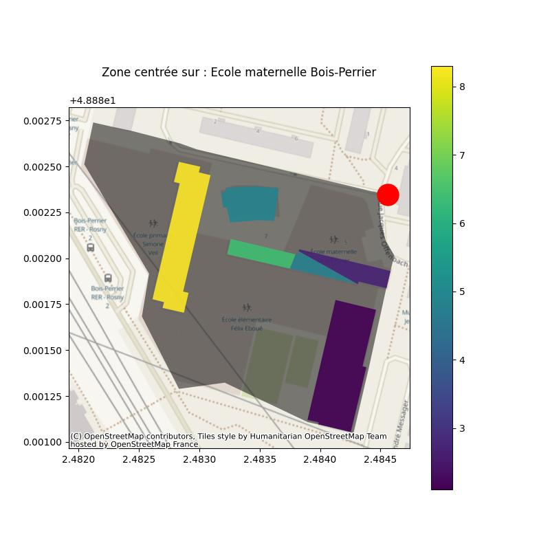

## Ecole maternelle Raspail

* Type etablissement: Ecole
* adresse_1: 141 rue Camélinat
* nom_commune: Rosny-sous-Bois
* identifiant_de_l_etablissement: 0931770U
* Surface totale: 2353m2

### Image

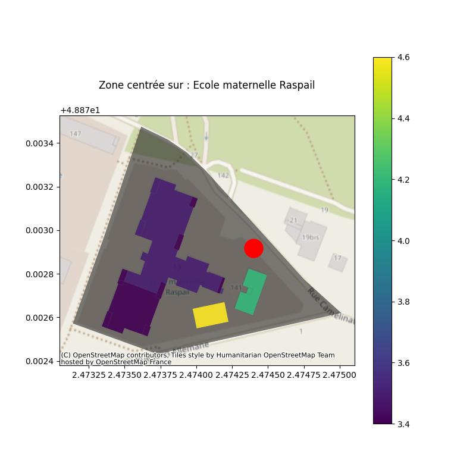

## Ecole maternelle Etienne Dolet

* Type etablissement: Ecole
* adresse_1: 2-4 rue Etienne Dolet
* nom_commune: Rosny-sous-Bois
* identifiant_de_l_etablissement: 0932054C
* Surface totale: 3493m2

### Image

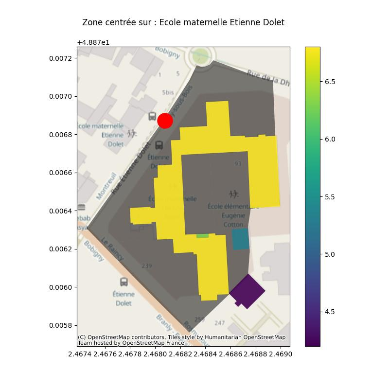

## Ecole maternelle Francoise Dolto

* Type etablissement: Ecole
* adresse_1: 1  parvis SAMUEL PATY
* nom_commune: Rosny-sous-Bois
* identifiant_de_l_etablissement: 0932818H
* Surface totale: 3293m2

### Image

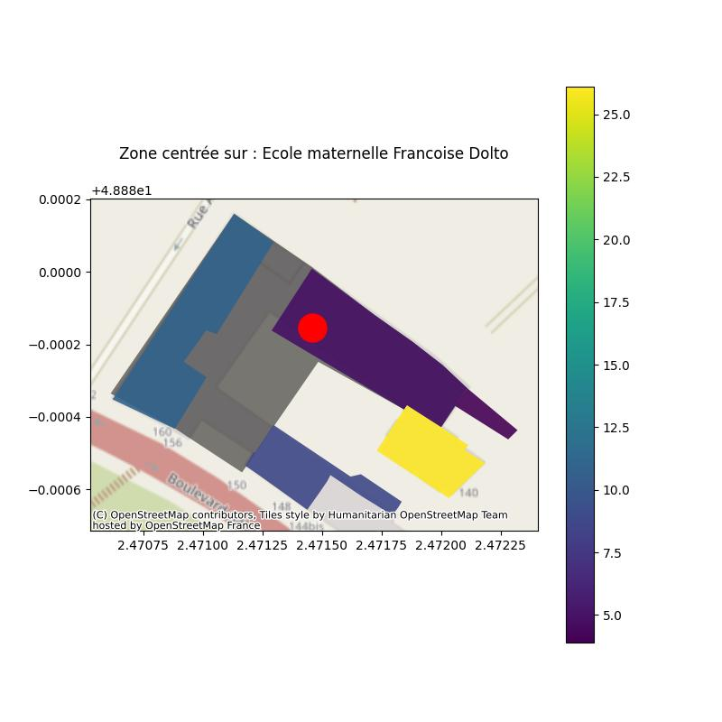

## Collège Pierre Curie

* Type etablissement: Collège
* adresse_1: 128 route de Villemomble
* nom_commune: Bondy
* identifiant_de_l_etablissement: 0931005M
* Surface totale: 4167m2

### Image

## Ecole élémentaire Marie Curie

* Type etablissement: Ecole
* adresse_1: 128 route de Villemomble
* nom_commune: Bondy
* identifiant_de_l_etablissement: 0930401F
* Surface totale: 4167m2

### Image

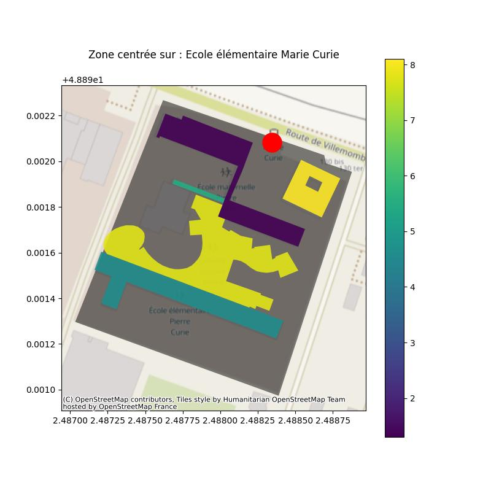

## Ecole maternelle Romain Rolland

* Type etablissement: Ecole
* adresse_1: 56 rue des Blancs Vilains
* nom_commune: Montreuil
* identifiant_de_l_etablissement: 0930418Z
* Surface totale: 3382m2

### Image

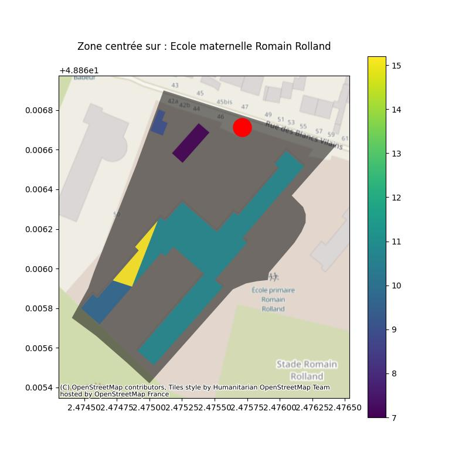

## Ecole primaire Jules Ferry 2

* Type etablissement: Ecole
* adresse_1: 2 rue François Collet
* nom_commune: Bondy
* identifiant_de_l_etablissement: 0930453M
* Surface totale: 2358m2

### Image

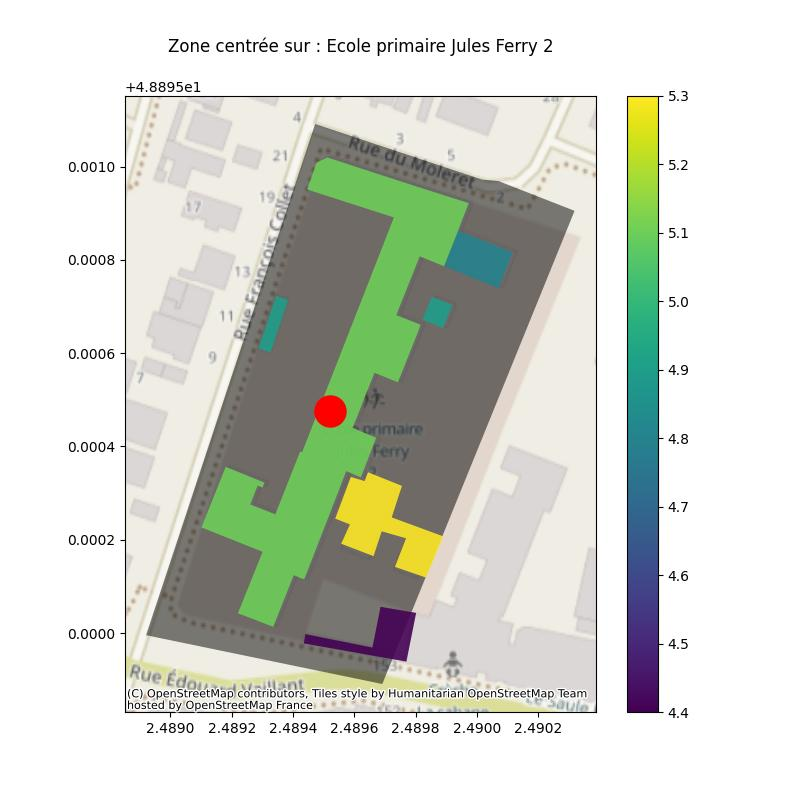

## Ecole maternelle Les Marnaudes

* Type etablissement: Ecole
* adresse_1: 35 rue JEAN MERMOZ
* nom_commune: Rosny-sous-Bois
* identifiant_de_l_etablissement: 0930489B
* Surface totale: 4366m2

### Image

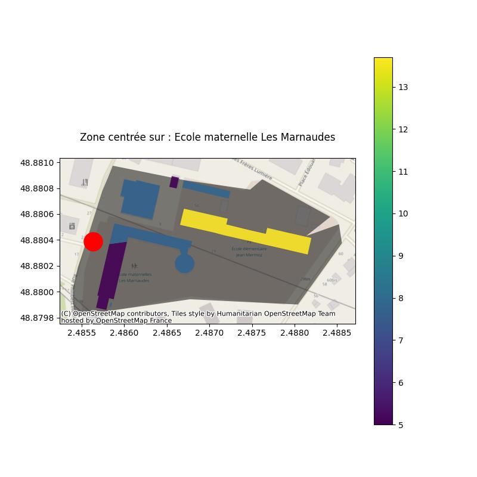

## Ecole élémentaire d'application François Coppée - Lamartine

* Type etablissement: Ecole
* adresse_1: 75 avenue des Limites
* nom_commune: Villemomble
* identifiant_de_l_etablissement: 0930556Z
* Surface totale: 2610m2

### Image

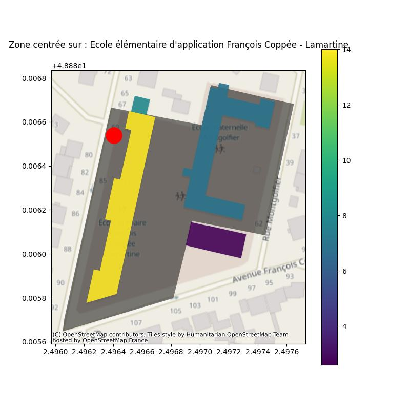

## Ecole élémentaire Louis et Madeleine Odru

* Type etablissement: Ecole
* adresse_1: 5 rue rue Henri Martin
* nom_commune: Montreuil
* identifiant_de_l_etablissement: 0932719A
* Surface totale: 2869m2

### Image

## Ecole primaire Anne Frank

* Type etablissement: Ecole
* adresse_1: 21 rue de la Carrière
* nom_commune: Villemomble
* identifiant_de_l_etablissement: 0932736U
* Surface totale: 3342m2

### Image

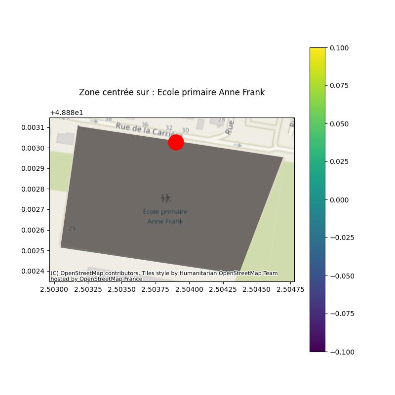

## Lycée Charles de Gaulle

* Type etablissement: Lycée
* adresse_1: 102 rue Lavoisier
* nom_commune: Rosny-sous-Bois
* identifiant_de_l_etablissement: 0932031C
* Surface totale: 3020m2

### Image

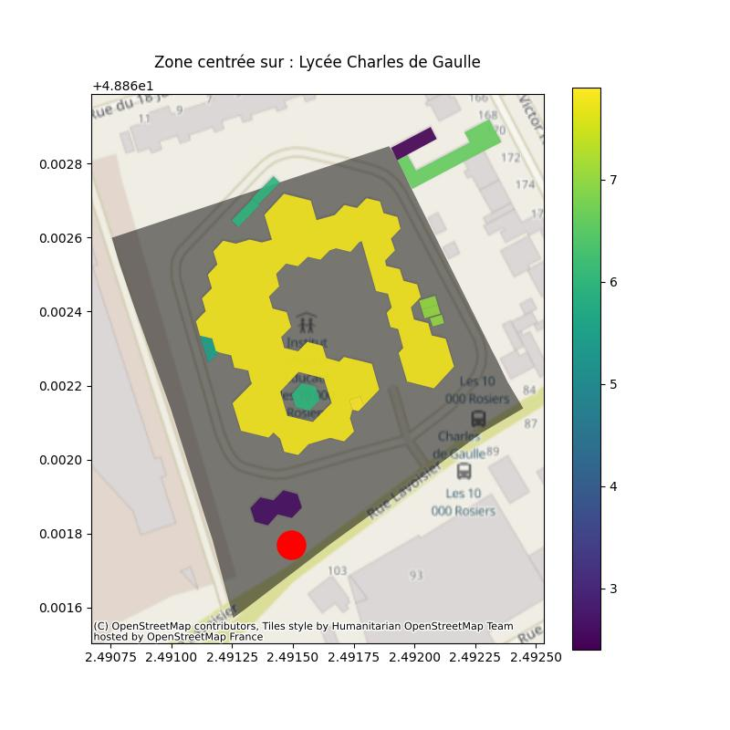

## Lycée professionnel Jean Moulin

* Type etablissement: Lycée
* adresse_1: 2 rue Missak Manouchian
* nom_commune: Rosny-sous-Bois
* identifiant_de_l_etablissement: 0931739K
* Surface totale: 4157m2

### Image

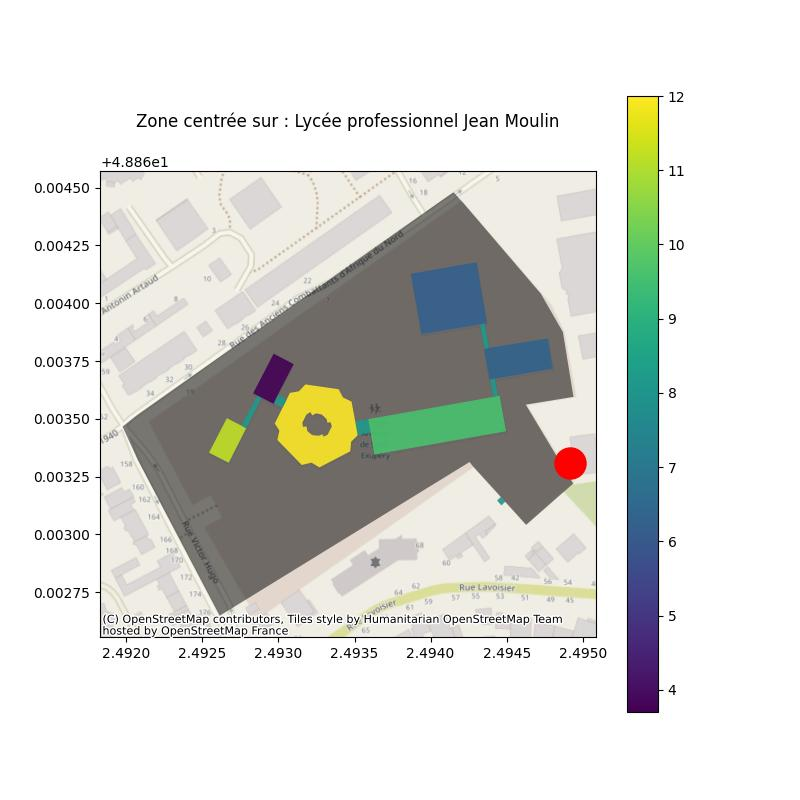

## Collège Saint-Exupéry

* Type etablissement: Collège
* adresse_1: 173 rue Victor Hugo
* nom_commune: Rosny-sous-Bois
* identifiant_de_l_etablissement: 0930593P
* Surface totale: 4157m2

### Image

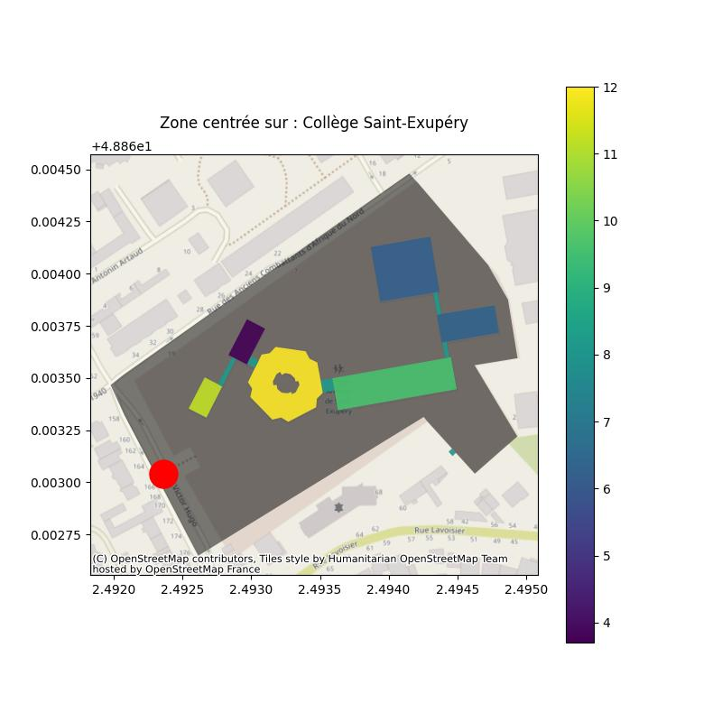

## Section d'enseignement général et professionnel adapté Saint-Exupéry

* Type etablissement: Collège
* adresse_1: 173 rue Victor Hugo
* nom_commune: Rosny-sous-Bois
* identifiant_de_l_etablissement: 0931323H
* Surface totale: 4157m2

### Image

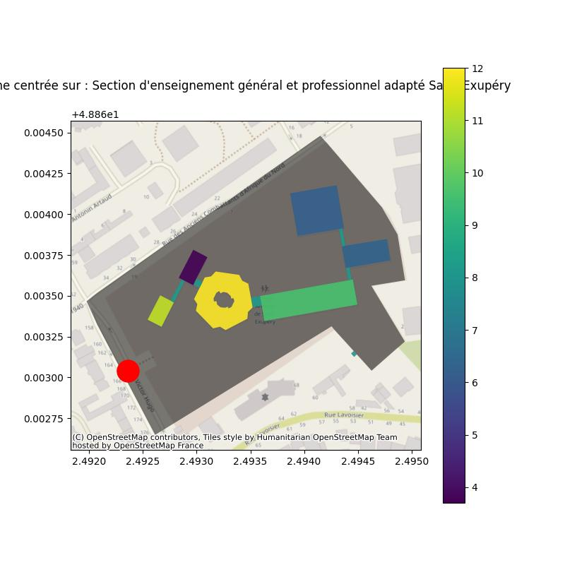

## Comité Local APAJH

* Type etablissement: Médico-social
* adresse_1: 100  RUE LAVOISIER
* nom_commune: Rosny-sous-Bois
* identifiant_de_l_etablissement: 0930876X
* Surface totale: 3506m2

### Image

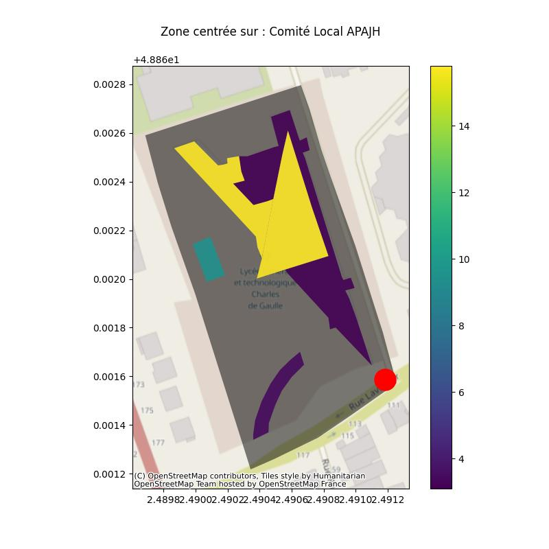

## IMP de Rosny-sous-Bois

* Type etablissement: Médico-social
* adresse_1: 100  RUE LAVOISIER
* nom_commune: Rosny-sous-Bois
* identifiant_de_l_etablissement: 0932401E
* Surface totale: 3506m2

### Image

